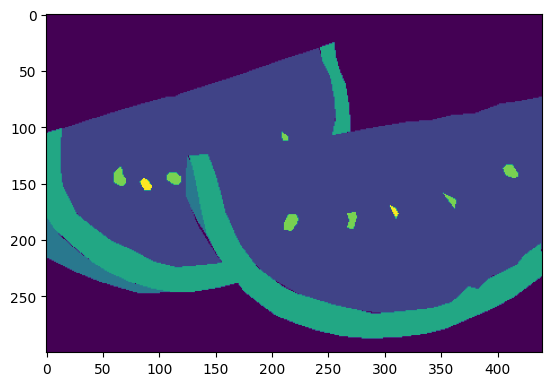

# MMSegmentation练习
原ipynb在colb上训练，但无法传到github，下载为ipynb也无法直接上传到github，所以直接上传了md文件，有些图片也是无法直接上传，只能一个一个修改后上传，真的很不方便。原ipynb文件在百度网盘自取：

链接: https://pan.baidu.com/s/18KV59UW1f6RTCFThqWD2ug?pwd=6fri 提取码: 6fri 

原文件中的配置文件是下载的子豪兄的迪拜数据集修改后得到的，这些配置文件已经上传到github（就在此文件夹中）。

# 安装


```python
!pip list
```

    Package                       Version
    ----------------------------- ---------------------
    absl-py                       1.4.0
    alabaster                     0.7.13
    albumentations                1.2.1
    altair                        4.2.2
    anyio                         3.6.2
    appdirs                       1.4.4
    argon2-cffi                   21.3.0
    argon2-cffi-bindings          21.2.0
    array-record                  0.2.0
    arviz                         0.15.1
    astropy                       5.2.2
    astunparse                    1.6.3
    attrs                         23.1.0
    audioread                     3.0.0
    autograd                      1.5
    Babel                         2.12.1
    backcall                      0.2.0
    beautifulsoup4                4.11.2
    bleach                        6.0.0
    blis                          0.7.9
    blosc2                        2.0.0
    bokeh                         2.4.3
    branca                        0.6.0
    build                         0.10.0
    CacheControl                  0.12.11
    cached-property               1.5.2
    cachetools                    5.3.0
    catalogue                     2.0.8
    certifi                       2022.12.7
    cffi                          1.15.1
    chardet                       4.0.0
    charset-normalizer            2.0.12
    chex                          0.1.7
    click                         8.1.3
    cloudpickle                   2.2.1
    cmake                         3.25.2
    cmdstanpy                     1.1.0
    colorcet                      3.0.1
    colorlover                    0.3.0
    community                     1.0.0b1
    confection                    0.0.4
    cons                          0.4.5
    contextlib2                   0.6.0.post1
    contourpy                     1.0.7
    convertdate                   2.4.0
    cryptography                  40.0.2
    cufflinks                     0.17.3
    cupy-cuda11x                  11.0.0
    cvxopt                        1.3.0
    cvxpy                         1.3.1
    cycler                        0.11.0
    cymem                         2.0.7
    Cython                        0.29.34
    dask                          2022.12.1
    datascience                   0.17.6
    db-dtypes                     1.1.1
    dbus-python                   1.2.16
    debugpy                       1.6.6
    decorator                     4.4.2
    defusedxml                    0.7.1
    distributed                   2022.12.1
    dlib                          19.24.1
    dm-tree                       0.1.8
    docutils                      0.16
    dopamine-rl                   4.0.6
    duckdb                        0.7.1
    earthengine-api               0.1.350
    easydict                      1.10
    ecos                          2.0.12
    editdistance                  0.6.2
    en-core-web-sm                3.5.0
    entrypoints                   0.4
    ephem                         4.1.4
    et-xmlfile                    1.1.0
    etils                         1.2.0
    etuples                       0.3.8
    exceptiongroup                1.1.1
    fastai                        2.7.12
    fastcore                      1.5.29
    fastdownload                  0.0.7
    fastjsonschema                2.16.3
    fastprogress                  1.0.3
    fastrlock                     0.8.1
    filelock                      3.12.0
    firebase-admin                5.3.0
    Flask                         2.2.4
    flatbuffers                   23.3.3
    flax                          0.6.9
    folium                        0.14.0
    fonttools                     4.39.3
    frozendict                    2.3.7
    fsspec                        2023.4.0
    future                        0.18.3
    gast                          0.4.0
    GDAL                          3.3.2
    gdown                         4.6.6
    gensim                        4.3.1
    geographiclib                 2.0
    geopy                         2.3.0
    gin-config                    0.5.0
    glob2                         0.7
    google                        2.0.3
    google-api-core               2.11.0
    google-api-python-client      2.84.0
    google-auth                   2.17.3
    google-auth-httplib2          0.1.0
    google-auth-oauthlib          1.0.0
    google-cloud-bigquery         3.9.0
    google-cloud-bigquery-storage 2.19.1
    google-cloud-core             2.3.2
    google-cloud-datastore        2.15.1
    google-cloud-firestore        2.11.0
    google-cloud-language         2.9.1
    google-cloud-storage          2.8.0
    google-cloud-translate        3.11.1
    google-colab                  1.0.0
    google-crc32c                 1.5.0
    google-pasta                  0.2.0
    google-resumable-media        2.5.0
    googleapis-common-protos      1.59.0
    googledrivedownloader         0.4
    graphviz                      0.20.1
    greenlet                      2.0.2
    grpcio                        1.54.0
    grpcio-status                 1.48.2
    gspread                       3.4.2
    gspread-dataframe             3.0.8
    gym                           0.25.2
    gym-notices                   0.0.8
    h5netcdf                      1.1.0
    h5py                          3.8.0
    holidays                      0.25
    holoviews                     1.15.4
    html5lib                      1.1
    httpimport                    1.3.0
    httplib2                      0.21.0
    humanize                      4.6.0
    hyperopt                      0.2.7
    idna                          3.4
    imageio                       2.25.1
    imageio-ffmpeg                0.4.8
    imagesize                     1.4.1
    imbalanced-learn              0.10.1
    imgaug                        0.4.0
    importlib-resources           5.12.0
    imutils                       0.5.4
    inflect                       6.0.4
    iniconfig                     2.0.0
    intel-openmp                  2023.1.0
    ipykernel                     5.5.6
    ipython                       7.34.0
    ipython-genutils              0.2.0
    ipython-sql                   0.4.1
    ipywidgets                    7.7.1
    itsdangerous                  2.1.2
    jax                           0.4.10
    jaxlib                        0.4.10+cuda11.cudnn86
    jieba                         0.42.1
    Jinja2                        3.1.2
    joblib                        1.2.0
    jsonpickle                    3.0.1
    jsonschema                    4.3.3
    jupyter-client                6.1.12
    jupyter-console               6.1.0
    jupyter_core                  5.3.0
    jupyter-server                1.24.0
    jupyterlab-pygments           0.2.2
    jupyterlab-widgets            3.0.7
    kaggle                        1.5.13
    keras                         2.12.0
    kiwisolver                    1.4.4
    korean-lunar-calendar         0.3.1
    langcodes                     3.3.0
    lazy_loader                   0.2
    libclang                      16.0.0
    librosa                       0.10.0.post2
    lightgbm                      3.3.5
    lit                           16.0.5
    llvmlite                      0.39.1
    locket                        1.0.0
    logical-unification           0.4.5
    LunarCalendar                 0.0.9
    lxml                          4.9.2
    Markdown                      3.4.3
    markdown-it-py                2.2.0
    MarkupSafe                    2.1.2
    matplotlib                    3.7.1
    matplotlib-inline             0.1.6
    matplotlib-venn               0.11.9
    mdurl                         0.1.2
    miniKanren                    1.0.3
    missingno                     0.5.2
    mistune                       0.8.4
    mizani                        0.8.1
    mkl                           2019.0
    ml-dtypes                     0.1.0
    mlxtend                       0.14.0
    more-itertools                9.1.0
    moviepy                       1.0.3
    mpmath                        1.3.0
    msgpack                       1.0.5
    multipledispatch              0.6.0
    multitasking                  0.0.11
    murmurhash                    1.0.9
    music21                       8.1.0
    natsort                       8.3.1
    nbclient                      0.7.4
    nbconvert                     6.5.4
    nbformat                      5.8.0
    nest-asyncio                  1.5.6
    networkx                      3.1
    nibabel                       3.0.2
    nltk                          3.8.1
    notebook                      6.4.8
    numba                         0.56.4
    numexpr                       2.8.4
    numpy                         1.22.4
    oauth2client                  4.1.3
    oauthlib                      3.2.2
    opencv-contrib-python         4.7.0.72
    opencv-python                 4.7.0.72
    opencv-python-headless        4.7.0.72
    openpyxl                      3.0.10
    opt-einsum                    3.3.0
    optax                         0.1.5
    orbax-checkpoint              0.2.1
    osqp                          0.6.2.post8
    packaging                     23.1
    palettable                    3.3.3
    pandas                        1.5.3
    pandas-datareader             0.10.0
    pandas-gbq                    0.17.9
    pandocfilters                 1.5.0
    panel                         0.14.4
    param                         1.13.0
    parso                         0.8.3
    partd                         1.4.0
    pathlib                       1.0.1
    pathy                         0.10.1
    patsy                         0.5.3
    pexpect                       4.8.0
    pickleshare                   0.7.5
    Pillow                        8.4.0
    pip                           23.1.2
    pip-tools                     6.13.0
    platformdirs                  3.3.0
    plotly                        5.13.1
    plotnine                      0.10.1
    pluggy                        1.0.0
    polars                        0.17.3
    pooch                         1.6.0
    portpicker                    1.3.9
    prefetch-generator            1.0.3
    preshed                       3.0.8
    prettytable                   0.7.2
    proglog                       0.1.10
    progressbar2                  4.2.0
    prometheus-client             0.16.0
    promise                       2.3
    prompt-toolkit                3.0.38
    prophet                       1.1.3
    proto-plus                    1.22.2
    protobuf                      3.20.3
    psutil                        5.9.5
    psycopg2                      2.9.6
    ptyprocess                    0.7.0
    py-cpuinfo                    9.0.0
    py4j                          0.10.9.7
    pyarrow                       9.0.0
    pyasn1                        0.5.0
    pyasn1-modules                0.3.0
    pycocotools                   2.0.6
    pycparser                     2.21
    pyct                          0.5.0
    pydantic                      1.10.7
    pydata-google-auth            1.7.0
    pydot                         1.4.2
    pydot-ng                      2.0.0
    pydotplus                     2.0.2
    PyDrive                       1.3.1
    pyerfa                        2.0.0.3
    pygame                        2.3.0
    Pygments                      2.14.0
    PyGObject                     3.36.0
    pymc                          5.1.2
    PyMeeus                       0.5.12
    pymystem3                     0.2.0
    PyOpenGL                      3.1.6
    pyparsing                     3.0.9
    pyproject_hooks               1.0.0
    pyrsistent                    0.19.3
    PySocks                       1.7.1
    pytensor                      2.10.1
    pytest                        7.2.2
    python-apt                    0.0.0
    python-dateutil               2.8.2
    python-louvain                0.16
    python-slugify                8.0.1
    python-utils                  3.5.2
    pytz                          2022.7.1
    pytz-deprecation-shim         0.1.0.post0
    pyviz-comms                   2.2.1
    PyWavelets                    1.4.1
    PyYAML                        6.0
    pyzmq                         23.2.1
    qdldl                         0.1.7
    qudida                        0.0.4
    regex                         2022.10.31
    requests                      2.27.1
    requests-oauthlib             1.3.1
    requests-unixsocket           0.2.0
    requirements-parser           0.5.0
    rich                          13.3.4
    rpy2                          3.5.5
    rsa                           4.9
    scikit-image                  0.19.3
    scikit-learn                  1.2.2
    scipy                         1.10.1
    scs                           3.2.3
    seaborn                       0.12.2
    Send2Trash                    1.8.0
    setuptools                    67.7.2
    shapely                       2.0.1
    six                           1.16.0
    sklearn-pandas                2.2.0
    smart-open                    6.3.0
    sniffio                       1.3.0
    snowballstemmer               2.2.0
    sortedcontainers              2.4.0
    soundfile                     0.12.1
    soupsieve                     2.4.1
    soxr                          0.3.5
    spacy                         3.5.2
    spacy-legacy                  3.0.12
    spacy-loggers                 1.0.4
    Sphinx                        3.5.4
    sphinxcontrib-applehelp       1.0.4
    sphinxcontrib-devhelp         1.0.2
    sphinxcontrib-htmlhelp        2.0.1
    sphinxcontrib-jsmath          1.0.1
    sphinxcontrib-qthelp          1.0.3
    sphinxcontrib-serializinghtml 1.1.5
    SQLAlchemy                    2.0.10
    sqlparse                      0.4.4
    srsly                         2.4.6
    statsmodels                   0.13.5
    sympy                         1.11.1
    tables                        3.8.0
    tabulate                      0.8.10
    tblib                         1.7.0
    tenacity                      8.2.2
    tensorboard                   2.12.2
    tensorboard-data-server       0.7.0
    tensorboard-plugin-wit        1.8.1
    tensorflow                    2.12.0
    tensorflow-datasets           4.9.2
    tensorflow-estimator          2.12.0
    tensorflow-gcs-config         2.12.0
    tensorflow-hub                0.13.0
    tensorflow-io-gcs-filesystem  0.32.0
    tensorflow-metadata           1.13.1
    tensorflow-probability        0.20.1
    tensorstore                   0.1.36
    termcolor                     2.3.0
    terminado                     0.17.1
    text-unidecode                1.3
    textblob                      0.17.1
    tf-slim                       1.1.0
    thinc                         8.1.9
    threadpoolctl                 3.1.0
    tifffile                      2023.4.12
    tinycss2                      1.2.1
    toml                          0.10.2
    tomli                         2.0.1
    toolz                         0.12.0
    torch                         2.0.1+cu118
    torchaudio                    2.0.2+cu118
    torchdata                     0.6.1
    torchsummary                  1.5.1
    torchtext                     0.15.2
    torchvision                   0.15.2+cu118
    tornado                       6.3.1
    tqdm                          4.65.0
    traitlets                     5.7.1
    triton                        2.0.0
    tweepy                        4.13.0
    typer                         0.7.0
    types-setuptools              67.8.0.0
    typing_extensions             4.5.0
    tzdata                        2023.3
    tzlocal                       4.3
    uritemplate                   4.1.1
    urllib3                       1.26.15
    vega-datasets                 0.9.0
    wasabi                        1.1.1
    wcwidth                       0.2.6
    webcolors                     1.13
    webencodings                  0.5.1
    websocket-client              1.5.1
    Werkzeug                      2.3.0
    wheel                         0.40.0
    widgetsnbextension            3.6.4
    wordcloud                     1.8.2.2
    wrapt                         1.14.1
    xarray                        2022.12.0
    xarray-einstats               0.5.1
    xgboost                       1.7.5
    xlrd                          2.0.1
    yellowbrick                   1.5
    yfinance                      0.2.18
    zict                          3.0.0
    zipp                          3.15.0
    

## 步骤 1. 使用 MIM 安装 MMCV


```python
!pip3 install openmim
!mim install mmengine
!mim install "mmcv>=2.0.0"
```

    Looking in indexes: https://pypi.org/simple, https://us-python.pkg.dev/colab-wheels/public/simple/
    Collecting openmim
      Downloading openmim-0.3.7-py2.py3-none-any.whl (51 kB)
         ━━━━━━━━━━━━━━━━━━━━━━━━━━━━━━━━━━━━━━━━ 51.3/51.3 kB 3.3 MB/s eta 0:00:00
    [?25hRequirement already satisfied: Click in /usr/local/lib/python3.10/dist-packages (from openmim) (8.1.3)
    Collecting colorama (from openmim)
      Downloading colorama-0.4.6-py2.py3-none-any.whl (25 kB)
    Collecting model-index (from openmim)
      Downloading model_index-0.1.11-py3-none-any.whl (34 kB)
    Requirement already satisfied: pandas in /usr/local/lib/python3.10/dist-packages (from openmim) (1.5.3)
    Requirement already satisfied: pip>=19.3 in /usr/local/lib/python3.10/dist-packages (from openmim) (23.1.2)
    Requirement already satisfied: requests in /usr/local/lib/python3.10/dist-packages (from openmim) (2.27.1)
    Requirement already satisfied: rich in /usr/local/lib/python3.10/dist-packages (from openmim) (13.3.4)
    Requirement already satisfied: tabulate in /usr/local/lib/python3.10/dist-packages (from openmim) (0.8.10)
    Requirement already satisfied: pyyaml in /usr/local/lib/python3.10/dist-packages (from model-index->openmim) (6.0)
    Requirement already satisfied: markdown in /usr/local/lib/python3.10/dist-packages (from model-index->openmim) (3.4.3)
    Collecting ordered-set (from model-index->openmim)
      Downloading ordered_set-4.1.0-py3-none-any.whl (7.6 kB)
    Requirement already satisfied: python-dateutil>=2.8.1 in /usr/local/lib/python3.10/dist-packages (from pandas->openmim) (2.8.2)
    Requirement already satisfied: pytz>=2020.1 in /usr/local/lib/python3.10/dist-packages (from pandas->openmim) (2022.7.1)
    Requirement already satisfied: numpy>=1.21.0 in /usr/local/lib/python3.10/dist-packages (from pandas->openmim) (1.22.4)
    Requirement already satisfied: urllib3<1.27,>=1.21.1 in /usr/local/lib/python3.10/dist-packages (from requests->openmim) (1.26.15)
    Requirement already satisfied: certifi>=2017.4.17 in /usr/local/lib/python3.10/dist-packages (from requests->openmim) (2022.12.7)
    Requirement already satisfied: charset-normalizer~=2.0.0 in /usr/local/lib/python3.10/dist-packages (from requests->openmim) (2.0.12)
    Requirement already satisfied: idna<4,>=2.5 in /usr/local/lib/python3.10/dist-packages (from requests->openmim) (3.4)
    Requirement already satisfied: markdown-it-py<3.0.0,>=2.2.0 in /usr/local/lib/python3.10/dist-packages (from rich->openmim) (2.2.0)
    Requirement already satisfied: pygments<3.0.0,>=2.13.0 in /usr/local/lib/python3.10/dist-packages (from rich->openmim) (2.14.0)
    Requirement already satisfied: mdurl~=0.1 in /usr/local/lib/python3.10/dist-packages (from markdown-it-py<3.0.0,>=2.2.0->rich->openmim) (0.1.2)
    Requirement already satisfied: six>=1.5 in /usr/local/lib/python3.10/dist-packages (from python-dateutil>=2.8.1->pandas->openmim) (1.16.0)
    Installing collected packages: ordered-set, colorama, model-index, openmim
    Successfully installed colorama-0.4.6 model-index-0.1.11 openmim-0.3.7 ordered-set-4.1.0
    Looking in indexes: https://pypi.org/simple, https://us-python.pkg.dev/colab-wheels/public/simple/
    Looking in links: https://download.openmmlab.com/mmcv/dist/cu118/torch2.0.0/index.html
    Collecting mmengine
      Downloading mmengine-0.7.4-py3-none-any.whl (374 kB)
         ━━━━━━━━━━━━━━━━━━━━━━━━━━━━━━━━━━━━━━━ 374.3/374.3 kB 8.6 MB/s eta 0:00:00
    [?25hCollecting addict (from mmengine)
      Downloading addict-2.4.0-py3-none-any.whl (3.8 kB)
    Requirement already satisfied: matplotlib in /usr/local/lib/python3.10/dist-packages (from mmengine) (3.7.1)
    Requirement already satisfied: numpy in /usr/local/lib/python3.10/dist-packages (from mmengine) (1.22.4)
    Requirement already satisfied: pyyaml in /usr/local/lib/python3.10/dist-packages (from mmengine) (6.0)
    Requirement already satisfied: rich in /usr/local/lib/python3.10/dist-packages (from mmengine) (13.3.4)
    Requirement already satisfied: termcolor in /usr/local/lib/python3.10/dist-packages (from mmengine) (2.3.0)
    Collecting yapf (from mmengine)
      Downloading yapf-0.40.0-py3-none-any.whl (250 kB)
         ━━━━━━━━━━━━━━━━━━━━━━━━━━━━━━━━━━━━━━ 250.3/250.3 kB 29.6 MB/s eta 0:00:00
    [?25hRequirement already satisfied: opencv-python>=3 in /usr/local/lib/python3.10/dist-packages (from mmengine) (4.7.0.72)
    Requirement already satisfied: contourpy>=1.0.1 in /usr/local/lib/python3.10/dist-packages (from matplotlib->mmengine) (1.0.7)
    Requirement already satisfied: cycler>=0.10 in /usr/local/lib/python3.10/dist-packages (from matplotlib->mmengine) (0.11.0)
    Requirement already satisfied: fonttools>=4.22.0 in /usr/local/lib/python3.10/dist-packages (from matplotlib->mmengine) (4.39.3)
    Requirement already satisfied: kiwisolver>=1.0.1 in /usr/local/lib/python3.10/dist-packages (from matplotlib->mmengine) (1.4.4)
    Requirement already satisfied: packaging>=20.0 in /usr/local/lib/python3.10/dist-packages (from matplotlib->mmengine) (23.1)
    Requirement already satisfied: pillow>=6.2.0 in /usr/local/lib/python3.10/dist-packages (from matplotlib->mmengine) (8.4.0)
    Requirement already satisfied: pyparsing>=2.3.1 in /usr/local/lib/python3.10/dist-packages (from matplotlib->mmengine) (3.0.9)
    Requirement already satisfied: python-dateutil>=2.7 in /usr/local/lib/python3.10/dist-packages (from matplotlib->mmengine) (2.8.2)
    Requirement already satisfied: markdown-it-py<3.0.0,>=2.2.0 in /usr/local/lib/python3.10/dist-packages (from rich->mmengine) (2.2.0)
    Requirement already satisfied: pygments<3.0.0,>=2.13.0 in /usr/local/lib/python3.10/dist-packages (from rich->mmengine) (2.14.0)
    Collecting importlib-metadata>=6.6.0 (from yapf->mmengine)
      Downloading importlib_metadata-6.6.0-py3-none-any.whl (22 kB)
    Collecting platformdirs>=3.5.1 (from yapf->mmengine)
      Downloading platformdirs-3.5.3-py3-none-any.whl (15 kB)
    Requirement already satisfied: tomli>=2.0.1 in /usr/local/lib/python3.10/dist-packages (from yapf->mmengine) (2.0.1)
    Requirement already satisfied: zipp>=0.5 in /usr/local/lib/python3.10/dist-packages (from importlib-metadata>=6.6.0->yapf->mmengine) (3.15.0)
    Requirement already satisfied: mdurl~=0.1 in /usr/local/lib/python3.10/dist-packages (from markdown-it-py<3.0.0,>=2.2.0->rich->mmengine) (0.1.2)
    Requirement already satisfied: six>=1.5 in /usr/local/lib/python3.10/dist-packages (from python-dateutil>=2.7->matplotlib->mmengine) (1.16.0)
    Installing collected packages: addict, platformdirs, importlib-metadata, yapf, mmengine
      Attempting uninstall: platformdirs
        Found existing installation: platformdirs 3.3.0
        Uninstalling platformdirs-3.3.0:
          Successfully uninstalled platformdirs-3.3.0
    Successfully installed addict-2.4.0 importlib-metadata-6.6.0 mmengine-0.7.4 platformdirs-3.5.3 yapf-0.40.0
    Looking in indexes: https://pypi.org/simple, https://us-python.pkg.dev/colab-wheels/public/simple/
    Looking in links: https://download.openmmlab.com/mmcv/dist/cu118/torch2.0.0/index.html
    Collecting mmcv>=2.0.0
      Downloading https://download.openmmlab.com/mmcv/dist/cu118/torch2.0.0/mmcv-2.0.0-cp310-cp310-manylinux1_x86_64.whl (74.4 MB)
         ━━━━━━━━━━━━━━━━━━━━━━━━━━━━━━━━━━━━━━━━ 74.4/74.4 MB 9.3 MB/s eta 0:00:00
    [?25hRequirement already satisfied: addict in /usr/local/lib/python3.10/dist-packages (from mmcv>=2.0.0) (2.4.0)
    Requirement already satisfied: mmengine>=0.2.0 in /usr/local/lib/python3.10/dist-packages (from mmcv>=2.0.0) (0.7.4)
    Requirement already satisfied: numpy in /usr/local/lib/python3.10/dist-packages (from mmcv>=2.0.0) (1.22.4)
    Requirement already satisfied: packaging in /usr/local/lib/python3.10/dist-packages (from mmcv>=2.0.0) (23.1)
    Requirement already satisfied: Pillow in /usr/local/lib/python3.10/dist-packages (from mmcv>=2.0.0) (8.4.0)
    Requirement already satisfied: pyyaml in /usr/local/lib/python3.10/dist-packages (from mmcv>=2.0.0) (6.0)
    Requirement already satisfied: yapf in /usr/local/lib/python3.10/dist-packages (from mmcv>=2.0.0) (0.40.0)
    Requirement already satisfied: opencv-python>=3 in /usr/local/lib/python3.10/dist-packages (from mmcv>=2.0.0) (4.7.0.72)
    Requirement already satisfied: matplotlib in /usr/local/lib/python3.10/dist-packages (from mmengine>=0.2.0->mmcv>=2.0.0) (3.7.1)
    Requirement already satisfied: rich in /usr/local/lib/python3.10/dist-packages (from mmengine>=0.2.0->mmcv>=2.0.0) (13.3.4)
    Requirement already satisfied: termcolor in /usr/local/lib/python3.10/dist-packages (from mmengine>=0.2.0->mmcv>=2.0.0) (2.3.0)
    Requirement already satisfied: importlib-metadata>=6.6.0 in /usr/local/lib/python3.10/dist-packages (from yapf->mmcv>=2.0.0) (6.6.0)
    Requirement already satisfied: platformdirs>=3.5.1 in /usr/local/lib/python3.10/dist-packages (from yapf->mmcv>=2.0.0) (3.5.3)
    Requirement already satisfied: tomli>=2.0.1 in /usr/local/lib/python3.10/dist-packages (from yapf->mmcv>=2.0.0) (2.0.1)
    Requirement already satisfied: zipp>=0.5 in /usr/local/lib/python3.10/dist-packages (from importlib-metadata>=6.6.0->yapf->mmcv>=2.0.0) (3.15.0)
    Requirement already satisfied: contourpy>=1.0.1 in /usr/local/lib/python3.10/dist-packages (from matplotlib->mmengine>=0.2.0->mmcv>=2.0.0) (1.0.7)
    Requirement already satisfied: cycler>=0.10 in /usr/local/lib/python3.10/dist-packages (from matplotlib->mmengine>=0.2.0->mmcv>=2.0.0) (0.11.0)
    Requirement already satisfied: fonttools>=4.22.0 in /usr/local/lib/python3.10/dist-packages (from matplotlib->mmengine>=0.2.0->mmcv>=2.0.0) (4.39.3)
    Requirement already satisfied: kiwisolver>=1.0.1 in /usr/local/lib/python3.10/dist-packages (from matplotlib->mmengine>=0.2.0->mmcv>=2.0.0) (1.4.4)
    Requirement already satisfied: pyparsing>=2.3.1 in /usr/local/lib/python3.10/dist-packages (from matplotlib->mmengine>=0.2.0->mmcv>=2.0.0) (3.0.9)
    Requirement already satisfied: python-dateutil>=2.7 in /usr/local/lib/python3.10/dist-packages (from matplotlib->mmengine>=0.2.0->mmcv>=2.0.0) (2.8.2)
    Requirement already satisfied: markdown-it-py<3.0.0,>=2.2.0 in /usr/local/lib/python3.10/dist-packages (from rich->mmengine>=0.2.0->mmcv>=2.0.0) (2.2.0)
    Requirement already satisfied: pygments<3.0.0,>=2.13.0 in /usr/local/lib/python3.10/dist-packages (from rich->mmengine>=0.2.0->mmcv>=2.0.0) (2.14.0)
    Requirement already satisfied: mdurl~=0.1 in /usr/local/lib/python3.10/dist-packages (from markdown-it-py<3.0.0,>=2.2.0->rich->mmengine>=0.2.0->mmcv>=2.0.0) (0.1.2)
    Requirement already satisfied: six>=1.5 in /usr/local/lib/python3.10/dist-packages (from python-dateutil>=2.7->matplotlib->mmengine>=0.2.0->mmcv>=2.0.0) (1.16.0)
    Installing collected packages: mmcv
    Successfully installed mmcv-2.0.0
    

## Step 2. 通过源码安装 MMSegmentation


```python
!git clone https://github.com/open-mmlab/mmsegmentation.git
%cd mmsegmentation
!git checkout main
!pip install -e .
```

    Cloning into 'mmsegmentation'...
    remote: Enumerating objects: 15132, done.
    remote: Counting objects: 100% (698/698), done.
    remote: Compressing objects: 100% (435/435), done.
    

## Step 3. 验证


```python
import mmseg
print(mmseg.__version__)
# 示例输出: 1.0.0
```


```python
!pip install pytorch-lightning 'mmdet>=3.0.0rc1'
```

    Looking in indexes: https://pypi.org/simple, https://us-python.pkg.dev/colab-wheels/public/simple/
    Collecting pytorch-lightning
      Downloading pytorch_lightning-2.0.3-py3-none-any.whl (720 kB)
         ━━━━━━━━━━━━━━━━━━━━━━━━━━━━━━━━━━━━━━ 720.6/720.6 kB 13.4 MB/s eta 0:00:00
    [?25hCollecting mmdet>=3.0.0rc1
      Downloading mmdet-3.0.0-py3-none-any.whl (1.7 MB)
         ━━━━━━━━━━━━━━━━━━━━━━━━━━━━━━━━━━━━━━━━ 1.7/1.7 MB 57.9 MB/s eta 0:00:00
    [?25hRequirement already satisfied: numpy>=1.17.2 in /usr/local/lib/python3.10/dist-packages (from pytorch-lightning) (1.22.4)
    Requirement already satisfied: torch>=1.11.0 in /usr/local/lib/python3.10/dist-packages (from pytorch-lightning) (2.0.1+cu118)
    Requirement already satisfied: tqdm>=4.57.0 in /usr/local/lib/python3.10/dist-packages (from pytorch-lightning) (4.65.0)
    Requirement already satisfied: PyYAML>=5.4 in /usr/local/lib/python3.10/dist-packages (from pytorch-lightning) (6.0)
    Requirement already satisfied: fsspec[http]>2021.06.0 in /usr/local/lib/python3.10/dist-packages (from pytorch-lightning) (2023.4.0)
    Collecting torchmetrics>=0.7.0 (from pytorch-lightning)
      Downloading torchmetrics-0.11.4-py3-none-any.whl (519 kB)
         ━━━━━━━━━━━━━━━━━━━━━━━━━━━━━━━━━━━━━━ 519.2/519.2 kB 45.2 MB/s eta 0:00:00
    [?25hRequirement already satisfied: packaging>=17.1 in /usr/local/lib/python3.10/dist-packages (from pytorch-lightning) (23.1)
    Requirement already satisfied: typing-extensions>=4.0.0 in /usr/local/lib/python3.10/dist-packages (from pytorch-lightning) (4.5.0)
    Collecting lightning-utilities>=0.7.0 (from pytorch-lightning)
      Downloading lightning_utilities-0.8.0-py3-none-any.whl (20 kB)
    Requirement already satisfied: matplotlib in /usr/local/lib/python3.10/dist-packages (from mmdet>=3.0.0rc1) (3.7.1)
    Requirement already satisfied: pycocotools in /usr/local/lib/python3.10/dist-packages (from mmdet>=3.0.0rc1) (2.0.6)
    Requirement already satisfied: scipy in /usr/local/lib/python3.10/dist-packages (from mmdet>=3.0.0rc1) (1.10.1)
    Requirement already satisfied: shapely in /usr/local/lib/python3.10/dist-packages (from mmdet>=3.0.0rc1) (2.0.1)
    Requirement already satisfied: six in /usr/local/lib/python3.10/dist-packages (from mmdet>=3.0.0rc1) (1.16.0)
    Collecting terminaltables (from mmdet>=3.0.0rc1)
      Downloading terminaltables-3.1.10-py2.py3-none-any.whl (15 kB)
    Requirement already satisfied: requests in /usr/local/lib/python3.10/dist-packages (from fsspec[http]>2021.06.0->pytorch-lightning) (2.27.1)
    Collecting aiohttp!=4.0.0a0,!=4.0.0a1 (from fsspec[http]>2021.06.0->pytorch-lightning)
      Downloading aiohttp-3.8.4-cp310-cp310-manylinux_2_17_x86_64.manylinux2014_x86_64.whl (1.0 MB)
         ━━━━━━━━━━━━━━━━━━━━━━━━━━━━━━━━━━━━━━━━ 1.0/1.0 MB 83.5 MB/s eta 0:00:00
    [?25hRequirement already satisfied: filelock in /usr/local/lib/python3.10/dist-packages (from torch>=1.11.0->pytorch-lightning) (3.12.0)
    Requirement already satisfied: sympy in /usr/local/lib/python3.10/dist-packages (from torch>=1.11.0->pytorch-lightning) (1.11.1)
    Requirement already satisfied: networkx in /usr/local/lib/python3.10/dist-packages (from torch>=1.11.0->pytorch-lightning) (3.1)
    Requirement already satisfied: jinja2 in /usr/local/lib/python3.10/dist-packages (from torch>=1.11.0->pytorch-lightning) (3.1.2)
    Requirement already satisfied: triton==2.0.0 in /usr/local/lib/python3.10/dist-packages (from torch>=1.11.0->pytorch-lightning) (2.0.0)
    Requirement already satisfied: cmake in /usr/local/lib/python3.10/dist-packages (from triton==2.0.0->torch>=1.11.0->pytorch-lightning) (3.25.2)
    Requirement already satisfied: lit in /usr/local/lib/python3.10/dist-packages (from triton==2.0.0->torch>=1.11.0->pytorch-lightning) (16.0.5)
    Requirement already satisfied: contourpy>=1.0.1 in /usr/local/lib/python3.10/dist-packages (from matplotlib->mmdet>=3.0.0rc1) (1.0.7)
    Requirement already satisfied: cycler>=0.10 in /usr/local/lib/python3.10/dist-packages (from matplotlib->mmdet>=3.0.0rc1) (0.11.0)
    Requirement already satisfied: fonttools>=4.22.0 in /usr/local/lib/python3.10/dist-packages (from matplotlib->mmdet>=3.0.0rc1) (4.39.3)
    Requirement already satisfied: kiwisolver>=1.0.1 in /usr/local/lib/python3.10/dist-packages (from matplotlib->mmdet>=3.0.0rc1) (1.4.4)
    Requirement already satisfied: pillow>=6.2.0 in /usr/local/lib/python3.10/dist-packages (from matplotlib->mmdet>=3.0.0rc1) (8.4.0)
    Requirement already satisfied: pyparsing>=2.3.1 in /usr/local/lib/python3.10/dist-packages (from matplotlib->mmdet>=3.0.0rc1) (3.0.9)
    Requirement already satisfied: python-dateutil>=2.7 in /usr/local/lib/python3.10/dist-packages (from matplotlib->mmdet>=3.0.0rc1) (2.8.2)
    Requirement already satisfied: attrs>=17.3.0 in /usr/local/lib/python3.10/dist-packages (from aiohttp!=4.0.0a0,!=4.0.0a1->fsspec[http]>2021.06.0->pytorch-lightning) (23.1.0)
    Requirement already satisfied: charset-normalizer<4.0,>=2.0 in /usr/local/lib/python3.10/dist-packages (from aiohttp!=4.0.0a0,!=4.0.0a1->fsspec[http]>2021.06.0->pytorch-lightning) (2.0.12)
    Collecting multidict<7.0,>=4.5 (from aiohttp!=4.0.0a0,!=4.0.0a1->fsspec[http]>2021.06.0->pytorch-lightning)
      Downloading multidict-6.0.4-cp310-cp310-manylinux_2_17_x86_64.manylinux2014_x86_64.whl (114 kB)
         ━━━━━━━━━━━━━━━━━━━━━━━━━━━━━━━━━━━━━━ 114.5/114.5 kB 12.6 MB/s eta 0:00:00
    [?25hCollecting async-timeout<5.0,>=4.0.0a3 (from aiohttp!=4.0.0a0,!=4.0.0a1->fsspec[http]>2021.06.0->pytorch-lightning)
      Downloading async_timeout-4.0.2-py3-none-any.whl (5.8 kB)
    Collecting yarl<2.0,>=1.0 (from aiohttp!=4.0.0a0,!=4.0.0a1->fsspec[http]>2021.06.0->pytorch-lightning)
      Downloading yarl-1.9.2-cp310-cp310-manylinux_2_17_x86_64.manylinux2014_x86_64.whl (268 kB)
         ━━━━━━━━━━━━━━━━━━━━━━━━━━━━━━━━━━━━━━ 268.8/268.8 kB 34.0 MB/s eta 0:00:00
    [?25hCollecting frozenlist>=1.1.1 (from aiohttp!=4.0.0a0,!=4.0.0a1->fsspec[http]>2021.06.0->pytorch-lightning)
      Downloading frozenlist-1.3.3-cp310-cp310-manylinux_2_5_x86_64.manylinux1_x86_64.manylinux_2_17_x86_64.manylinux2014_x86_64.whl (149 kB)
         ━━━━━━━━━━━━━━━━━━━━━━━━━━━━━━━━━━━━━━ 149.6/149.6 kB 22.7 MB/s eta 0:00:00
    [?25hCollecting aiosignal>=1.1.2 (from aiohttp!=4.0.0a0,!=4.0.0a1->fsspec[http]>2021.06.0->pytorch-lightning)
      Downloading aiosignal-1.3.1-py3-none-any.whl (7.6 kB)
    Requirement already satisfied: MarkupSafe>=2.0 in /usr/local/lib/python3.10/dist-packages (from jinja2->torch>=1.11.0->pytorch-lightning) (2.1.2)
    Requirement already satisfied: urllib3<1.27,>=1.21.1 in /usr/local/lib/python3.10/dist-packages (from requests->fsspec[http]>2021.06.0->pytorch-lightning) (1.26.15)
    Requirement already satisfied: certifi>=2017.4.17 in /usr/local/lib/python3.10/dist-packages (from requests->fsspec[http]>2021.06.0->pytorch-lightning) (2022.12.7)
    Requirement already satisfied: idna<4,>=2.5 in /usr/local/lib/python3.10/dist-packages (from requests->fsspec[http]>2021.06.0->pytorch-lightning) (3.4)
    Requirement already satisfied: mpmath>=0.19 in /usr/local/lib/python3.10/dist-packages (from sympy->torch>=1.11.0->pytorch-lightning) (1.3.0)
    Installing collected packages: terminaltables, multidict, lightning-utilities, frozenlist, async-timeout, yarl, aiosignal, aiohttp, mmdet, torchmetrics, pytorch-lightning
    Successfully installed aiohttp-3.8.4 aiosignal-1.3.1 async-timeout-4.0.2 frozenlist-1.3.3 lightning-utilities-0.8.0 mmdet-3.0.0 multidict-6.0.4 pytorch-lightning-2.0.3 terminaltables-3.1.10 torchmetrics-0.11.4 yarl-1.9.2
    


```python
# 进入主目录
# import os
# os.chdir('mmsegmentation')
!pwd
```

    /content/mmsegmentation
    

## 下载预训练模型权重文件和视频素材


```python
import os

# 创建 checkpoint 文件夹，用于存放预训练模型权重文件
os.mkdir('checkpoint')

# 创建 outputs 文件夹，用于存放预测结果
os.mkdir('outputs')

# 创建 data 文件夹，用于存放图片和视频素材
os.mkdir('data')

```


```python
# # 下载数据集labelme标注格式（没有划分训练集和测试集）
# !wget https://zihao-openmmlab.obs.cn-east-3.myhuaweicloud.com/20230130-mmseg/dataset/watermelon/Watermelon87_Semantic_Seg_Labelme.zip
# !unzip Watermelon87_Semantic_Seg_Labelme.zip -d data # 解压

# !rm -rf Watermelon87_Semantic_Seg_Labelme.zip # 删除压缩包
```


```python
# 下载数据集Mask标注格式（已划分训练集和测试集）
!wget https://zihao-openmmlab.obs.cn-east-3.myhuaweicloud.com/20230130-mmseg/dataset/watermelon/Watermelon87_Semantic_Seg_Mask.zip
!unzip Watermelon87_Semantic_Seg_Mask.zip -d data # 解压

!rm -rf Watermelon87_Semantic_Seg_Labelme.zip # 删除压缩包
```

    --2023-06-17 08:07:10--  https://zihao-openmmlab.obs.cn-east-3.myhuaweicloud.com/20230130-mmseg/dataset/watermelon/Watermelon87_Semantic_Seg_Mask.zip
    Resolving zihao-openmmlab.obs.cn-east-3.myhuaweicloud.com (zihao-openmmlab.obs.cn-east-3.myhuaweicloud.com)... 121.36.235.132
    Connecting to zihao-openmmlab.obs.cn-east-3.myhuaweicloud.com (zihao-openmmlab.obs.cn-east-3.myhuaweicloud.com)|121.36.235.132|:443... connected.
    HTTP request sent, awaiting response... 200 OK
    Length: 13230222 (13M) [application/zip]
    Saving to: ‘Watermelon87_Semantic_Seg_Mask.zip’
    
    Watermelon87_Semant 100%[===================>]  12.62M  4.39MB/s    in 2.9s    
    
    2023-06-17 08:07:14 (4.39 MB/s) - ‘Watermelon87_Semantic_Seg_Mask.zip’ saved [13230222/13230222]
    
    Archive:  Watermelon87_Semantic_Seg_Mask.zip
       creating: data/Watermelon87_Semantic_Seg_Mask/
       creating: data/Watermelon87_Semantic_Seg_Mask/img_dir/
       creating: data/Watermelon87_Semantic_Seg_Mask/img_dir/train/
      inflating: data/Watermelon87_Semantic_Seg_Mask/img_dir/train/IMG_6865-1024x683.jpg  
      inflating: data/Watermelon87_Semantic_Seg_Mask/img_dir/train/unnamed.jpg  
      inflating: data/Watermelon87_Semantic_Seg_Mask/img_dir/train/maxresdefault.jpg  
      inflating: data/Watermelon87_Semantic_Seg_Mask/img_dir/train/R (2).jpeg  
      inflating: data/Watermelon87_Semantic_Seg_Mask/img_dir/train/R (1).jpeg  
      inflating: data/Watermelon87_Semantic_Seg_Mask/img_dir/train/20170613134012_430390.jpg  
      inflating: data/Watermelon87_Semantic_Seg_Mask/img_dir/train/OIP (5).jpeg  
      inflating: data/Watermelon87_Semantic_Seg_Mask/img_dir/train/04_35-2.jpg  
      inflating: data/Watermelon87_Semantic_Seg_Mask/img_dir/train/pureform-citrulline.jpg  
      inflating: data/Watermelon87_Semantic_Seg_Mask/img_dir/train/24a3a0f8a11ae29f8ccca35c822ac0e2991b4773.png  
      inflating: data/Watermelon87_Semantic_Seg_Mask/img_dir/train/test.jpg  
      inflating: data/Watermelon87_Semantic_Seg_Mask/img_dir/train/Watermelon.jpg  
      inflating: data/Watermelon87_Semantic_Seg_Mask/img_dir/train/OIP (15).jpeg  
      inflating: data/Watermelon87_Semantic_Seg_Mask/img_dir/train/R (3).jpeg  
      inflating: data/Watermelon87_Semantic_Seg_Mask/img_dir/train/OIP (3).jpeg  
      inflating: data/Watermelon87_Semantic_Seg_Mask/img_dir/train/vDMIiCPqS1EC.jpg  
      inflating: data/Watermelon87_Semantic_Seg_Mask/img_dir/train/R (9).jpeg  
      inflating: data/Watermelon87_Semantic_Seg_Mask/img_dir/train/s0569_001_c01.jpg  
      inflating: data/Watermelon87_Semantic_Seg_Mask/img_dir/train/OIP (10).jpeg  
      inflating: data/Watermelon87_Semantic_Seg_Mask/img_dir/train/OIP (1).jpeg  
      inflating: data/Watermelon87_Semantic_Seg_Mask/img_dir/train/2401-food-tip-image-MAIN.jpg  
      inflating: data/Watermelon87_Semantic_Seg_Mask/img_dir/train/OIP (2).jpeg  
      inflating: data/Watermelon87_Semantic_Seg_Mask/img_dir/train/69735779_m-5b756b48997fa.jpg  
      inflating: data/Watermelon87_Semantic_Seg_Mask/img_dir/train/360_F_85084369_iab0VH1ohx2lHtM3OfCncfE9I7VPpl0N.jpg  
      inflating: data/Watermelon87_Semantic_Seg_Mask/img_dir/train/045_sozai_l.jpg  
      inflating: data/Watermelon87_Semantic_Seg_Mask/img_dir/train/skmrk03.jpg  
      inflating: data/Watermelon87_Semantic_Seg_Mask/img_dir/train/8fe7f149146b6866.jpg  
      inflating: data/Watermelon87_Semantic_Seg_Mask/img_dir/train/uportcocoloni_16696_0.jpg  
      inflating: data/Watermelon87_Semantic_Seg_Mask/img_dir/train/OIP (8).jpeg  
      inflating: data/Watermelon87_Semantic_Seg_Mask/img_dir/train/alkompis_QGYeyHjwPY-scaled.jpg  
      inflating: data/Watermelon87_Semantic_Seg_Mask/img_dir/train/OIP (7).jpeg  
      inflating: data/Watermelon87_Semantic_Seg_Mask/img_dir/train/ac330c7605098e36de5507d857d0b55c.jpg  
      inflating: data/Watermelon87_Semantic_Seg_Mask/img_dir/train/c38e1f595c46d502c75bda7ec9bf6078.jpg  
      inflating: data/Watermelon87_Semantic_Seg_Mask/img_dir/train/68200_main-1.jpg  
      inflating: data/Watermelon87_Semantic_Seg_Mask/img_dir/train/OIP (12).jpeg  
      inflating: data/Watermelon87_Semantic_Seg_Mask/img_dir/train/ed2de27518d0526380c9bcc9f9fb78333565cce8.jpg  
      inflating: data/Watermelon87_Semantic_Seg_Mask/img_dir/train/R (8).jpeg  
      inflating: data/Watermelon87_Semantic_Seg_Mask/img_dir/train/11-loai-trai-cay-dinh-duong-nen-an-hang-ngay-dua-hau.jpg  
      inflating: data/Watermelon87_Semantic_Seg_Mask/img_dir/train/piece-watermelon-isolated-white-background-top-view-95945299.jpg  
      inflating: data/Watermelon87_Semantic_Seg_Mask/img_dir/train/suika011.jpg  
      inflating: data/Watermelon87_Semantic_Seg_Mask/img_dir/train/R (5).jpeg  
      inflating: data/Watermelon87_Semantic_Seg_Mask/img_dir/train/R (10).jpeg  
      inflating: data/Watermelon87_Semantic_Seg_Mask/img_dir/train/OIP.jpeg  
      inflating: data/Watermelon87_Semantic_Seg_Mask/img_dir/train/istockphoto-849574338-170667a.jpg  
      inflating: data/Watermelon87_Semantic_Seg_Mask/img_dir/train/R (14).jpeg  
      inflating: data/Watermelon87_Semantic_Seg_Mask/img_dir/train/31cc9b997d1e3a8ed5b6a3cbf5efd86d.jpg  
      inflating: data/Watermelon87_Semantic_Seg_Mask/img_dir/train/da23-e4580.jpg  
      inflating: data/Watermelon87_Semantic_Seg_Mask/img_dir/train/468D11D9CB53158C55CF126CFE3D49C0A070758A_size321_w400_h400.png  
      inflating: data/Watermelon87_Semantic_Seg_Mask/img_dir/train/img_de56fb30d23e2c761302ba61198a4be4233656.jpg  
      inflating: data/Watermelon87_Semantic_Seg_Mask/img_dir/train/R (15).jpeg  
      inflating: data/Watermelon87_Semantic_Seg_Mask/img_dir/train/1471253631_2.jpg  
      inflating: data/Watermelon87_Semantic_Seg_Mask/img_dir/train/Manfaat-buah-semangka.jpg  
      inflating: data/Watermelon87_Semantic_Seg_Mask/img_dir/train/adpDSC_5275-750x499.jpg  
      inflating: data/Watermelon87_Semantic_Seg_Mask/img_dir/train/shutterstock_457769608.jpg  
      inflating: data/Watermelon87_Semantic_Seg_Mask/img_dir/train/o0833068314488481500.jpg  
      inflating: data/Watermelon87_Semantic_Seg_Mask/img_dir/train/thum-20180809094803.jpg  
      inflating: data/Watermelon87_Semantic_Seg_Mask/img_dir/train/7c75f4c6f3bdd9d61d8782ddff1ff6ac.jpg  
      inflating: data/Watermelon87_Semantic_Seg_Mask/img_dir/train/img4f375505zik9zj.jpeg  
      inflating: data/Watermelon87_Semantic_Seg_Mask/img_dir/train/202007220195_top_img_A.jpg  
      inflating: data/Watermelon87_Semantic_Seg_Mask/img_dir/train/R (13).jpeg  
      inflating: data/Watermelon87_Semantic_Seg_Mask/img_dir/train/1510702494080_melon_NWS_block-low.jpg  
      inflating: data/Watermelon87_Semantic_Seg_Mask/img_dir/train/pfauwbexemva1nvwobqs.jpg  
      inflating: data/Watermelon87_Semantic_Seg_Mask/img_dir/train/img56610866.jpg  
      inflating: data/Watermelon87_Semantic_Seg_Mask/img_dir/train/0778_02.jpg  
      inflating: data/Watermelon87_Semantic_Seg_Mask/img_dir/train/21746.1.jpg  
      inflating: data/Watermelon87_Semantic_Seg_Mask/img_dir/train/8-thuc-pham-chong-cam-cum-1459496975020.jpg  
      inflating: data/Watermelon87_Semantic_Seg_Mask/img_dir/train/huyet-ap-cao-thap-nen-an-gi-kieng-gi-tot-on-dinh-2.jpg  
      inflating: data/Watermelon87_Semantic_Seg_Mask/img_dir/train/foods083_img01.jpg  
      inflating: data/Watermelon87_Semantic_Seg_Mask/img_dir/train/OIP (14).jpeg  
      inflating: data/Watermelon87_Semantic_Seg_Mask/img_dir/train/watermelon-slices.jpg  
       creating: data/Watermelon87_Semantic_Seg_Mask/img_dir/val/
      inflating: data/Watermelon87_Semantic_Seg_Mask/img_dir/val/watermelon-medium.jpg  
      inflating: data/Watermelon87_Semantic_Seg_Mask/img_dir/val/la_wm_img01.jpg  
      inflating: data/Watermelon87_Semantic_Seg_Mask/img_dir/val/OIP (11).jpeg  
      inflating: data/Watermelon87_Semantic_Seg_Mask/img_dir/val/01bd15599c606aa801201794e1fa30.jpg@1280w_1l_2o_100sh.jpg  
      inflating: data/Watermelon87_Semantic_Seg_Mask/img_dir/val/17897490_93d9666602_z.jpg  
      inflating: data/Watermelon87_Semantic_Seg_Mask/img_dir/val/R.jpeg  
      inflating: data/Watermelon87_Semantic_Seg_Mask/img_dir/val/5b3c8018N634d43bd.jpg  
      inflating: data/Watermelon87_Semantic_Seg_Mask/img_dir/val/dua-hau-1.jpg  
      inflating: data/Watermelon87_Semantic_Seg_Mask/img_dir/val/depositphotos_204189678-stock-photo-slice-watermelon-white-background.jpg  
      inflating: data/Watermelon87_Semantic_Seg_Mask/img_dir/val/OIP (13).jpeg  
      inflating: data/Watermelon87_Semantic_Seg_Mask/img_dir/val/e52m_8686.jpg  
      inflating: data/Watermelon87_Semantic_Seg_Mask/img_dir/val/OIP (9).jpeg  
      inflating: data/Watermelon87_Semantic_Seg_Mask/img_dir/val/OIP (4).jpeg  
      inflating: data/Watermelon87_Semantic_Seg_Mask/img_dir/val/R (4).jpeg  
      inflating: data/Watermelon87_Semantic_Seg_Mask/img_dir/val/L007-05_5.jpg  
      inflating: data/Watermelon87_Semantic_Seg_Mask/img_dir/val/dun-soi-hat-dua-hau-lay-nuoc-uong-ban-se-bat-ngo-vi-ket-qua-nuochatduah--u1-1493799084-width500height313.jpg  
      inflating: data/Watermelon87_Semantic_Seg_Mask/img_dir/val/denn-ke-11-7.jpg  
       creating: data/Watermelon87_Semantic_Seg_Mask/ann_dir/
       creating: data/Watermelon87_Semantic_Seg_Mask/ann_dir/train/
      inflating: data/Watermelon87_Semantic_Seg_Mask/ann_dir/train/IMG_6865-1024x683.png  
      inflating: data/Watermelon87_Semantic_Seg_Mask/ann_dir/train/unnamed.png  
      inflating: data/Watermelon87_Semantic_Seg_Mask/ann_dir/train/maxresdefault.png  
      inflating: data/Watermelon87_Semantic_Seg_Mask/ann_dir/train/R (2).png  
      inflating: data/Watermelon87_Semantic_Seg_Mask/ann_dir/train/R (1).png  
      inflating: data/Watermelon87_Semantic_Seg_Mask/ann_dir/train/20170613134012_430390.png  
      inflating: data/Watermelon87_Semantic_Seg_Mask/ann_dir/train/OIP (5).png  
      inflating: data/Watermelon87_Semantic_Seg_Mask/ann_dir/train/04_35-2.png  
      inflating: data/Watermelon87_Semantic_Seg_Mask/ann_dir/train/pureform-citrulline.png  
      inflating: data/Watermelon87_Semantic_Seg_Mask/ann_dir/train/24a3a0f8a11ae29f8ccca35c822ac0e2991b4773.png  
      inflating: data/Watermelon87_Semantic_Seg_Mask/ann_dir/train/test.png  
      inflating: data/Watermelon87_Semantic_Seg_Mask/ann_dir/train/Watermelon.png  
      inflating: data/Watermelon87_Semantic_Seg_Mask/ann_dir/train/OIP (15).png  
      inflating: data/Watermelon87_Semantic_Seg_Mask/ann_dir/train/R (3).png  
      inflating: data/Watermelon87_Semantic_Seg_Mask/ann_dir/train/OIP (3).png  
      inflating: data/Watermelon87_Semantic_Seg_Mask/ann_dir/train/vDMIiCPqS1EC.png  
      inflating: data/Watermelon87_Semantic_Seg_Mask/ann_dir/train/R (9).png  
      inflating: data/Watermelon87_Semantic_Seg_Mask/ann_dir/train/s0569_001_c01.png  
      inflating: data/Watermelon87_Semantic_Seg_Mask/ann_dir/train/OIP (10).png  
      inflating: data/Watermelon87_Semantic_Seg_Mask/ann_dir/train/OIP (1).png  
      inflating: data/Watermelon87_Semantic_Seg_Mask/ann_dir/train/2401-food-tip-image-MAIN.png  
      inflating: data/Watermelon87_Semantic_Seg_Mask/ann_dir/train/OIP (2).png  
      inflating: data/Watermelon87_Semantic_Seg_Mask/ann_dir/train/69735779_m-5b756b48997fa.png  
      inflating: data/Watermelon87_Semantic_Seg_Mask/ann_dir/train/360_F_85084369_iab0VH1ohx2lHtM3OfCncfE9I7VPpl0N.png  
      inflating: data/Watermelon87_Semantic_Seg_Mask/ann_dir/train/045_sozai_l.png  
      inflating: data/Watermelon87_Semantic_Seg_Mask/ann_dir/train/skmrk03.png  
      inflating: data/Watermelon87_Semantic_Seg_Mask/ann_dir/train/8fe7f149146b6866.png  
      inflating: data/Watermelon87_Semantic_Seg_Mask/ann_dir/train/uportcocoloni_16696_0.png  
      inflating: data/Watermelon87_Semantic_Seg_Mask/ann_dir/train/OIP (8).png  
      inflating: data/Watermelon87_Semantic_Seg_Mask/ann_dir/train/alkompis_QGYeyHjwPY-scaled.png  
      inflating: data/Watermelon87_Semantic_Seg_Mask/ann_dir/train/OIP (7).png  
      inflating: data/Watermelon87_Semantic_Seg_Mask/ann_dir/train/ac330c7605098e36de5507d857d0b55c.png  
      inflating: data/Watermelon87_Semantic_Seg_Mask/ann_dir/train/c38e1f595c46d502c75bda7ec9bf6078.png  
      inflating: data/Watermelon87_Semantic_Seg_Mask/ann_dir/train/68200_main-1.png  
      inflating: data/Watermelon87_Semantic_Seg_Mask/ann_dir/train/OIP (12).png  
      inflating: data/Watermelon87_Semantic_Seg_Mask/ann_dir/train/ed2de27518d0526380c9bcc9f9fb78333565cce8.png  
      inflating: data/Watermelon87_Semantic_Seg_Mask/ann_dir/train/R (8).png  
      inflating: data/Watermelon87_Semantic_Seg_Mask/ann_dir/train/11-loai-trai-cay-dinh-duong-nen-an-hang-ngay-dua-hau.png  
      inflating: data/Watermelon87_Semantic_Seg_Mask/ann_dir/train/piece-watermelon-isolated-white-background-top-view-95945299.png  
      inflating: data/Watermelon87_Semantic_Seg_Mask/ann_dir/train/suika011.png  
      inflating: data/Watermelon87_Semantic_Seg_Mask/ann_dir/train/R (5).png  
      inflating: data/Watermelon87_Semantic_Seg_Mask/ann_dir/train/R (10).png  
      inflating: data/Watermelon87_Semantic_Seg_Mask/ann_dir/train/OIP.png  
      inflating: data/Watermelon87_Semantic_Seg_Mask/ann_dir/train/istockphoto-849574338-170667a.png  
      inflating: data/Watermelon87_Semantic_Seg_Mask/ann_dir/train/R (14).png  
      inflating: data/Watermelon87_Semantic_Seg_Mask/ann_dir/train/31cc9b997d1e3a8ed5b6a3cbf5efd86d.png  
      inflating: data/Watermelon87_Semantic_Seg_Mask/ann_dir/train/da23-e4580.png  
      inflating: data/Watermelon87_Semantic_Seg_Mask/ann_dir/train/468D11D9CB53158C55CF126CFE3D49C0A070758A_size321_w400_h400.png  
      inflating: data/Watermelon87_Semantic_Seg_Mask/ann_dir/train/img_de56fb30d23e2c761302ba61198a4be4233656.png  
      inflating: data/Watermelon87_Semantic_Seg_Mask/ann_dir/train/R (15).png  
      inflating: data/Watermelon87_Semantic_Seg_Mask/ann_dir/train/1471253631_2.png  
      inflating: data/Watermelon87_Semantic_Seg_Mask/ann_dir/train/Manfaat-buah-semangka.png  
      inflating: data/Watermelon87_Semantic_Seg_Mask/ann_dir/train/adpDSC_5275-750x499.png  
      inflating: data/Watermelon87_Semantic_Seg_Mask/ann_dir/train/shutterstock_457769608.png  
      inflating: data/Watermelon87_Semantic_Seg_Mask/ann_dir/train/o0833068314488481500.png  
      inflating: data/Watermelon87_Semantic_Seg_Mask/ann_dir/train/thum-20180809094803.png  
      inflating: data/Watermelon87_Semantic_Seg_Mask/ann_dir/train/7c75f4c6f3bdd9d61d8782ddff1ff6ac.png  
      inflating: data/Watermelon87_Semantic_Seg_Mask/ann_dir/train/img4f375505zik9zj.png  
      inflating: data/Watermelon87_Semantic_Seg_Mask/ann_dir/train/202007220195_top_img_A.png  
      inflating: data/Watermelon87_Semantic_Seg_Mask/ann_dir/train/R (13).png  
      inflating: data/Watermelon87_Semantic_Seg_Mask/ann_dir/train/1510702494080_melon_NWS_block-low.png  
      inflating: data/Watermelon87_Semantic_Seg_Mask/ann_dir/train/pfauwbexemva1nvwobqs.png  
      inflating: data/Watermelon87_Semantic_Seg_Mask/ann_dir/train/img56610866.png  
      inflating: data/Watermelon87_Semantic_Seg_Mask/ann_dir/train/0778_02.png  
      inflating: data/Watermelon87_Semantic_Seg_Mask/ann_dir/train/21746.png  
      inflating: data/Watermelon87_Semantic_Seg_Mask/ann_dir/train/8-thuc-pham-chong-cam-cum-1459496975020.png  
      inflating: data/Watermelon87_Semantic_Seg_Mask/ann_dir/train/huyet-ap-cao-thap-nen-an-gi-kieng-gi-tot-on-dinh-2.png  
      inflating: data/Watermelon87_Semantic_Seg_Mask/ann_dir/train/foods083_img01.png  
      inflating: data/Watermelon87_Semantic_Seg_Mask/ann_dir/train/OIP (14).png  
      inflating: data/Watermelon87_Semantic_Seg_Mask/ann_dir/train/watermelon-slices.png  
       creating: data/Watermelon87_Semantic_Seg_Mask/ann_dir/val/
      inflating: data/Watermelon87_Semantic_Seg_Mask/ann_dir/val/watermelon-medium.png  
      inflating: data/Watermelon87_Semantic_Seg_Mask/ann_dir/val/la_wm_img01.png  
      inflating: data/Watermelon87_Semantic_Seg_Mask/ann_dir/val/OIP (11).png  
      inflating: data/Watermelon87_Semantic_Seg_Mask/ann_dir/val/01bd15599c606aa801201794e1fa30.png  
      inflating: data/Watermelon87_Semantic_Seg_Mask/ann_dir/val/17897490_93d9666602_z.png  
      inflating: data/Watermelon87_Semantic_Seg_Mask/ann_dir/val/R.png  
      inflating: data/Watermelon87_Semantic_Seg_Mask/ann_dir/val/5b3c8018N634d43bd.png  
      inflating: data/Watermelon87_Semantic_Seg_Mask/ann_dir/val/dua-hau-1.png  
      inflating: data/Watermelon87_Semantic_Seg_Mask/ann_dir/val/depositphotos_204189678-stock-photo-slice-watermelon-white-background.png  
      inflating: data/Watermelon87_Semantic_Seg_Mask/ann_dir/val/OIP (13).png  
      inflating: data/Watermelon87_Semantic_Seg_Mask/ann_dir/val/e52m_8686.png  
      inflating: data/Watermelon87_Semantic_Seg_Mask/ann_dir/val/OIP (9).png  
      inflating: data/Watermelon87_Semantic_Seg_Mask/ann_dir/val/OIP (4).png  
      inflating: data/Watermelon87_Semantic_Seg_Mask/ann_dir/val/R (4).png  
      inflating: data/Watermelon87_Semantic_Seg_Mask/ann_dir/val/L007-05_5.png  
      inflating: data/Watermelon87_Semantic_Seg_Mask/ann_dir/val/dun-soi-hat-dua-hau-lay-nuoc-uong-ban-se-bat-ngo-vi-ket-qua-nuochatduah--u1-1493799084-width500height313.png  
      inflating: data/Watermelon87_Semantic_Seg_Mask/ann_dir/val/denn-ke-11-7.png  
    

## 删除系统自动生成的多余文件

### 查看待删除的多余文件


```python
!find . -iname '__MACOSX'
```


```python
!find . -iname '.DS_Store'
```


```python
!find . -iname '.ipynb_checkpoints'
```

### 删除多余文件


```python
!for i in `find . -iname '__MACOSX'`; do rm -rf $i;done
```


```python
!for i in `find . -iname '.DS_Store'`; do rm -rf $i;done
```


```python
!for i in `find . -iname '.ipynb_checkpoints'`; do rm -rf $i;done
```

### 验证多余文件已删除


```python
!find . -iname '__MACOSX'
```


```python
!find . -iname '.DS_Store'
```


```python
!find . -iname '.ipynb_checkpoints'
```


```python

```

# 可视化探索数据集

## 进入MMSegmentation主目录


```python
import os
os.chdir('../mmsegmentation')
```


```python
os.getcwd()
```


    '/content/mmsegmentation'


## 导入工具包


```python
import os

import cv2
import numpy as np
from PIL import Image
from tqdm import tqdm

import matplotlib.pyplot as plt
%matplotlib inline
```

## 查看单张图像及其语义分割标注


```python
# 指定单张图像路径
img_path = './data/Watermelon87_Semantic_Seg_Mask/img_dir/train/045_sozai_l.jpg'#/content/mmsegmentation/data/Watermelon87_Semantic_Seg_Mask/img_dir/train/045_sozai_l.jpg
mask_path = './data/Watermelon87_Semantic_Seg_Mask/ann_dir/train/045_sozai_l.png'#/content/mmsegmentation/data/Watermelon87_Semantic_Seg_Mask/ann_dir/train/045_sozai_l.png
```


```python
Image.open(img_path)
```


    

    


```python
Image.open(mask_path) #mask的各像素值在（0-6）之间，图看不出
```


    

    


```python
img = cv2.imread(img_path)
mask = cv2.imread(mask_path)
```


```python
img.shape
```


    (300, 440, 3)


```python
mask.shape #mask大小与原图大小一致
```


    (300, 440, 3)


## mask灰度图标注含义


```python
# mask 语义分割标注，与原图大小相同
np.unique(mask)
```


    array([0, 1, 2, 3, 4, 5], dtype=uint8)


![image.png](data:image/png;base64,iVBORw0KGgoAAAANSUhEUgAAApkAAAFxCAYAAAA4ULMgAAAgAElEQVR4nOzde3RTdd7o//ecYRFn1MihM2GVNUR9hnA5psKZVAFbpkLGYoPoaUWGCl4CHadSpKgzFCiUoXJpdVBACh2tVAUsD4Ptg0AqxYId2xGkeRZIXFzCjFqe0y7yTPuDKGcIC9f8/shOsnPrBUIv+HmtxdImO3vvJDt7f/bn+/1+vj/48S0D/oUQQgghhBAx9D96egeEEEIIIcSNR4JMIYQQQggRcxJkCiGEEEKImJMgUwghhBBCxJwEmUIIIYQQIuYkyBRCCCGEEDHXr70n5y8o6K79EEIIIYQQfdjalwuD/m43yIz0AiE6Mn9BgRw33yPyfQvRveQ3J3qjSIlJaS4XQgghhBAxJ0GmEEIIIYSIOQkyhRBCCCFEzEmQKYQQQgghYk6CTCGEEEIIEXMSZAohhBBCiJiTIFMIIYQQQsScBJlCCCGEECLmJMgUQgghhBAxJ0GmEEIIIYSIOQkyhRBCCCFEzEmQKYQQQgghYk6CTCGEEEIIEXMSZAohhBBCiJjr19M70KGhBgxnnDhVDxmn55Fp1AJw9i/5lNaoX2DAMNSJ80xsd8Nwrxn9LQAezp2ox9ESZcH4TNasTOZS83nAw5kDhZQfiO2+kJpO5hU3p5tqscf4ffYJfeCYMAw14DzjjPbS2BpqIjNzFgbncgq3u7pnm6JzUrNZ+cshQKTj8voy3JuJZVoiN9W+SHF1Z16hwzAUnGfUx5CZ7BUTGQLgdlDxcgUO9SuGGuCMk5gedfFGkkcOQgPwbRO1n3XT70gETMxjywvJDAC4UM/aGcXUXpcN6TCmJGAYnkiiXs+gfh+RtbDqumypc4xYphvw/N0RctzpsMzLJUkH4KJx6zqqTl7jptSfsbOSKc+Xd+nlljkrSbjSwN7dtojxiO6uZBIGaegwZrnOeneQGZ9J2ftrMLttFL+YReln3ocNqZlY03QAODyqE3d8MnmlZeSOOkf5c4+Rv1t16lN/oe0437CWJ1aH/5wyC7eQPQrAhe250WTtjPRqHdmvLSMzxRvs4LKRs6TzbxcCgYtu1ESMcTcxaMQwBg34KYYhA2j681RSlzgwT8ljzVS99/1vHE3qS9+jwKK3HxND01m5djVW0yXVcWImb9t8km/r2ls9/ecpvPhO+8sYFu2mZp7Je0E+C43bc7AFnsV0L9jlIt1zxmRgnW0E1MelkcwFmSj3RB1rOkD+G77jz0TBhyXcU/c7Zq+ujxLcGcj7sIbcURoA3PEOiqs7voCZlm5l5zN6HJtfYPYym7LuJDJmWzECuGw0qoJMw1MlbFmezk2HCpk9vRS7al3W13aTYehoi6epfOhFwvYsaT4bXregAzhWyuAHCzvcdxFjAw0kmEze78B1js4eqldj8u/LyDV5j1U8evLWVVHcbkBkZc2eDIbFYuNhwd1k5r+WixHwfFbMnY+sA7y/jZI5Ru959ssqHAfMmAcHr8pz7jj1X6h/kQZME/XRry9GE/eYTN7P9ubTmCeao+9n2M2WhclZVtLjreQub6Ji6lhebAh+SdKLGyhJ09F+zHL99eog0/rHZVh0gM5CwftHSVo9myc22iMvPNRK2Y6VWOIBtFhXrMKxO4sK3/PqH007XC4tvrurQT8EvjvH8TpHB6/yMi3dSl5K4OfY5DhH4oqVJHbwukCGI5uV7xWQfHPk5QxDkwGYOFqvPOLkyAffowCT3n9MmDKf5XGTFtBiWVpGZkMWFS1aDEYTpo42FEJzOPhvQ2o2T0/PYLLhOIvHv4gNcL69lyNPm0jWAkPMPP2MDtsbyjExvYBtr5nRejy4zlaybnyEC7roAQbMM6ze47gzjnmUINNEwYc7yR6lgVE7qBkVHtx5OSkuqyVTCdS0SRnkxZe3f+FOWsmrs41o+oHpmTIOJ5WT80Q+toiv0ZG8fCtbnlEuuil5rF5aS+pLgYvgkJEmTKM6emMajgAMNWHWey/F55tqI7wf0R0CmS9gsJabfE98p2HARDPthEAR+YIu86ItzE9q51Z+oAdQtqsxYX1/N8ltkRf13ngPIcFk8t74XKt+R4L/fsaE797I2ei9Uuiml/GW71gHuDOdNdvSw1blqs5h9Cx1FjaT1duyO7efIzLZsi0z+vOhN1sTJ2OKV/6/5b8Z8spJTsYFv0Sj8cUiOsxFJzm5MnSl56ldOJac65w47tVBZvmMKbBxCwXpejT9dJiX7mS3JpXNoQuOyGP3nlxMvuCsxUb+NFUwEcrjwe3xqB7QoNVqVH8nMX99ifci4LKRMyqrw33VTS/jrTmqAxHQT7Ri7fCV6gzHOdwXgdAg0+PG7WrC6dZgSHuWyUP9W+DxHSd5NNqKj5czYmpxJ/ag7+jtx4T9pUWUJymBgM5CXlEmtU+5cDrs2JVMpkZnxDjEu25PiwNHsyfiuk43qf6IL6DkHd8JS8fkNLBVAy2lvF2bTXK6DtCSnJmL8Y18HIA5yeC9S9Zo0GluoilsC6JvsbP3gIPHR3mzH7qUAnb+NYHCV44z1DQkZNkLnG0D3UBAYyL9tZVog7qLnOXAktJAE2hDPo895eatjbmYBoLmLitluwaQde+5sL1If/0DSqb6bnQ9ON54gpkvRc+We9xugn5ZGi0a9U8rczVb5ijZ3o2DST3RiY9CxFwg8xUi3szKbV0NMQNBl9aQgKkLd9jaO02Y7oz8XOiNN3jwuD2B40ujxX/aDjunK36oQXuzJvxxIH3sMOUa7k3g6Kas5M9FFnT9ImwL0PxYi8YXRV0J37fzbjfuyG8leD+ueHD/v8jXAQC+DX7OMjUJ3y/Qdaged5IJbTvpZs3NWsLf8SU0P4z+mljp1UEmOCmf8zDOs29RNs/EperFzH7NSVJoRHGynE07LZQ8ZeDCgUJmz4h0dx/gOvBCyB1HATUtnbzjiMDw1Bb+XGTuMCPWsSoqSobR+N+NOJMK2DLDe0/leGsEqS95l7BuO6najgaNVhPh4FHcEvWZPqy3HxN2Cgvew7zLigHQTbSSPSKVwhm1+ML93F1fYhwC4MGxJZUpr3VitS2l1B/LxjgKQEfSFAtUexvGbX/aizPduz1GTObZtHxyqo2qjDe4nY3XqU+ViCRv50msCYAmcOY3zj7JyZnnqV2YRe22cs51urk80A5mf3kKv2wq4YOidPQa0Nys4dLoQJN8NPoUK9YU9SMOPOogE3DVFTPlERcl7xaQPthJ6dwcbBQwP2RdVVveJvOXBSTf7KD8+ZnBXVDCOCgfnoq6wTt989HIwYy4wXlwnXRw9uLVr+F06J2yq5YXRmVRBd6uVB+u8SYCPA5Kp6VS+FmElUwt46ivO0YQM78yKo+edXAmZQc1i5KV5VzYnk8lS9XnXTe9jJrXlPW02CheFpoSLGbatCbyHjNG7m4w8B4eT1cSUy1HeL8myo1aUHcZAAuTx/r23snePzXivi2QxPDRDjFi0Hn7ZEb+3M/jjJIxjqXeGWQuraF5TvhJU5u2hqMta4IeM85ppnlO4G/dxAJ2txT4/3ZsHOwP0GJPR/Iib7DjP4habBT+roJo9/WaIRbylmZi8GXYXPVU7gs8X/uG0sHamBf+4ntX8vREZUseFw7HWcLvfX6KwaS/rn1oekSfOSaAz/Ip3p7MKkM9y+fnU3UGeGoNux8bBmgYYgwE/z+dtJvdkZIEYX2FXJQ2OMgepeQyzZlYsXmbv4+tw2Z/nFyTBvfZ05y/2QCjMkn2Z7zdHKmRhvLupLlFG55Z0GjRai6h+aGDipfzr3rdru05PHzxPFsXDKJ8WhYVWTWs6fhlUaRTdqwkQtO9kexdzWSrH9JZKGlppkS1jPWNo4HWGiXD35PDNsTVc9ZUUN7sPWhvGv0omSbv/3u+qOK9Q+e7vD63I/QqeIHGkinevoGqQC+8mVl9I9LJ/oTxFla+typwHGsiHL/gPUajnfvTMkjyNQi0wdD0e1SBqA7La0dpjpYQiLew5j+bvb9DddO2wUzm7EgBbYghyVhnJ0d+zt9dRvFUJmZfU/nJeiqO1eJYdp5GfXCXBOMzJeQpQebpqrX8KaiHV/cNBuqdQeZ1dptpPrv3zFI98lP0UZeOxkTezm3kJgWuJJ4vq1j86GYM5dvIvvIei39TGNSnyTRnC28tMiupd6DNzrrfTPMPXgnq0DwwsEf6tN3sHgOawcZAf5Hts0ldGCE3l17GUSXIdDUf7/K7+r6KzTERYHs+RTUAB9AnYDKFBska9KNMkbcT2lcIcJXVYp9txKQBtMlkLjVS/pIDcFH+Sg6N/9dGrdIkatk42X+s4D7CgQ4GEInY8nzrxu0OaRr2uHF7LsFtZswTu7g+pX+baekOVsdXkzMnn9TdypOHKynXhB4vBsyzk5Vjq4n6t2pDbnzPEjJO4DrRY9mzm3tUj2iHdHEEnOgWju3F+G590jdPJlNJVVxo+oj8JeogUH1j0sVBJZYaml8PPg/q0kpobimJ8gIdltebaX4dwEFpfHBWHIB7s9lSWhAIvDxu3EFt2qom9PZ2bUqSKhg8R/7ji9F/uAbztSTd25wct9sjD/65eQjGETpvJtPdhN3535HX4Twb9Gd2WrI/ieT6stE7EE/V5SScluRFWwgOYbtvMFDvDDIjnjRhwOjJpEfq29HmoP7AcZwXLoU9dTasDwdodIYuD8IIZ+ejY01kJ3nT3e7P1pGV3UjaezuxjtAA2ZR9Ysb26gtk1eiVEcfBAWnhkzmUB/WTityh2ddHxeNy4UGHxl1PxTo7wT927w+wcoxB+aF4OHv8Bsop9IVjIsJodf8Icd/+j5iM1VsHA/exKt5vVGUIhpqxprQT2rYUU9lgxTRRC2gwTp1P+kvezJGrzhZo+ozP5VlVaspVWyEDfrpZ8dQRFOPtGpF3r/cK5+v2UvBhM1s6HBQTzFWdQ2rNZN6ak4yOZGpGJwbOHzWl5IeVRirgHn9mxI1jSX74xRkAZ+Sm+5v0JP8fc6DFxc9DU0MtDWfOcSm0D5rbEaEFR4veFOVGSvRawwarzh9fNmAYqgspbeVzgXOqL920tIxZTcXkvNNNFS1uS2b1DktIEHme2lVPkPPOBZLnreKPL1i8QZmniarVi6liFcvCVmQlMzSabKnA2eINMoOyrRNLOLQtHX1IoFbwYbNSbURZY6cqLHSCIYPdezK815KjK8lM6SBiDg2yVcL6Q3eD3hlkBp00DZifyea3WRkkD4ny6Qw0kjzVyD0uJ/UHKni7pNSf0fH7zsOl9jrhKi51ob+I/aWZLB6ylfQvC5m7uh4XOqiqxfyCBb0GuNmAZelumheh+qQ9NFUXkzOr/T6CkVywF1NMNo87CymNkuZO6Aeuix50Nzs5sr2LG+jN+sIxEWG0ur+jurL/ubseVx7w8HllDvlvqBZeek9Iv7lw5eve5+mJSv9LnYX5RSaqQjLalsWZmPzZMweVf7KFrkZ0h/g8fjUqdmf0IfpB/hG/mjvTWfmhgaEd9onsSHDTve6uTLJftPL4A0a0Ea8OGvRJFvRj3DQdq8e2dS2l2x1hpZR8mdz2nY/Q3Uf0PCNa1c2Ffvph6mY7VX0cB6me9+A55v0/7+BXCzrMmMYU8sSc8vCbjrpFPLF1ABh/S8kib0bOXVdMzhvB1TqMz5QolVrc1K/OUZp6z4cPXrxQz9o/aXn6t1D1+2r0fygg/U496UV1WJZ60PgG1rTZWTdnNsV1Lpga/o51CzK8FTqi0E18lZOnVnv/0GiVTKIO88rAqG3Nj4Nf07kKCwqtHpOp/VsxzWGwjFG1UEXh3JlDYZRTfuBz7T69M8iMT8b6dCYTzSbuGaoPvktpc1D7pR6zkhVs+syG+w4zRp0Gjc6AeXoB5ukFuM/Ws7fsT5S+oTQTVeUwtgqCmqSjFpkNL08QmYuKZ1JVI5Zd1K/PYmxtHrt3qUY2q5rHy5e8QH5VtLu8QlLjvfkG67aTrFT6Xwb1IYw/y4XRePuyRFhDxe9SaNxhgs/sUfuF9kl95pgIFygUP4B77vLt+AX4t5WsXKFacKjqxz/QyMoVeTj+XEzFMdUyn62jou5RCpQThWH6avIqUin2LXPvSvKmBk5WrgObKFS/XnQbY64lEOwD+qSVpA/Np6GyHE1j8LIDxj5OunJsNNWVh90QuR1O7Nun8MsTK/nz61YMGuBmI9bly2jcnYPDPzGAz22qAYEabgspQaOu6WdIzyV7ShKJo+/BEK/+YXloqj4CaUqz+0UH9Ue13D1Gj7afFr3JQrbJQnaRC8eBSsrXlFKhrNOXyVWXr+lM3VfRG5i5W1WsQDtQAxjJfrMM54NZVLToGOC7tnk8XAC4t4CtRb6+hxr0SUkkxpfjDE2GXLRTewAYmMklQAtoRmYw/4VfBS2m9ScPLuFurvW+JopzG+eS9YUZ8xQzP/0uUA5JoxpB7r7wTwxTrGQPbMQ5MPTGz0humin6AFoAjQZthBSgRhtp1LZX6O/8ptsMJExMxjhQecDjwnGgliPNqta2fgMwTLSQHH+O+n+vxal66uzhTDJf67i5zTBjC1tmdLhYt+mdQWbLPxlqScc8VPXYFTfO/ZvIz1/HT1cexazcS7gbs0h9RIdxejZ5OY9jVi7U2iHJZC4ewIXDtRQeU9U4xEiiSamFdbYJXVj9r/M0XdUMPd59mD/TQvIofXAWwOPCvnU5Lyyp6lzgF59HhqqvpyGtjNy/LGZdnQum51GywITG46Z21aLgTMAzWzi62IxO48H+8p2dG7XcV/SFY2JnFqN3ho+eVReKD9CR/JSVKF29lY7gw7AdDQkycVG6+j0yxmZj1ODt4F5cwEcPFmKPz6TsTWvgTtdjpzz/Buoy0adYeDY1OOegHWWl5JPHcVYVkvXSEbQDXdiVoCx982TS71K6UXyRT36UwQmu3fmknDvLjjcLSKaewuwcqoAC/8QAkRjI3LYFdRU+dfPfhZ8mMVnVzwvA47Lz3h9eIL8qk5oW5Si92ETF1CymDTWTnTOf7HQTOg2g0WFMyyaP41TMqgqqe2kcdQ8mkxbwQEN4X1TPuePUt/cxiu43cRg/9UVOF124+um837POwqryAk7/SR9orblwjqb4TMreVM5H4B3Z/ZssKjo5qOSauirdlMiyr45690/N48J55hKDhnuvxdo7k7HcmYxlBrjDZmIbFAiaQ1QUPEHDLaAdOpHMrMcDLWcX7ZQ+t5aGQO0k9FPmk9mvnOIt3siy9o18akkm752VZKYYAvt4xY3jL3s58uUlbhps4O7RP1Ley08xDPfFDnruue8m3r7vRVXffjMJF4GBtE+ayzvDTn5ZLY8WmdG6m6i3vc2fVM2dRtUoOG//OheO7YU8sb0Q3V2Z5C7P5fEkPZ6GCiWLo6pxqDYkUlFVB6Xxmzq1l7q7kjGnpmM2J5Fs1EftXOy5chOGx1az+7HVEZ8/X7OIsc8FggHL4vSgDIjmTgt5281k7FyMTa+UPNCco+kwDMpRrehwExc0oEODcUw2UNqp99E39I1jIqKLl3B33HYYwSU830V4+Fghi95JZqdSIFgzKpu3Nl+gcvB81fvx4PjTItb10FRi33e6559VJgEI52k5woWsV6mbY8TT1oRt1Vg+Ui/QLxnra/P4beo9DDhayIgZIT1qPytl2oMOkofUUx+pREsXud4o5P3MGqwjPLi+qKWyTN0E3kDlW0rRdF+fyzO1lD5fS+nzBszPzycvKx3jQCd71ynnsIiDEDSY5m1hS+i2q3MY/eW1vwcRO7oUQ6APbcteZlfezc4F3kyfZmgyGb8kEGS2OHE88Tiv+h9wYVs4M3LpIDVnLRVvdWYmITdhg9TVLjVSUZtIbvpteNqAgRo8Z+rZW+ek6cQBHP/lQTM8jYzUZBIT9Og0DjaVnMP6mkG17VqO/91Duu4Cros6b21ZNKQ/v5JfJSaTlGQID2JvNmHNTaTywWJcKbmsWjEfy1ANkEdmQyq1/vdfj6vfoODX99NinJgZpTyeB/fZczQdXUfOM6FVanz7CR5N9NKF6pKHoXqifFgvDDKVDNPZChY9V4m7Tbk4682YlSPf+H+sWH39NVoP4AzqgO7iwMZ8DmzTor3kxpxi5HhdFzbfdg4ndNxRPT6Pt/bmBgWD0UQuhBpwSX0XdW8B86dE2rqG27TJJPv6eJ11cOAYQdkJjh3AcdaKYQhoEieSTekNEmb2kWMiiqrnxsa8rIt92SLKxyhF3wFdWl5QuQ7PsVJeWN25mapErBnIfdh7UfZ4PGiU1EFTgw1PnIe1L7mw7vFmOTUDPZx3QFDq/IqBiZZk9Fog0mw9z+zg5It6nA21GAe8TWmNk7Mn7NiDjnl1KTM3TXYn6rGr553Kb0jJOh5Yn0PjJV8GZBAJEwcpS1rInJ3pzY6fqaCh0cUg1Xo4Vknxc3vRDtTgjjNjGtq1GXtcZxuAZ7vwCnF96bCaAhl4l7MR+2vrWJxQwzJDA8XWHDQrVHcFd5owb5nC1G938NaiYZxePTuolmSYIXls2dPxVL5qd49OJrGdrhan54xm8Bzg+d18ucCEdmgymUOTQTUVisftpml3FqN/VwtTy8ImSak85SS7rZbGpFwsAAzgV5nppPu7DXhoaniPddtcpP8hj2QdaEZZKdljQW8yBK7vbWc557kNdWe28q3vMVGjx3XyHJfw4PZoME18lOQRqoHALQ5qq8qpvJLOq3OSMQ5ZQ80nyRRagwcH13/loP6r8wx7Knpd7tASfj2tFwaZUTJMEWlJXhA6ND+Ey0bOqMWsnfcEFT8EzZQCyqZ7f0SBDsdGfvt6HskDgSsewscjR9BSzKbd6ZRNDQ89PBfdkTNQKpHT1iYKCq0YQx537FyHZ4yJ+pN6slO9jzUdrqQWbXCQSS0fOVykD9HBzfcw8RkofYMbQB85JtrV1eLuUcp1+NkptHpLbIR9Li4bi63FSIjZU5ycPeeBER7qG5owT/R+6+5jWd4MQ3wB8313pyfrqThGSGf+cipqczGn60Bjwpylo/ilwEUrfewwtFodpjQrQ640UlrjpPz5KSEVBNTHWxO2h6ZEPpbaLX0SYmgmZe1NfYfSf7xiEU80DACM/HZTnjKgwknFjEJv058lMNEEV75f0+L2evFWkgPt3pw+5L09rpg12jv2ID6bHf9bdYHSJpO9MpPKWdNIrdLhagn/PvVxvpJVLppaDGR0YirfUOEz/QQz3GtGf2wtWXMMJJoMGEYMQ683oB/onVVHo9XiuRi9pJ/r0FoWH9WQ8aHvkXMsr6gnKfNHNO5+j7f/AmnP5bJqox6Nq4kmjx69RotBVTGGs1VMuzcnrPuHrukAtoZMLJPNQeMJPC1O6usqsP2lCdcFD6DDOPG/cbaBSQeaoems/MhE0ss5ZClTJzsqFlFomM/Wp9r5MKS5vCe4cNTV4kBH3guBoLDp2DqlQ7GWzLApoTpmW/U2pT/U4CxxYX5vjb9uWO3CjutPRUxbT5yFRclMud1utL5qzq5iptxrZOXBGuWOqQl7VS2RBqNUHTrNq2k6NGgYNjYd3pA+eZFdn2MinA5LUS76hbEfR6sbpkMT4WbGc9HDTVH6GInuUf9VE/ybg4qThrB+iMZcs/9mw3FgHQ5Cg0yw7WygKT0dPWCcmIvxpXzlpkE1KwkeTjf2wt/3Gbu3G0taBmv8Bf2c1B+o9Q6oS4ow0YToFYIGq3kcNIQkKdKXZ4eNwtalrWLr0tOkvhQph21Epx5o43Jy3O4gwWj0NyG7ztg5eyH0dRqGjDCi853H2j0XZ7PyvQKSlWU9F9142ppwNtWzt8aJ036acz9042xo54am2oaNdDJUD7l2F1PMLNIzl7Fjjq8wfTk5JTD/NV8u1IOjzok+xYh2SBKZaVBfHVhH5uajrInSPK2J9w1KbeetafRYlu7kUKJSkeaYA0cHw8ulubxDDf4MUxhNIr9dm6sc5B48Ho03Kr/opGJZcOFzv+/O4b9/GZWLxf8LcnKkncounotKCY6L7QQHLaUUzgFIp+szu0ZwYC/2lnT08U7er/JgfUqVYUh7lskjlP8/U8umaANR3mjAsTgZkwZ0psmkU3UDzMDRh46JELr0GsriXZQuVN3fttVT/NyfImQaVdnT9sQnk7tyJfPTDBG7YWjuTGflQTMZO4spfrmceumX2e0cf3diO7cc2y1bQ55RDQjy2Kkti3LhO7CJ2jPpWIcCI8w8OzGfnAPAqInKlKQATuzX2lLhzzqG06WvZI3SUqNu9ncdWMfitxojlh86r6oxY50ZaNLznGiMfh7ynPf3WT4vNY16UPBgNc+xj1jn/0tH8vKtvDolcIPj+MyJ4V4jGjQY52xj95UsZq+uD6l6kozB1zfZ1cTxA8UUHigOmpJRN0RL7atZvOirujI0nTWlr/qrs3iOlbIo8nAGr7QEhqluqjU3a9HcbMQ0xIgpCZitPHHFg2PbE6Q2RlpJOOvybf4KL1xxY9+8iLWXZlGy0RTUl/T8gU00jSzBotNhebEAU3Whv8tIRd1xlqWZw/qeetxuPKjnPg9M/Xi+6XOa2gAGcc90C8abNejHTOZX95Zi70QfbGku75AvwxTMkL6SkhVWjL5ZFY+VktNgpmSOEc3NBjKLShj2zqJ2RnDryF70aCBjoPRpBCA+AX1QcF9Fzn3Bp8SEa3tTnWRj76EmTN8Vk39xflC/EcPN5zl91oNuiAZnQ0U7TaG1fH42D9NQYKCBxCSo6p6pPa6jvntM6OK9K9Grk85X3DT5sjpBOsiexhvJzCkgd3oy+pBMpefLehw3JWPyndD7aTFNX8mO9FwctnKKX10XXidUXD9vZJEFsDT4Yd0zT/tnJnE3VAb3tQzioKLBiXWoAdCTNNUCB2zoHr4ncLyeOcLea91PX9ZRLT6Z3JV/ZH6aL8PvonZhMSzyttboJuZSorexdolS8SIS9RS4eHAcDvQOT78zJJPy8jRGvKz6O0IdQ3H9BQ9Wc1NfqYSY8cnk/nEDeRMD35vni7XscY0AACAASURBVHIWPVJK8q7DymQDWkzzdvCXpHKW563zl7JiamIgAPzvJv8sU67tWaRSRs0rFnQaA5kb65g8u5xNR+/m2adM/uos7s/WMeOR4vb7+VbnMDo+B91dySQMGoJxopFhd96NXj8EQ/xtaH2ljPpdoKmxHni6U59H+dZacn9p5sL+TRSWNjGxcDVbRmkBF7Y3jpP4jBkdGgYMquLthmVY0nVo7srm1aK9pPhqF7+zlhz323BBi2HiZDJSB1E/d4p/YFSggLtvyk0dmX9cRXJrLZu255P/tpWS5UPZ+7v8yAmTPqAXBpkBurssZGRmkDHFW/PQT+lzZmspZ7HuA1ZN1aPpp8U0u4S6x/Kor62g6m0bFZ8FQgvT0q2qIqQenE1a5u/ZzXy8M+qEZqC9B6xvm4bA3VjHe425KFCgNRqNJvK4OtvbOZz7zA5L5wc97tyZz7Sd+RjSM0lsG4R54iBgWFDRXG8SwMGBynI8rkoqtt1gtTLpo8fERRfnLqgGDt2WyPw9u5kVtqCW8Bn3dBjTMrDOfprJY/QRCmR7vCVx5pTjjE8m7/WyoKlO0egwpuexJT0P91k79bvfY21ZRbfMWSvCJdzkxnnWjWnIJeprmjCnGGn6RwKTjeFNWI6KepxPGTB4XLjc3uMuMzFwVDYdPYBjwQ5Ozr47wpY0quyJEeupkzweukhrLYvuy1EyjAZMMyzMSs/EHHSceXBsnE3Wdjv8Xc/u8lxMA0Ez1FvxwvpFLXt3VFKx2xY4pkJLabmcnE/azW4zcNNPMd6leq9XlG1P1PsHg2gT9cjEk90tMFgNgDPvs7bBTPZr85k/1RR83nHVUpjtzdbZs3PQvVeizHIHWpOVNR89Tt4XtVSWFtM4MdGfzXb9/XhQltMbaJbwwSvp6Pt5X5tnCjzfVF1I/prK9gPMqOdS4MJZnBfOAhq0A3Xo77wJ49O72X3zkM4dX9U5pD7orUxStkvv/Ww8Tsqfe4z8m9dwUrWo7aVy7JY8TBowPLWTmotTSX3Jju6uYSRNsZIxMdA9wPhmGcdHZUXO7E9dRd4MCzospC9YhetMPbVb3g6vN9qOoLraIaS5HAADuTv/zPxEXcQOqm57KS/45wR3UfHcw5xtfouyeUoKW6snOT2P5PQ81lzx4D5TyQtLIG+OMfADOmujeCMUbDOHjRh2Oxq8X35qHmULIhVoddHUQWawo9Hk7frM3u6PyllVQeI7J9mSGhKkupo4rfxv7Wv5EbJkfVlfOibSmawq+haYPrQA/4RFGh2GTheGG0JGbh6ZEWaO8ZwJySa11FM8dQSV6St5dYUVU0izu3aICXPSETZFOQGJ6692fRa168Fwl5HkBTvDf8cQ6H92rILi5w/g3O6bdzxXNYOQC7utFhLzAn232xGxaPQlDaSVULfWgiFS/bWLTu+0uMqgAz4rZsojLkreLSD9Tg2gQXeXBetyC9bl4Lno4sj6xzhw36qgUlr2t2fSeP9h8sJKcfi6p+iZVbRFNZI3wH3uRrtN7q2cVBx2Yh1hANzUb1mH57Gt5E03Bh03YdMht9jIf/wJPOVb/JUuQINu6CAuNCSTudJ3ILg57dKzcuMW7tYPQKMzoNe1P6e4Pq2ALWkFyoa9g1mcb09hirrpvEvnUrowxeltrDz4pT94BvB4QMMgHl36AZN1vsoNLpocQMs6/vDOZG9ZOU8TR472o2DPl2SHHPPuL+pxXtEza89uZvFTDP7atpfwtIFRd47jZ1wkD/WOq9ANNZO53EzmUhe2348mK2wWvwTV1NJenWsuV+aEzypl8IPRh5fGwv+4rmu/Kk7WbW/kQsjB5z5TS+mcFEY8FNrPzkX96in8cnoxVV+E1CLsd47al1/E1vAiL2x0KJm+JqqW5WA7cJym0OkC2+rZ9LIyRnP7kYhZQM+xeio7uKvw9t1r/5/nGvoeVZwJm1wL1+G9N0Dfy2j60jFRxaad3vV6jpXyxKOh89MDePBEPC48Efq5eUeR16pSAB6XnYol0xgzPitic6WzKp8pd41m2uoqHC7VGl02FlsLuzydqYg95xcO9n4V/jvG46DW3y/Ygc0fYALPJAUqT7ga+agaf3/Gq/p30QPVm7CF1qn0uLBvz2fa+JRAgOlzppyc+1LJeas+/LfyRTlz1zspfX4xNuWw9Hy2ltmvuag9EfpePTi3ryX/GEAt9Sci1ZF1Ub+7IsLj4npwrLNh94Dns03MfcOFY/Uiyr/wnT88OKvySb0vwvmspZ7CB8eQ9YYd9xXvsvZ1s1nXUs+B2ibvOc19hOo/38Q9FjMmkwnjEFWA6XHT9EUtVS+/SM6ycmz2pvDR0RotWo5Qubq7bjou0PilMhrpohPb6mmMWVWPR6NFO0QfqHt5toFK5cJrX7aI8mNObAsfI3/3YQpLbP5pMN1fVFE8fTQjfjWNeoyYTCZM/hJjgKeJ4wfAsT2fJ8aP5s7xT1C4vZ4m38/iq71s6qPTRPfCTCawM4vFSXWsSjxHY90BKt6OMO90CFfdOnLq1rH8rkyyX3wcyxgj7t055CgjvbzzjL+FueEF5bF6qt4ox6kFcHPW/hG1Varm5ZbjOL90o48DLjThdHn4p6uet/Mjl4bxDwrhPLULx5LTQcSnnm7NX7NOrek4drv3l3Y69Pz8QTnrNEb/AepyVFCx/QYvWNOHjgn7SzNZfCGD0+vV89N7OO+bJz2omVItnZK/rsYcB0HzOrdU8OJqM1uzoL4s8lzREd499etzSF0PhtRsnp6egLs0p9OzcIgYaWdQi6uullqTx99M/E/X51S/s47yaNOAvjGNO3cbsUzJxDxAya6H9me8Gta1mPZmMuCEnb27N1HR4fHlpGrJNKqWGDA/k83TT5hJ1h6nOHud93UtFWT9xsCOBbD+Oe9jrgMVlF9RUpWtDqprav3TWgJUfPE5y8beDVzinPMsbs5z+s9rebGDKh0ihlqKqdyu5b11yveIncI1ldyTc4n31P0sI3JhWzYF25Z0Cp4YROVrLsBF+ZyxfN6ymz9oiik/5uBclYVXU8D5dyenG2qxNTRS+1lw4Fj1Rj6gdE8abWLi/07AMGIQ7r+sVcp0deZc2o70Eg4Vmb2/u2/VP0o3Tocd+22A8yxVNZX8qtnJphKle1F8Eo4X7/Z2A7nQxOeOWt7OL1bNyGOn8MGUwOqqcyjeeAn9X4qDkgGNDifuOwdxyeX0jqq/dI76dxYH17T2T3jgnbnOfEWVHPjOwyXl/V+6eDz6oNjO+DbCjW6M/eDHtwz4V7Qn5y8oYO3L1zeVKm48ctx8v8j3LUT3kt+c6I0iHZe9sLlcCCGEEEL0dRJkCiGEEEKImJMgUwghhBBCxJwEmUIIIYQQIuYkyBRCCCGEEDEnQaYQQgghhIg5CTKFEEIIIUTMSZAphBBCCCFiToJMIYQQQggRcxJkCiGEEEKImJMgUwghhBBCxJwEmUIIIYQQIuZ+8ONbBvwr2pPzFxR0574IIYQQQog+au3LhUF/9+vqC4ToyPwFBXLcfI/I9y1E95LfnOiNIiUmpblcCCGEEELEnASZQgghhBAi5iTIFEIIIYQQMSdBphBCCCGEiDkJMoUQQgghRMxJkCmEEEIIIWJOgkwhhBBCCBFzEmQKIYQQQoiYkyBTCCGEEELEnASZQgghhBAi5iTIFEIIIYQQMSdBphBCCCGEiDkJMoUQQgghRMxJkCmEEEIIIWJOgkwhhBBCCBFzEmSKPi1981GaW2ooCDxC2bFmmo+Vkd6D+yWEEEJ83/Xr6R0QotssraF5jg7bc6PJ2hl4OH3zUUrSdFe3zmOlDH6wMDb7J4QQQtxAekcmMz6P3V818+WePK7yUi9ucN6MZXPYv46DwwJqfMvPgdL45eyNuJyD0vjBDO70v1IcsX+boj1ynhCiG5jI3ljD0a+U8+bZLzm6ZyXpQ3t6v0Rf1CsymcZcCyaNm9o/F+Pq6Z0RvVLVrNFURXjcm4WM8ITOQklLMyW4sD03mNSdquVNk2FnVsj6jGS3NJMd8z0XsSLnCSGuNxMFH+4ke5QG95laqupcaMZOxmKyUvL+IG56MIuKlp7eR9GX9IIg08KzqQZoqaLinZ7eF3HDcNnIGRUaSELCYB3o9CRAyHMOSuNT6XzDdwE1LdkYr31PRafIeUKI60234A9YR2lwVb9I6qwK5WaumMzNNaxJs5C31ELFHFsP76XoS3q+ufypTMzx4KzZhBy6okNTyzjabnN5FU0t+APJYAUkjwKO1XchmBS9gpwnhLjOjOSmmdB47FTkV6haC1xU5Fdg94AuKUMGVIou6eFMpo68x5LReuyUr5MebiKadMqOlWDR4c1Qxg/2ZyEjNZcXPlhKckt2lOZvB6URB+pIc3nvJecJIa6/ydwzAvjiCOWhTeIt5Rw5k4vpLj0J8VAlTeaik3o2yByVi8WkwX2gkmI5aEVUVWSNitQjM1pfzUJS4zufq4zW35OpZRx93YJORpD3LDlPCHH9TTWgA1xNxyP0eXZxvMkFd+nQJwE7wxYQIqIeDTItv52MARdVW8t7cjfE99XSGprndKJX5ahsmlvaz3G6qnMYPStyICyujZwnhOgGQwZxG3DhSnsL3cagId20P+KG0INBppVMsw5OlrOpuuf2QvQxnQ0Mw7jC6mPyUiqDX4rVjonrQ84TQnSLWzRoANfZ9m6WNWhu6a4dEjeCHgsydQsySNZ6sL+1TuoNii5zbBxMamcDRKUIe1S+ZvGr2A/JYF5fcp4QontpbjZC1F+bh/PnunNvRF/XQ0GmMorNXUvly1LxTvQOXQpclcBUXE9ynhCi25xowoWR23QGogeZF3C3dedOib6uZ4LMtGeZPAJcVRVILytxNYxzvDP4dJ4EKX2OnCeE6D7Oc1wADIOHRXhSR4JeBzhwyqAf0QU9EmRaZ5rR4aT8T1LxTlydmDaXK7oeuEroej3JeUKIbnSsEafLimGoiWygVP1cvJV7hgInj0SZlleIyLq/GHt8HhlJWjx2G+uOdfvWhYjKsTF8jvLSYxBxXvPnbBJgXk9ynhCim1VR+ZcmuDmZpzeq+6jryFyZiUnjwf6B9I0WXdPtmUyZf1jEQkyby3dmMdrXBLS0huY5RJliUplK8lgpgx9UvUbEnJwnhOh+tlXrsP1yDZb0Mv4yzMbeQxe4bexkLHdp8Rwr5Q+vya9RdE03B5ky/7CIjVg3l3tnDlKWcbnQLwVC1z9V772799fNjFAWScSAnCeE6BEtFWQ9eIGCN1dhHWUh8y7A48JRtZZFc0qx9/T+iT6ne4NM3/zD78j8w6L7pN8ZLcBUTVcJ3ikrR2WpZv9JRx8PuJo4DkEZT19Qanm9mebXpZRRTMl5Qoie02Kj8CFbhJYcIbquG4NMmX9YXH8FHzaTPSr8cVd1TnjGcepkEnXhAWLoOhwbs8KmnfRPRTm1jKOvJ9JokwAzNuQ8IYQQN4puDDJdFD90J8Xdt0FxI+pglp7CBwd3/g58Z+R+lbFYh7hacp4QQogbRfePLhdCCCGEEDc8CTKFEEIIIUTMSZAphBBCCCFiToJMIYQQQggRcxJkCiGEEEKImJMgUwghhBBCxJwEmUIIIYQQIuYkyBRCCCGEEDEnQaYQQgghhIg5CTKFEEIIIUTMSZAphBBCCCFiToJMIYQQQggRcxJkCiGEEEKImJMgUwghhBBCxNwPfnzLgH9Fe3L+goLu3BchhBBCCNFHrX25MOjvfh294P1/33bddkbcmB799Qw5br5H5PsWonvJb070Ro/+ekbYY9JcLoQQQgghYk6CTCGEEEIIEXMSZAohhBBCiJiTIFMIIYQQQsScBJlCCCGEECLmJMgUQgghhBAxJ0GmEEIIIYSIOQkyhRBCCCFEzEmQKYQQQgghYk6CTCGEEEIIEXMSZAohhBBCiJiTIFMIIYQQQsScBJlCCCGEECLmJMgUQgghhBAxJ0GmENdNDu8e+gRb0QM9vSNCCCFEt5MgU4jOmruZw4c+CfsXLYicVJTK8OuwG5OKdnH40GbmdXL5eeXKvu5dwaTrsD/d7wGK9irvqTzn2laVtgLbodisq93vRdmO71jxLvsJ7869pk0KIUSv1q+nd+C6SVuBbVkKfFyIZeH+nt4bcU1yePfQ9BgGbE62jZ3Fet+fyrES19HLTmxnzNgKivYWMIE6CiYvYV/UhXOYcf9AaK1jne/46+x2FK1Rjt19dcfJvT+FxLnAhuDnJhXtovD+gcHraW2DEzWM2XH6BggyH/B+/nFtHFz+CAuru/bqeeWfMGNk8GOtHxcyZuF+SHuAScC+uZs5PNMQ8fXRvpPA990KaUBH+1W3gTELh/HuoU84PDPkeLxW/uMsxuvtiPK5Rf+M+hrfeaebP0chbiA3bpApbiAlPDm2JMpz3gvBT9QXNuUi+4+t43lyQ5SXRRB6cfQGJOEXmGZXAejaX9e88ukMp42DG1SBaPUSLKHBR4c3Q9ED7LiZn3B4pvoN1LHtuPe/BRsgd9lgPhw7i1NFuygcBFTvbyco7gt8ASbAQCYs+4TDy9pbPlogGiVoCPp8Ql+rHGdRtuTNWrdxcMMs1nci8N1XvR/Y385xfbVyeHdZCnEntjPGGut1f9+U8ORYePfQdGaU57D+e/h53pGaR+Gih+D9rp1LhfCRIFOIWJu7mRkjofXjDUqQksO7h1JpvorMW/sBdrhJRbu6uoG+IW0FtmUJfL58PGPa/QwDgWjg87/elCzmie3e7c3dzGGTPTjIq27hH8tg+P0FHD5UEHEt154BfICivUrm7XsYEF0fJTy51cThmdN5d27J9ybQuiP5SWY9k8mkYbcAcKqH90f0XRJkChFTObw70xDUTO7NasLwaTlQfRUX/7DmWyfbxtpJDMlwnto6nm3Xsuu9lLcLAJ1oHg9kfU91MYsdtL2fdbZDg5f3+/UFdg9QlGaAOAOHD02PuPx1a06em8mEODi1VZp2Y2pDBQfTCpiQtoJJG9rrInMjeIDCnQuZ9LP+8N23fNVymTvi+/f0Tok+TIJM0WdE6k/nFyFDFNacDERvQoV//FcXLvxxgxkOIRccXyZJ1UyetoIHR+Ltz3kt2aVWpQ9o2gpsywYrD/reizd7N7jdFfRFStDYWkfB2CXs4wGK9s6FDRG+P18g3tpRX1kAAzMOfcKMoMcCx8XwQd6+tAc7kwVVstb+wC4thbsj9hdVMqyu7depv6IS3LbWse17km3rPvs5eHwuE+5PYcZc2HeDf779f3iZrz6tZPPaEnh2F4XxAzt+kRBR9ECQ+UBg4IR1P8NXLWSG8RY48S5jrG96F9H9AuvcuTx2v4G4/gCX+ebrT9m25lXKP2sLXp3uF1hfeIEZ993Orf2B776l+eieTvWLEn1QaBARqf9llD6ZvozYtTp1rg0iBrv7vf0140L6C7bWUXCtzZdxKRQe+oRCAJzKg8HbuaGatHyDV8KC84FMWLaLInxBXKB5vPPZy/YGcuSQOBJaP64LCVRP09wKwwcNA/b7l/VlrX2B3aSUBOJO1HRTM71KWgp3x0Xabx/1ebeSwepz5uVvaT6+h/XLSzjoCn3d7Ux64QWyU40MHqBktC5/y1f2SkpXvxlh+YDhC7bybsbtUTO3Ewp3UZR6C8c3P0bWG97z+h2pz7Nk7kMk6Lzbutzq5MO3lvPNlK0R+0d3af+UG5FTW8fzyvkCfp+ZwvC4/viuL+WrlrDtWOT34hts95OfPUDg+78R7WdheuD99f2BgqKn9WAJo/7cvUQJMJW/vYzMK36F7NTb4as6PthRyb5PW+BnKWT/8Y/MG6Vahe4hisrWkX3/7Wha/5N9Oyr54JOv4H9Np/DZBG7t5nckesDPB3d6tHas7PuvViCOwWnhz623jmfM2PGMGVvIwVYgdPDP1Wqto2DseMYsr6PV/2AbB5ert9XO/uri+9YFo3oJlrHjQwLM/SycXMjB1oFMWLaZoqJdHD6kBE5jYzEwQclEqysCqLdd7YSR05XSVbso8n3/yg3A4UOfUHh/a/v9Ia/T9zApJYE42vi8rqMA6FYmFL9Ctqk/pz6uZOeuOo639mewaTpF5aElrsbx+22bKZz2C37y3dcc3BVY/o5xT1JUvoKH2xkAd+rtOo5fhriElAjvOYUJowfCN3Y+VALMhLmb2VKYQULcZb76dD87d+yn8dt4Hl6wngcjbucq9++OFRQ/Mw7N6TrvNlrg1ttTmPeHAiZEezPVdXzeGu29CCGi6bnm8h8OZ0JCKx+smEfpHqf/wjlhWQEzRn7LX1+ex/OVX/sXj3voZbYsGcdjc55k/W/f9S777JNM0EHrx8U8sXBP4OKre4ii8rzoJwxxw/D2n2uj+W/dveWBDP55O08r/eNiMvhkwyzGbFBqKw6qYczYJd7Hx5Ywr/wTbCmFWCaPB2BSEeBqYR/x5F7jZnsnX7bYwIT7nWwb+0jM+h/OKy9gQpyTbWOj3BQo30MQfx9bX5WDiij7o+z3SHVGOtTVl8oZPmgg4KS5o2Mt7hcktVaSM+M1Gv1ZvtuZUVLKPFMKsxYY2PeyN1M+YdnzTP15//DzKwOZUFhKUWoK8xZl8MHzlZG35XqfxtPTSTAmMCEN9qn3Le0BEnXQ+vF+dgLoniR3moH+l51se24W61UZxYS5m9k4M7zJ9mr3b3hyAgdXzGDhHqVV7FUjv//3TUy9fRwPZ8DBiG/H9/1F6iYjhIim54LMAbfQvNnKyj3q5u8MHk6OhxPbWaEKMAFa91TROHsck2438jDwgW/Zbz5lc9AJBnDt4ZVdk0maZeyGNyJ6zgNMSOhC/7lofj7YmwXqbKD6t2ZaMbTTdKY0o56IRf87ddkegOnhA0pGKv1RT2yn4FyU/Y3Yh7QvUZVy8vfRhKDPp9P9XqP1ydzOqWXTIzwXLFLz76SiVG/f0YWqpvRotV1jXl7oAQbrgNbmTnSZaOPgZnWACfA12zbU8HB5BncYU4nDSWt751faOFiwnb+Oe577Rqcwg8ooA87aKLXZmWocx90pD0B14DObmmoijjb2feh9bPjTqST0h68qVwcFmADHN1TQkKb+DQDXsH+XP6sIBJgAOPjA/jVTb7+duCEDgZAuWUKIq9aDA3++5vM3Qn7M44zccSswcjq2KCMz4SfcoVr28jGH9044ROvZVr6J6f6KXsc/mrabR3xW1/H53BQmBPXPCwgebXyt9rNwsncbk4p2UTioJihAmVf+CQ+eCwQ9k4pSY7DN3kNdXN5fND3Cc4DSlB1+3gjvq9lexjA+eo3VuZs5PDMuQpN0DjPuh4PL1cdhhNJTyusP7ujB8kL//IpTH0d4/ISDL1szuCMunkRgXwfnV6jk1H89z30j4xk+Dvg0yvYqD3H82XHcl5DCJHx1SDNIMt4Cf6tkm7IviT+LB9r48qgzwkp82WvVQ9ewf1/+rSZs6VP/7zIAP4k3cWP3uRSie/VckBnprntAfzTA5dP7+eBotBCxhUbVst/8fy3XcSdF7xU+6CJUZzvpe5vcWztuavTzNZ2ZmAfBwYoy2jhituwqM1jBwVT0TGbrx4Wsi7SC6hb+sSzB24e0jwyI81cSOLGdMaHBmqqA/ZixUb5f1WjzLo229t1AhJWrUUZv+2phBu3rdIaf2M6T1arvKtJ3rWTAQ7tZTCraRS4bumeWnP/3Df/ozHKdOL9+ea4NRmroP6C9FVXywadPcV+qiQczYF8lkJlC4q3w1f49/mtA3K39gVaaw+O/2O/fd5KpFKK79K4SRt95/9P/uxZeefXNTr3k1h9397AP0fNURacjlaupXsKH0z5hRsTC1+EXGG/JmuPtNzWGjFhfb3cyY6QhbGrHeaZAPctrqdWotm/hI+yjc5nMeeUFtJ47DcSr1nCa5tbp7fch7WXWW8eHZxp9I86VQVBRs9ddKmcUaj8LqzM5PDO4XI2/v+bk4MBxUtEu5abCG/y3thf4KgXZ1Tc//qC0VZ3p66pY9BeM5ye3gr/5RzkX3/o/46O9gMH/8xaghdav2l/zwWo7zakPkDA+AyormTHOSP/LDg6+HZq17I9mJHCiE7sbw/0TQlw/PTi6PIKa0zRfBu4wttsnCoDqr/kH0P+OYREH+EwYl9Dto45F9xheNFeZuzr6IInAKO/Av4KPI2UwlP5srpZOXZyHm3K8/7PBzin13xG2G5vZQXK881sf+sQbjPhHN3v/zRgJcfcXeP/eu5lE9Wja1mYo2oWtCJpdvuCm75lUtMv7/ubCurHjGTN5CRTt4t25UZZV+sOO6XKAqdhQwcFWGD5zM/MIBJKRipz7amoWKN95+9lIbxkk7wjlByja6/1OT20df/X7qjh1ro1oFQ+CxN3B3ZHKb2UYuaM/XP6bw7sfyrm4/78ZmRpxRRnc/W/94ZtmvuwoKPy0gr/+DW41jmUqTzJhdH8uH62jVNUv9FRzGxDP8PERajLqfsPdoTdIsdy/TulKv1chhE/vCjLZQ8OJy/CjXzCj6KGQIHEgibkryPd3OXufvzougy4F69yQAT6jcrDeLwVkb1SnFj7CmLFXM0VjBL76gudOt79c9RI+PAGMTFVK15TQGPT39VLCk2GBsq90Uci/yXaIU4rK/3wwca4W1v9XK3EJKZyyO/te+ZW5m73B9aAa5f0FBvtMSBjI8JmqMkKqoK3148JOdEsIBO/+f3t9JXz2s3BDHa1KlwdfIBjppmG9tSsB4n4OHm9TSh4VKDdKynrnbubwIW9QezW8ZbUGegfYtOt2Js1/kgT1Q7qHKJo9jltpo6F6u/Lgu/z5r21w6zhmRTgXTyiczn23QnP93ih9ItWcfHDsa7g1gaSV4xje/1saP94etMS+/XZa6U/CIy+ElB0ayMMvPERC2KQzsdy/TvCdJ45Hq0MqhIikdzWX00b5xkomrJ3O8Pvz+I+qyTR8dprWH8WTaDJxR9y3HFweWLb09Urue306w2dumEY/5QAAIABJREFU4qPxn/LXwy0wxMR9997ONw4HraNkdLlo37xpKcThZFun+8MNZIIyPeT6HXU8uCzF/3ew0FHhXGXzrcLXBKz0UZxUtIvDy1rZNraCwb4i2xvgJzj5cANMKorzBs5/i/eOLP9bM61xEUrJ9GaRSgYB3sFQw3j30HQmzF3BpJ8PpnCmgY6KrAdGexuYcQi2jR3Pk9G27etyoWT9Ol2E29ekH3FflGoIENZn0zeV5VX3m/VNfZjQQbP7eSfNP/sNG6vGKefWO7hv3C8YfCu0fvwmr6i2ve/VN5nwv/KYcH8e/7E3g4b647QSx/B7TSTE38LlE9spWF7Xqd079XYdxx96ksTxw+jvquOD0DJBH2+g9GMT+fenkP/vO5j0yad89c84ht87joQBDo6fHkjCsOCXxHL/OuKrQ3qwwzqkQgi1XpbJBI6V8OTThex0tEGckQmPZDA11cTg775m36blQSdBjpXw/O/e5ODX36K5fRyTpmUwYWR/Tu1YQtZ/tFOdWgjwD9JpjVrbEHwDeHxN04B/wE8guzldabr1ZtO8mbECBleHZhqvIsBMW4Ht0CccNtmDmvv3LXyEgo/jmOHbzoY6hqckENfazCkeYEICfF4HRXNTiCOOwdTxeWtnMl19RQlPbnV6s4LKLC5j2q0x6c0IbzsBHdajVD7zGSO9mcZtJ5QuCeU5ERf3N+erm/RD1j+v3HtMTIhr49SJNm8FjaLAd+HrF3z1pbgCWdIZEboR+H3XzLbFJTRcvoOkRzKYmvoLfvJdC40VS0JqTQKuPSzMyqW0xsk3P77dey5+JIXhP/qGxh2FPGEt4Xhnd8/1Jg0nLtO/f3+a7fs5GLZAGx8snEfBDgetP4wnMTWDqQ+NY/A3dayfn8vn30VaZwz3r12+UmnX8v0I8f3UA5nMQEmWqL7ezytZ+3mlE2tr/exdFv763QjP1GGRE8KNJ669YtadoQRqaSuwKdmvDyNmMZU+WAp/bUQlo/hg0QOsX7if9dbtJB6a7m26/dsj0Y9tf4YrioiDlLyDhyxjvf/vLU9k4t1DnzBceW7MWG+zr+3jOv5x/0DvtIJpKeTGDSRuWQGcqOMgKQz++X62HZ/bcaarD1CPto/V4CqvQLYzqFxS9XjWp63Atsw7uCewTWX5SCPgQ9YXGtjOK/cNTMvk4MdxTBgJnOhcv+Bo9i3cwIS9BRFGxoc4tp2Fv94e7dlgrv+kvGAW5Z1ZNmrmGWAgmh8CfM1fd0Srd/Q1+159ln2vhj4+jsIBwGVPeFm6WO1fO89NKprbM6XSegHfoEMhrlYvay4XogPX0OQcPHd5HZ+fSIAdUTJa/hqcIUHMBjunZhr4if+BEp7casL2s4r2+4hWL7nGmx4lmxI3ELaOV10QlXqMaTm8m+ALmPcHbWte+Sfc/bMH2LewhhmHUvtWk7nCX9IIQoqxx3b9obU4/XzfX9oKbMs+4fDMNg4ufyS8Fiag7ioRbX3rreNZr9ywTLgfiEld1f0s3JCCbVkKuUUPsK87SiJ11sinmGDsDyc+ZXNXB+KMHMvweODr0/z1euxbu3KYoZSkit3NjBDfHz/48S0D/hXtyfkLCnj/3yPP5SBENI/+eoYcN98j1+X7Dsn8xjZjeYNT99/1B65K4Ms19Au+agN5+I/l5Cf3p3HdDHIqulCnUvcL5hW/oozuz+bJDZGKtV8vvkz01U/3eb3IOVb0Ro/+egZrXw5uZ5RMphCi97nmzO/3WLvN1t0oLY+SVGjtfx8TTAO5fOJd1kcNMHMo+8tDxH31FV99dZrm83DrkAQSRhsY/CO4fGI7r3RrgAkRZ20SQnSJBJlCCCFi77tbuXNcConfXabV/i4Fy99sp8bkf/K5fRwPGodx3zBfVZDLXHY5Ofh+BaUb9iM11YXoeyTIFEKIG14nBlzGWs0SLJ2dJpJPWf/8p72qSVoIce16XwkjIYQQQgjR50mQKYQQQgghYk6CTCGEEEIIEXMSZAohhBBCiJiTIFMIIYQQQsScBJlCCCGEECLmJMgUQgghhBAxJ0GmEEIIIYSIOQkyhRBCCCFEzEmQKYQQQgghYu4HP75lwL+iPTl/QUF37osQQgghhOij1r5cGPR3h3OXh75AiI7MX1Agx833iHzfQnQv+c2J3ihSYlKay4UQQgghRMxJkCmEEEIIIWJOgkwhhBBCCBFzEmQKIYQQQoiYkyDz/2fv7qOius+F73/PahfktFFzQ8+4YDVoToPU0yG4AokaSRGpKGNe7iEklWLMwZAeBKN5eU60TRzraFpMalJfUJoQODF640kpc+fFQeEQpWKiCXRBnD4GaR4NOc+wnFN8EpOe++BK1nn+2HuYt73nBYaXweuzFitx2LP3b/Zs9r7273f9ri2EEEIIIaJOgkwhhBBCCBF1EmQKIYQQQoiokyBTCCGEEEJEnQSZQgghhBAi6iTIFEIIIYQQUSdBphBCCCGEiDoJMoUQQgghRNRJkCmEEEIIIaJOgkwhhBBCCBF1EmQKIYQQQoiokyBTiHBtbsE54Az46a4z67zBTG2PE+dAC5YQ62zZPJqGqdvpqUWvJVOLe786cR7V3bPhKaqleyA66zLXdet/1+p23MeKsuxov3chhJjcvjnRDRAiNAstA+UYo7Y+BzVJ+Vjd/yyqpXuPCUOot/XUkJy0n9qeakzYqcwowxZs+aIVZBmAng7PtsQomZX9b3Bhf3QeZY2Rvdty1El5hu9rruZKktfYoMiMGbBtbsFZoX20uZormbdG61u3sLbAAC4XFAGh2mXfSvKadFoGnDgr/I7H0Ro+nqO83lDU/aa/j2KN+7wzzvtRiClEgkwRA6zkJ+md4pULgcH7wqZeZF37ksnfFv5W/C+OSkASeIHpH6iGpNDrM5uyMACOU6O7PGkFRtpMVA84qQ62iCuM4HjScgeYAAZMe5w49wRbXi8Q1QkaGm1e+8X/vepxpteyukKMuLBvy8caRuBra7QBtiDH9UhZaNljwtBTQ/JyCYtGx0p+ErQMlFN+1IL1mtifqZi3P8tG822kJMQrLw25cNjrsW7bRcfAxLZOxB4JMoUYI+nJBsBBRwSBrhbr8uQQvSjm8HtXY1VRLd17suh8NJnkoEGcJxB1NW+NuKdzZNRezJ4aZXubW3Au6vAN8hr7ce0BY0E1zgHt24DR9wCaqe1Re96uiYBoPFjJ35eNs6Kcls3WiG5aY5F53++oNhsY+tRBW/sH9P/nTG5bmofRvJHX/n4GRcutdE10I0VMkSBTiLFQVEthBoCR8gEn5f6/l56msJnruqkuIIzhcU9ahSPCXmyf7d0UMnHCd6tHvQM7M7VFRjAYcQ4EfOtANIJJHZvXYjKAY58M7UbVtv3Yi6oxFdVi3jZFb+Lchs5j23Q/la/2eb2YieXfGinP+AmPPWTlwVcnrHUiBkmQKWJG0GFjjR4iQ4UTZ4X/gvq5fK4LEVw+DCmkg+4FRxkq19iWOpSP82z42/J6X/DwJ/hw+WgCr4mhBo0uO5VJZdgwU9uzBbZpfH/uPMqw0gG0An/Pd5WebACXnSPh9IJubqE8wyuwK1pBlma+qNrDOlAzRvmKanDrsrM/pr7jWGDjSNcWTAUm1m4G2xTev7bHH9D42+nC2tZH+Q+MpGblwattE9AyEasmbHa5IWcDtSc/4oJ7ZmfvaV77WTbFdd04B7qpLfIsax5+zYBp61t89KkyY3ej1/pSzc/y+vte67vYzVvbzaRqbDu8ZS1KUv5RC9xeTvW/dQ8vf+FP7dRWZI7JfhEhuOxUJiWT7P551I4LJYAK+lpSMpXNrqg04awz1HrMrMg0QE9TYDA0N0U7ULyplu5gs5sby5iX5Pt5Iv2JqQCzqJbugXKMPTUk+wSNBkx7vM8P6kzzCqPyfYeVLuCgJmD/uINCC9kZ4Oo64rees/S7wJCc7vWahZYK38DObMrCoPW9jzV1kllgu928KhAkZbOhrp2PLrrPfx9xutGCSTPPOBXz9tc5/acLnooKFz+i/dBGneU9jFXtQasvmPZ14xy4wFtPef4iUs3P8tYfPdu60NPCzodSsRzVq9IQQfu8KjlkVlTT0uN+zwU+OllL+e36n8Vm78QFGG66Nuo3BBj8jCHguvjpE90SEWMmJMg0rKyl5fBGTDfHc6nLTsMrDdj7IHv9a2zMnKH7vvisvbzw00ymq/2v8V7r+92+UrJnfMYHtnrqD9npcs0g8+FqfldX7HNRj2RZAL6ZSu3LG8mLP4v9lXpsp/ohIRXT5mqqC6K4U8TI6AVtY8h2wQUYSCnSWWDzWmX2c23goKUyFOui0+4bChgLTBgyykdfkmeqcAfVPikFNsoyKrG7DJj2tFBb141zQM1FjUoQreY0uuxsDehttFHW6ICMcjUw8Qp0DUoPsnPASXWBK3g+ZFLKmJSZcvec+x9Xgaazov41Ni6K50O7+/wXT8qicmqP+pfAyuPZ4y1UP5zNzK/6sB/yLJ+6ZAO1R2spDhJoOnbZ6RoCQ+YKjc9sYsUCA1zpoOk55aYtc3MLLftKyfy7IfresVH/io2OKykUV/2OQs3tjLB9N9fyylN5xDvsyjY+hek3m7Dsrcak92Eaj9Dp0vssU59p3hziGeLTc1M6WUCMgQkYLjex5QmTMpT4eD5lhz29QoaVtbS8qPdnfh3pBbdx6fCTFD3XgMM9yy1pA69UmZjxp3oeePBpr9lvah5JwQa2LGmg8p0Il3X7QR5ZzU/ywzUNKC19msyqdt56KJW8VaXQXB+tHSNGwB209Z8b7y0bSJmr9bo6bOmeBOLHPRmo3+93jn3JdCxyUp5RjvMovsFVkJI6kYr98jI2ZXa/wYipwEFN0ryo5R9ajlZjMjioSdLpDd2WT7J/INvo3rq7ysF+nfao7c4IltIw8lI5esdVAEM2ef9RzwOLvc9/qZQ3voVlkYnHqozYNjkAMO15ltLvx+NqfpL84fMfgAHTvjepNZvY8utSGkp0zoED9XQ4ysnMzGJFEdh80kYKWZQEruYm6gGSNvCLh43EDzmoeSAf6/ueRTM3t9BYEXgrOdL2GfOzsD/+Q8+155lMnj35FqU351H8ENg1cw7d31/wNJkp6XYLj5kMcKWNphcnujEi1ox/T+ZDxeTdCFfe2eUTYAK4Dv+cph69N05nxqc13P+4V4AJGDcUkhnvoq3mab/yCl1YjzgYIoXUHEPEyw77awc1Picw6GrooA+YPvPGce9FE97UYWlXZ3j5c3rmpmCIJFA9168/dObdi7m5xa9AujIUq1c307pcHdLX6dH0H/6P7KcGR5gfb3JS01cGnJQnuVMm8rGOqDC7kpPpW1S/m5TaGhyavwtdfN9cV+jXA+ppr/tnOJ+4p0bnOxrphB0zKUmAq5/Qmb4u7Dv9z3991Gz7PX1Aalahek4rpTg/Ba60scvv/Acu7BW/pe0KTJ9fEDipzWu5Hb/r4AoGsky++6zUnI0BF6d+p+wv5dwMfYef8AkwAbq27actIENl5O0baq/xu/Z00XCqD5jOzL+XM7qPm0t57eVyjPEu7FueRLpURKTGPcg0zk1hOtDv0DpcXUHz3frO7MD/t3lzUxiumed/QXgqk3jAcOOiiJcddtFBk39DeoYYAvi7FBb5/06MH/ds2sZxnvHpHjrzyc8Ddy+mu3SOBXAYTFS7h1Y3Zyszn4PUzbStmUfyPoduoHmtcT8Zx6nWQk1O8uRdmt3D5e64YHgo2/cn8Kk6ejmZVvJ18nmTk5KV70VzSNrC2gKw+8w8tpKv836tNIpx89fznG3WeL2nkz4XnnPakixSp8PQR506gUU9jgvAt1NIXxJke6++wwdX/IeZS1mSNR0+OsJ+tS3Zs1MAF31ntG6FbPT712ccRfv6egPO6Dj+OgRonP+vYanmnbQcfZa8BBf2TfcHdAoJEY5xHy5PNcwAXPT3hVzUj3ZP04z4eKCfjlfa0FvlFUdfxMsO+4qAwFZMBoGTLvwpPY2hw8/hIfewe0PdQ2fZWMDryUEryDI4aFJ7s6zb8mGbMoxq2uPECYRVN3NbPsm0eNXmCxymDVmgPWCWdbCC9pPP8OfrqSHZv93uGfrNlSQn6Xy/XrPNI5pt3XiEzs0mjXI1+mkQlqPKBKX8Rne5JYN2iapz/bgwBqRZmOu62cLW8Ulj+OsVLoWzXEI81wGfD/brLnLe6YKM64hPCLaiehraNpBnzqbwIbC9Cvy0gOzp0GdrGO5dN9wQD7joD3cXjKZ9X8kZPTgDpqqDVD9khAt2rI+VUfN+6HcJoWWCShjNYHrQE1P4lPvP67jS9TRPhzhBRbKsmMy8ik5rzSZuLKOpzEm5ZuHrwAuMUrKmM/hQo99ThKynHJRnGMneDLiDmMYy5gUEqp6nhhgBl27Onh+t/L8AWjl87sLssU2zAL27jJNaYUD3Tziickb+bJQ1rsVZ4VuuZjhfM8Nvb9d1q8F+Oc6BcuURlXqBr1qQ3fvmZzgoda3AjG2EPfLRyBdMYeYM4HP1n18r/5mRmKL/jsQZQD+XQnQY2BtP0W82c1t+KbxaT/mS24gf6sK+y7/XMp74DEA3ZcpLFNsnvBkormthZ8EM+m1P82BFvW6HjBDhGPfhclufC4hnzjyty6CJH82LLCems68fMJA6P/TEiEiWFZNXet0W9dnV+jls1uWBw53aJYzUfLaB/rAuzsZF6hD2tg4c3v8OSil/A55ezqgIKwfPw1zX7ZcjGhuGh8w3w1Z1uJy6bo1hcHXZCqXHMbxyRhq27cfuAmOFUjLHHUhqFTl319R0l9UK3huplkHKXIFZzSWtLjBEUHopyJqdISoeuBlSydLqAX8oi9R4GDrXqbTDdpZPhyD++1mUaq6olKzvx8OVfv4cKih8Zz9tH8H0rCWUsoEVC+IZOn2EHV5D4Gf7XUAKtyzTOP8nbeS27/u9Fs32hSWSvNfYZfzZQX5ZMAPHSw9yjwSYIgrGf+LPv7QpZS1Mj2Hxq0uWufmxkLXX/LXZu+gHUle+ELA+bi6ldt/GES0rJq+za+Z51TUcJXd9wVDF0RvLlElpGYVq6RorHT7/1meu2xLlJ7FEFhi7pScbhovIxwS1rmF1cpNPLqZ7wpexIrBeZnWBQelNDPk0pcCJOZ4A3EbZNjsudRKQOxDUKpFkXR5JgGjjSJdLLXlUrd4oqevd3KJTBzI87rJa/hNsAqVyn3UDPlV+k4qpfSKP6bhoa6xRX9xF3TsumJ7HhoDSbgZM+/6JvOnQ39IQxmQQBw1n+mD6bSx56UcY46/Q0Vzjs4TNdgoX8WSW/NKv7JCB4meLyYzHTzTbF4aQdUingjzWmo3ED9j5zZYOSRMTUTH+w+UDO/jFK3k0Vhgp//1HZLce4QPndaTk5JE3+zM6ulxkR1LnvHkru95axM67lfXl/aGNjgv/xcx5i8jOSGH6n2pGtqy4JljKTBhwUBN2D6MBU5kFGq1Ya+0U7jEN/1vT5pbhHL2oFUNXL3gOvW1qisGeGN2UARtlGelKruvmWsxzU6iuMBK8BJDnkZPK7HKoSUomX2/b7pQLtdcv3Pxez5OZtFMZVmSq4ZBfzqb7UZYpRcBIbp7cjz7MDDHsftlB/+yNNL7/I9r+8CGXvpVKXl42KdPB1byDn3tt2/b0DlbM24mpYCdnekppa/2AS8zklh9mk3njdIZ6aqh81B5W8xy77HSt3EB2vhLENPiXCWreyo7mRewsMLHz5GnMLW30/edMbvlhHpkJH9D1JwOZP/B9SzTbF8rwE7xC1iGNZYtIvRG4ksnat99ireYy52m6S2aZi/BNSDH2rm2rePBXdvquxGMsKKb0YRO3xX9ITcU9NER8++Si4af5PKCuL3WJmdKHizEZb+CzM/VUrrOOcFkx5amPBAyeJ+kpaTM80Uad8OPp3SzXHLqlqJZud25g1J5TbqFljwmDbtCqzsT177Gccj0xVvL3OZReQffTfoKWAFJme9f0QMh6lEW1dA84Kc9QehpresBQUK07298zA95rSN9v/coTa5TeS0ePUqbKuxSSOy945KW4PL2ka7WORbev+tn/iJW2oVTySkopNWcz86t+Ol4q86s1CQw0ULbiAXbYHHz+7VRMJaWUlpgwfvszOl6pJH+5la5wmzewg3/rGSI+Pp7+U00Ehn4uGtbcT+UrXbi+mUK2uZTSH+dx4xU71p88wAdfaa0ziu0LKkql0mLF9BQyMzN1ftK5caLbJ2LKBE38cdGxu4yc3YG/2VA2A7jE0GXPa7Y180JcGPXXN/Jlg83Gja2ZulOKIfjzuUNTL6PuAFA3T1Lt+XO/y13EXJ1UUlhnxrrGhnV5DdkD5crQ7TmvIfxRTT7Rok7oMShtSQ7S8+puU8DzuV12KmO6ELtieLIM0X4eu8VrgpbXPm5MxlpUS/ceZXKPZ5vq8loz4P3W5x/YWo66J6atxd5swJQB9ESW/uDPtmYrK3qqNWbG+3m/hrI7wxy1GehgV0U+u8JZNuhkNQPXfQOgj7ZavWdf92F75m5sz/i/nkd1AjA0NDwvKertC/I7T7rLOJdKG3dyXRPRN0FBph41Wfuv/Zx9J/TS4ho0iqBNCU7c/zpCZ08W1Or0aLlrcPoHMds6cFQYvXLArOTvy6b7pv3DAWbQMjaRtzrs4NJj6l0sfEo2uexU6j2VZ5Tr193H7soBRbV073HirHBhf3Sezn4O/Z1ZlydjVW9ETAUAjuCPowyLjbJtK+jeY2JLnRnbZLqhyNiAKTMeetrYFelEnIwlGG8E/vwheuHp2LGwNtrpLkJcQyZRkJlK6asbyJsOruYGJDtS+NMsaxMB3x5xG2WNQS7Cuj0bGgHctnzmqf/rDmTtjyZHZ2ISNsoyJlGwMF6GcxsVjn3JJC8f/Wr1jqGwjy3NMlX+wvzOwipTFaHGMubNbcFZUY3zaHoUbnKiwUDxEytI5QodTTWRTShJysay4yekMoSjpWGcn1rl7omOxg2AENemCQgyzdS+/wJZQw7O952nz/lfXJecStb8bFITgAE7O6SIpYhRoVM7/IxFoDEVhBXMCU2T5Zgq2snrZviP+DxMiwwM9ezC+pJeiGnhrYs/4e/+3Eff+Q/pvww33HQbmfONpHwbhnpq+Nm28X4w6tQbERBivE1AkNlH5xkHxiVGbivIJFt9dehyPx2Hf8vu5+r9nqsrhBAi5nw9gzlLTGR/NYTr1C7WPbojSE/kKT44lUdhlpG8H7jLiwwxNODA/up+dmyzSc1GIWLQBASZDmoevVuGw4UQYtxMQNqFrYx5YW+yDWtJW5TqyAohJosJKWEkhBBCCCGmNgkyhRBCCCFE1EmQKYQQQgghok6CTCGEEEIIEXUSZAohhBBCiKiTIFMIIYQQQkSdBJlCCCGEECLqJMgUQgghhBBRJ0GmEEIIIYSIOgkyhRBCCCFE1EmQKYQQQgghou5vvnX9Df+t98vHnrKMZ1uEEEIIIUSM+s1zVp9/fzPUG37/r4fGrDFiarrvxyVy3FxD5PsWYnzJ35yYjO77cUnAazJcLoQQQgghok6CTCGEEEIIEXUSZAohhBBCiKiTIFMIIYQQQkSdBJlCCCGEECLqJMgUQgghhBBRJ0GmEEIIIYSIOgkyhRBCCCFE1EmQKYQQQgghok6CTCGEEEIIEXUSZAohhBBCiKiTIFMIIYQQQkSdBJlCCCGEECLqJMgUQgghhBBRJ0GmEEIIIYSIOgkyhQjXujrOnD4Z8GOvWhrZ+49sZ1nUG1fJgTFb92SzlKoj6v6vrxzdqgq2Yz8dnXUtq3qDM6frWB9kO+5jRVn2JAfWjWqTQggxqX1zohsQqWVVb2BdDMe33sum5lBLL8X6poVl0xzUV6yl5tx4tFBEXyUHTq8kLWrr6+PQgjXsdv+zYDv2LTkkhnrbucPMX9BA1RELubRjWfEMx8Le5lKqClKVbUf0PuFrqbL/Ey+HeQ7wtb7+JCVzfV8bPGFl/qZWKFjKMuDYujrOrErVfP/gCSumTa0av6mkZHECDA5CARCqXe17mb9pjnJjsMrveByt4eM5yusNRd1v+vso1rjPO+O8H4WYQmIuyBTXompWL6jW+Z1yIfiO94VNvcj+5eCdrN4b/lb8L45KQBJ4gXG6LGAIsqIgQQqkUnL6JCUh2tIb0PYwA+3EHKynT2LV+/25w8wv1duXk507wARIIHfLSc5sCba8XiCqEzQ0t3oF//7vVY8znS0tq8onjcsc37uG3WEEvseaW4HWIMf1SFVyYEsOiTH9PU8W1axeAAdOr6SkvpLd18L+zK7kxUfzSU9KYFqc8tLVzz7hVMMLPP/qHxmc2NaJGDTFg8xWLPe0Ygl4fSn/XPsIyxLP87xZepXE2AgMFMMQNEAFBvV6UNUgVO/3auDNpfMRNmiSKNiOfUs6H269k/lBgzhPIDp4Ym/EPZ0jo/ZinjusbG9dHWcyu3yDvOYB/rIF0hZbOHM68IwEwXpJw7WUqiNqz9u1EBCNi2pWH8zkzKqVHFhXHfnfc6xJN5IeN0jvu+9y0XWVOMMcsuYbyV37PMnTNrB6r2OiWyhizBQPMvXMId2YxLTBGL3gCjFCf/n32BvGDD9FxtPbO6IA372974ZMnPCxvt47sFPTIhJTOXN6pebyYzacvK6Y3EToPShDu1G1t4HjBRZyC7azbO8U75TYv5Yf7fd7LaOSA3tWknbvaor2PkXjhDRMxKprNMgUsUgrn26YRg9R4qqTnFnlv6B+Ll9EAVhiMmkQOxec7yWTCPxlotsREa/e2QXPcIylVB1ZB3s1vj93D7BuT683rZQFz3GRNjMBBts5Hk4v6Lo6SuZ6BXYFOdyimS+q9rC6Do9RvqIa3A62c2iq97aNu1aOn11H7uIcStbBsWtt//ZU0/nxStLmfofkiW6LiDnjG2QutGB7cSnJ5w5jKq32ye8o/W0b5RlXeXd7AY+/7Xk9cV0d9lVqejvOAAAgAElEQVSzOPtSHmV13itLIHfDFtYXGEm+IQ6+vsrguSae/3k1x13uZdxDZ54cLJ9AxSt/zad3wXArpevWcf/iVBLjAK7yxSfvcWjnC9S/f3ks9owIl38QoZV/qZOT6e4RG63eS5dBL9id1C7j/Hii2xAm9+SVgNzCBHK3vEEV7iDOMzwefu9lsIkclWTNhcET7X6B6nmcg5A2cw7QOrzsgVW+gd2ynHQSz7WM0zC9l4IcbknUarfbUs+EtdImkp94gpI7Zil5d1e/xHn2bXZv9T53us1i2RNPUJ6vnmdRlr/Y1UTNr17WWN4j7amDHCicpdtzm2t9g6r86zlbdz9lLynn1dn5j/PMurtINyjbujrYx9FXtvLF3Qc186Mjap96I9J78E6e/8zCPxfnkJYYh/v8Xv/LZzjUo/1ZjrWfZcPiHL7z3aV4vn8hRCjjW8LovffoHQRmz2G5zy9Ws2huHHA9szMX+vzmnvRZwCd8+LbPy0zL+TXWB+bwRXcLjW+00/tFHInGlVh3PBJ0ckRnSxONr/8RJ8D/6ePY6000vt7Emx0X1SWMrN/xPOX5s+BiO2++3sSx9wbguzmU//rXrM8Y1R4Q0ab20I2nY/8+CCSSXDDOGx6NvWuYvyDy2dgTpvkZTAvu9AswW9m0wsrxwQRyt9RRVfUGZ06rgdOCkQ+Pe6g5jYPt7AoIilrZ1NwHc1eqpaveoMr9/as3q2dOn8S6eDB4PqQhaUxKTC3LSSeRy3zYHioAmkbujucpz4yj90QTjW+0c3YwjuTMlVTV+5e/Wsg/H6rD+sCtfOfrTzj+hmf52QtXU1W/nXuCTIDr/Zd2zl6FxPQcjc+cQ+68BPiii6NqgJm+ro7XrIWkJ17l4nutNL7eSueXSdzz1G6Wa25nhO2bvZ0dP11I/Pl2ZRsDMG1WDut/YSFX78M0t/PhoN5nmeIMK0n7LvDx2dgZuRGTxjgPl7fSef4JchfOJt27zEdxJmlxlxkcTCD5HxaQxnv0AnAXt8yKg0/OcsznjjmBrDsGOVRRwG73necrK6k+VEnW3Bzumfsyz+uUK3q34UXepZIDD9wK/+nk1Asv+vzh5G6xUDL3S959bj2PN30y/HriXc/x2jMLub9iNbv/6UB0docYNSV/biJ66BJI/t54b5PQs8d1fz+ykj+TT6syuz8xldzFfRxacG/U8g/X17tHPXSG2/euYb5/INvsDijdVQ4adNqjtntusO9v5KVy0mYmAH04Q32/ibeyaLCJypIX6Rw+p86ipLqG9Zk5rHkqlWPP9QGQu+Vxir4Xx+CJHTy46W2vkacEcq01VOXnsP5nhbz5eJP2tly/p/P8StKN6eQWwDHvthUsJcsAgydalRw/w2o2PJBK3NU+Dj26xnNeRwk+961KCFj9SNuXlp3O8e0lbHpbHZV6wcg//+t+imYt5J5COK75cdzfX4ylyYzKLNLvvYs1DxaSFT/AmwdfVK/LQoRv3HMyG98/z4aFt5J2+0Jofg+AZRmziRs8y9Gz6ZQsTmeZAXpdwMJbmX0DON87HXBwD5541edEhOswx3oeIis7Ubn4j6gmZiH3ZCfBucNs9wowAQbfttH58EKWzTJyD/DmSFYvomwpuekR5M/p+V6y0gsUbqD6sZNBUkMOnaVp5oSO0rnDzC9VyqqkhVWmxp3XeHZ0+2jCeZVwGs7RBJ+yRmGX7dHLyTxM75aVIUtMaQ3/LqvKV3JHN3kNpeuVnIp6eaGlJBuAQWcYQcBljtd5B5gAn3Bobwv31Bcy25hPIn0Mus+FX7xHnU8Ap67Dcph3Fz7OHfNyKKGJQzrbqrF3UWRcyC05S6HZs8+K8jNJ5DLHjiqvpf1jPulxcLHpV77ndeDs3gZOFbhLV7mNvH1X32/wBJgAOHiz6xOKZs0i8cYE4NpOiVLSijxB/dVP2tn9qH4qgRDBjP/En4YuetfeSvr3biWR9xgkh0X/kMDVjx3s7pnG/YuNpOUBDZB25xySuczx99/zW8mX9L7fHrDqoa+uAgkkzh5h2xYamT0NmLsSu87MUPgOI129iLLh2bTjPOOzuZ0P1+WQ65OfF2hMShgBUM2hE/lYF+dTVVAdtHdSqd8Ivc2xOSvW+4I3XDRd43eAOpQd+Hcb+D0E6zFM0q+xuq6OM6sSNYakKylZDMe3eu9jjdqu6vuPvz6B5YX+z0V6T2i8fs7BhcFCZicmkQUcU8+FV3scOrOJm+j998e5Y24SaQsB/1P08GKnObt2IXek57AMdx3SQhYZr4ePmziktiXru0nAZS5092msxN177fXSKNp34eOWgKV7//MqAN9JyuRaz7m82PE2ja7rgTgSv5fOLek5rP9tG8uarDz+XLvUyhQRmYDZ5W/z4cePkP49pUewfmEO6YarfNhwGBri6F17KzdlLIWGVnLnzoIv3qMz4CJ6laGvx6BpN8QRD1w938qb3V/oLDRA5xhsWkQqcNKFv3CT9JUh98HQQ43D3ENnmayHCSkXc2xTCyWnV5L7QKXXkK2fgu1sWJwQkzOOhyfonTvMfP9gzV3z84SV+Qt0vl+v2eYRfXb3DURAuRp19ra7FqZPW5Ve5dXNXoGvVm+l2gPun2axrOoNNrB3fJ6S859fhFdhQD0XfvH/DegucuHSZZgbT9wNwVbUxJvvPcQd+ZksL4RjTUBxDlnT4GLr28M9r4nT4oBBnIHxX/Tb9/W13VMZSu/bL/O8zytG1tfvoqTQwo6/3E9Znew/Eb4JCDIvc+zcJ5TMnUNWMbx74xySr57nzQaAt/nw4iOkpy3kDhJJnw1Xz/5x/OpyqYFr3NcDPP/Cy+O1VRExr6LTWuVqmp/h6AMnKdEsfB14glRK1pwNPtToN2N9d1cfJXNTyVoHjGMANzhcTN1dJFqvN3MpVetySOQyx2Owtt/u0jsDg3f3jPNBZaKP7meKqJyRv1Y2NRdzZpVvuZrhfM0VvoHjsqo31GoVSi/qYLDAVy3I7n3zMxyUDnr39EUqGvmCSXxnGuC+t1bPhdP+R5LuO5L/x/XAAIMXdRcB4HhzF878paTfWQhNTZQsNBJ31cHxf/HvtYwjfi7hpTpFsX0iFAe7f9/FPc8sJHmO9PSKyIzv7HJV78nzOInjpoy7WDZ3FnzsUHMcL9P58QAkzSbrLiM3/e1VersPj0ELrmq/3HIe51VgtjHkY//ExEmrWqc+u1p/ksTu0juZv8D3x3JC6w5czWdzDYR1cU7LrFT+Z28Xvd7/HmsFSXwHv1qee9dgOQG5W+pY77f4sqp14/zUm7GzrOoNZUb3Oti14E7mr3gGqt7gwDqdZVcpPY7zR/qM+L0NHB+EtFXKfnUHklpFzt01NS3qMRa8N1Ipg6TMUF5K1ZGTWBcn0HvwzpG3VdV76TJhVTxInM0tWuW3Co3MjoOrHzuUdqjnwri/N1KkuaJCbvn7OPjCyYVQQeF7Dbz7MUwzLqCI1eTOi+Nqdzs1Xnmhvc7LQBJpdwZO8MHwCLf4T7KLZvvCEkneqxDCbUKCTN5r5ewAJN60kkVzoberYTjP4933zzPILLLum02iRumi6LiIcxD41jS/ZxG/zalzV+Fvb6Wk6i6/0jgJZG3YztP5Y9EeEYneTfdGrxyPu75gqMctNj/D0XPA3Hy1dE01nT7/HmPq5CT/WfTHNt3LoXOplBzxlJ/x9I5pleKJIevqlLJAM1uUG4UVnsk+uekJpK3yKiPkFbQNnrCGOSHqpFqOSP0Z3oetbNrbzqA6QcgdCGrl1+4ujSRAbOX42ctqBQCLeqOkrnddHWdOB94shEspq5WgTLAJahbLHltNuvdLhruoengh07jMqWb3Tf0BfvfuZZi2kDUa58Jc60rumAbOjiNhjDT18WbPJzAtnUXPLiQt7ks6T/h2Hhxr7WKQONLvfcKv7FAC9zxxF+lx/uuMZvvC4D5PnNWrQzoVPMKLv32ErICyT0bW35fJNL6k9/0YPp+ICTFBT/x5j1O9l1m2eBaz+YTGNq8epmYHF57KIWvuLPikya90UbR0cXHgKhhvpbTeQvL565n9jVYqt7dSv6+J3N+sJG3xRv63bQWn3j/P4N8mkZWZyezELzm+dSzaIybK+gdySKSPQ2EHYwnDeZC7X29n+Zac4HmRURIsb3R36Z30Vr2B9XQduScSyVUDzMiHiicZrZJBgFIvcw4HTq8kd912ln0vGeuqVEIVWffM9k6l5DQcWnAnq/W27U65UHv9wi7C7R7S12yLWg0BAnI23Y+yTPYu7RYJ96MP00MMu3/Wh/O7j7DPtlA9t83mjoW3kjwNBk+8zPNe2z72wsvk/sNGchdv5H8fKeRUx1kGSSTt9kzSk67n6rnDWLYGTsDU0vsv7Zy9azVZd84hztXOm/5lgk7speZEJk8vzuHpf32dZSff4+L/SSTt9oWk3+Dg7PkE0uf4viWa7QvFXYf0eMg6pLEsjsSMlVQ33sXFri46P/2CaTemk25MVY+PF9muU61KCD0T05MJHOu5qAxaD5znlM9wxmE6zyvD2c7/O7B0UXRcpmbPyxz/5EumzV1K0b2ZfOfrL5Vf9VSz+h+tNDouQ6KR3HsLKcrPJPnrTzi2f6vPSVjEOPWRgIO6tQ3BXe7mzGmvJ0WpE348vZsrNYduo0cNTs51abdzXZ06yzp16gSYIVWz+mCf0iuoPsVlftAak9WsXnAnh85ByHqUBduxnz5JyVylp/HQOUhcbOFMvXZqxPBwvveQvt/619efVArHJ16m99xlpYJFlafX0Z0XPPIyU55e0pJgx+LXTg79vJpTV2ez6N5CivJv5TtfD9DZ8IxfrUnA9TabyjZQ09LHF9+apZwL780h7W+/oPN1Kw+WVnM23Oa5XubUuavExcXh7GrleMACl3lz03osrzsY/EYSWfmFFN21kOQv2tn92AY+1JroGc32BeUulRbrZcBCaWD3/lZ6P7ue5IVLKXqgkGW3z2Lal3/kzZ0bAo8PIcIwcc8ub9jAnQ3av6r/pzzqdd52bNO9uhfPwN+1smmFzp1nz2E2/Vgn3/OTVp4va/WbYScmhVDFyENSe80LtmNXe7+OavZiqjlYquHaiOqkkuVVS9m9qZXdpYfJOr1SGbr92HcIP2p1MtWhut6A3lLv3jlP4LSs6g2sp09SMpISSjHAu3TRiMpE6fLsT59ySc13srtgO/YtyuQezzYrPfVK/WfA+63PP7BdX++emFbM8ROJ5M4FzoWXF6zn2Ka95B6xaMyM9xPs3OfP9UfqLWt0z8c+dHueARKI/wbAJ7z7ul69o0849sJajr3g//pCrDcAV4cIqPkRrfYF+Z07v3ncS6WNu8t0vmpl9asT3Q4xlUxckCnESIyil8732eXtfHguHV7X6dEarsHpF8Ts7aJ3VapXLq8yy9v+3YaAHNFo1clc/4Ayo3qX37PZE0Fzf7hvtpTeM5gKT/sZLmkEfsXYo7t+/1qcw5qfwdSMuu9PcmaVsk8DamEC3gXi9da3u/ROdqvfde5igL7gj6MMSyub9uZg35LDhqqlHJtM+bhzHyLXGAfn3qMu0ok4cxeQlgR8cp53x6JtQVVSopakmoo3bEKMtb/51vU3/LfeLx97ysLv/1X7WQ5C6LnvxyVy3ESLd+mkjz3BZWQBrNdTcSJ+b2hj8n17B9JEv81TmvtGxSfvUz0GmIhUigTu+XU9T2fH0bmrhMqGCOosGm5l/Y7n1dn95azeq1Wsfay4e6JH/rjPsSLnWDEZ3ffjEn7znO84o/RkCjGZuXvQAPD+/0gESRuZrJpH+llF8GHrcVSwkep8GIy7g9zMBK6eO8Bu3QCzkto/3EXixYtcvHge52cok07mpZL8t3D13GGeH9cAEzSf2iSEiIgEmUIIIaLv62nctDCHrK+vMth1AMvWl4NM5PwjH3YtZLlxDnfMMaqvXeWqq4/jv2+gZm8rUlNdiNgjQaYQQkx5E9Cb3fIMpnAfE8l77H78vUk1JC2EGL0JK2EkhBBCCCGmLgkyhRBCCCFE1EmQKYQQQgghok6CTCGEEEIIEXUSZAohhBBCiKiTIFMIIYQQQkSdBJlCCCGEECLqJMgUQgghhBBRJ0GmEEIIIYSIOgkyhRBCCCFE1P3Nt66/4b/1fvnYU5bxbIsQQgghhIhRv3nO6vPvkM8u93+DEKE89pRFjptriHzfQowv+ZsTk5FWx6QMlwshhBBCiKiTIFMIIYQQQkSdBJlCCCGEECLqJMgUQgghhBBRJ0GmEEIIIYSIOgkyhRBCCCFE1EmQKYQQQgghok6CTCGEEEIIEXUSZAohhBBCiKiTIFMIIYQQQkSdBJlCCCGEECLqJMgUQgghhBBRJ0GmEEIIIYSIOgkyhRBCCCFE1EmQKYQQQgghok6CTCHCtbkF54Az4Ke7zjxuTTDXdeMcaMEyblucjMzU9qj7/+go90RRLd0D0VlX0O9G3Y77WFGWddKyeVSbFEKISe2bE92AycRy1El5hoOapHys4b+LloFyjD01JC8P511manuqMRki3U6ENrfgrDDi2JdM/rax2sh4Ufdx1Nbnt++LauneY8IQ6m09NSQn7Ve+P+xUZpRh01ou3PUF4WquZN4a2/C6XJrfo3osDdRQ6SykuiD0FofXG7Pcfz8u7I/Oo6wxsncrf+O+r7maK0leY4MiM2bApv7taNHffxbWFhjA5YIiIFS77FtJXpNOy4ATZ0WUzwXDx98Yn2P8qfst9o8xN/d5Z5z3oxBTiPRkihhgJT8pmWTNnxocqIGC+7VH7bgAxz6992hfMHzWkZRMTQ8oAan62nIrYKN/ILxW620/YL0an2dY4xE6XWBcpNE/tnmtEmzVWrGtmafzWT37A1x02mP54u8OMAEMmPYE9ir7/nRTW6S1Ht99PxwQNdq8bhpc2B8N8r34t6yuECMu7NvysYYR+NoabXiO62gGMBZa9pgw9NREeb3XIiv5STU4MFI+2h7zGGba1z3uIzZi6pAgU4ixVFRLt26w472M3hC4jbJGB2QUBqzDssgIPU0hevPUoANw7Iu852/SKKqle2ALbNO7cXD/VGJXImpczVvH6fOqvZju72JzS+DQe2M/LsBQUK0bFI/+Im6mtkfteQtrVEWEZiV/nwMyyq/N1IYMC4+ZRjMmI651EmQKMaaO0Nmj9LppX6TUINBlIEXvIratAwcGskxeQUhRLYUZSi+mPnfQofTSxmrahLmuG+eeLDpDDo9baBlQejod+5JHPGRrvimyi6rlqHdgZ6a2yAgZ5X5BpCfdw7/HPKBHdaQ2r1U/u/RgRtW2/dhdYCyq5drqyzNQ/rOfYIyf6HaIWCZBpogZlqNaPUDKxdunh0jtuTNWRDKECq4LEVzkDSmkh7Nco42y5coQudaQt+VoOUaXncqMeZTpBoFWOnrAkOzZYoopC0PQXkyvoeWemhjNkbPQMuCkOrOTyqR5lDWaqe3R+f42tyjHgstOZVKoPGQj5UGOi/RkA7g6ORJOL+jmFsozvAK7ohVkGfyH2r16WMfsu1CDW5ed/TF6MzF52TjS5QKDibXXUm9m0S8pz5lOX3uHmm4jROQmJsi8vZSdb3dz4aJ6gv/0Ah+9X02p32KGnA1U/1s3Fz5Vl7v4Ee11G8hOClxlJMummp/lrT9e4IJ6gbnQ00J1ReboP9fNZp5927sN3bTsKyesNSdls2FfC91/vjB84bvwp3Zq9dp1s5lnG0/z0UWn1/ItPLsk2EYyKT+s5Nd89MbG8No12ahBRND8S52czMrm6JwqzzojX491ebLmxDDr8mSS9SYQBXl//5p5wSeaqb1ahD0hbZIpqqXbPaHOZ/8YMO3xDjTVmebqJLdw9qV2Pqy7l9RCdga4uo74recs/S7fQB8stFT4BnbmkMH/GClaQZZBq91u6n7qqcWclM2GunbPuePiR5xutGDSOFdCKubtr3P6T57zkvPiR7Qf2qizvIexqj1oGoCS63eBt57y9By7z81Or3PzzodS1RtMrZSSCNqnVodo2QyZFdW09Ljfc4GPTtZSfrv+Z7HZO5V0h5uulb5MM7WbTRg+tbGj8cpEN0bEsPGfXZ6xkZbXN2D8xhX6/mCj48J/MXPeIvIyU7nRe7nbLRx8tRwjLhytDXzgvI6UnDzyCjbyWvIMipZb6RrBspmbW2isMBL/1RUczU3Dy5o3v4JrNDHIN1Op/X05eTho+9cjXPpWCtk5eRjNFhr/fgZ3L98RfOLAs3vZWGDgyp/bsLX381lCKitM2Zg2v0Kty3eY0LCymjerzKTED+H6k50jpy/xXwkp3JaVwg0JelswUFz3CpYcA0M9NZTcu8Oz/2LZ3BQMMK532rYLLqoxkBJiFrGxwomzQve3lA84Kdf57fDn0ZypbvB5b7AKAo5TMRhgAjSWMS9g39ooy0Dpod3TQq3JgKnAoN54hBNchqKmF7jsVAb0Ntooa1yLs6Ic50A5ysSgJuVXBhPVA06qASWADbLPk1KUGeyjbqtfy01ZGHBhDzmxazor6l/DdNMlOuz19P3nTG75YR6Zi8qpPZriVzEhj2eP11L6/XiGXA7shz7gEurySzZQezSVJ5eX0aAzEc6xy07Xyg1kZq7AjM3vM5tYscAAV9poek452r3PzX3v2Om4ACk5eRRX/U7n3DzC9t1cyysPZ/P5KTv1FyA130T2zSYse6vpv70Su9amGo/QudmESfOzTDUGiuu2qBUcKrFTyy8nukkiZo17kGksNmGMB8dLPyR/i+fMYcjJ9goyTVTvLcf4eRtP3/cg9X8eXoriV1vYmV/KLx63cveLES6btIFfPGwkfshBzQP5WN/3tEs5wY0iwfkHeWS98zT5JfX0uV9Lymbn669TnFHKxod28OCrQd7/+VkaKqw8aRt+N7t++jp/2JpN3oMboHGXus5y9m41kxLvwv54PmWHwwuvMjcf5JcFBoYu2Ph5qXVqBJi48+dc9J8b7y0bSJkbfAm94C94qSylbMrwkegTbElJFWV2fzUYjJgKHNQkzYvafrAcdZcW0wlYt+WT7P99Nrq3rn5vzft12qO2O8M7IPU38u81PdkAOOgP1YNqyCbvP+p5YPHTdAwHX6mUN76FZZGJx6qM2DYpt8OmPc9S+v14XM1Pkr+mwetGzoBp35vUmk1s+XUpDSX12tsaqKfDUU5mZhYrisDm3baiQhYlgau5iXoY0bl5pO0z5mdhf/yHnnPnM5k8e/ItSm/Oo/ghsGuep93fn5ImM5WDTMPKX7KxwICr+Ul+3ohSkkuIEZqwnMzp0336LXG1d3gCn4eKybsRHI1PegWNAC4aXj1FP/GkziuOeFnjhkIy46Hv8BM+JzGArm2/wR5maRpNQ100/F9eASbAQAdPvtbBENO5bUlx0LfbHn/QJ8AEcL3koB+Ij58x/JqhrJDs6eCy/TzsANOwspZXKozEu+z8/L5K3Z6H2GNmRWYE+XN65qZgiCRQPdcffOissYx5IfMC9ShlbTTz9jZna9YKdRf29vlR6zwG5qWGmOk+aSn5mc4BJ+VJ7pSJfKwjKsyunZOZUquWqwlaFkl7+NdcV4jRZWfr8Pfmaa/7Z7g+Z09NRKW1QjOTkgS4+jkbclkX9p3eASZAHzXbfk8fkJpVqN7glFKcnwJX2tjlE8Cp66j4LW1XYPr8At3eeHCx43cdXPGftAaUmrMx4OLU75T9FfzcvJ+2gFPdyNs31F7jd+7souFUHzCdmX9/jc+kztjIwSoTBpedrQH7VYjIjXuQ6WhqwzEEKSsbOd24k/L81IBl8rJSmQ4YKzQunofMpADTZ6ZGvuzcFKAfR4vWwLWdSxp/UZqTTXo0Zhl++iFHtIK3lxz0ebUhmNT8cjbue4233m6nu/cjLnyqzkhVh9gACn+QCrjobNUc1Al0cy0tL5owuDqwPqI/tBWT3LNpG6MxVBoBtXalb37e2LMs8oSY2Uc9wY5mjcx9yjEeWKsztsoYeQLocgzuWdnqkK7yO3fdTDRmdDt1nqqjl5NpJT9YjdV9DrRrjVpYWwD2bd7HoUZtV/X9wSsCjLG/nudss8brPZ30uYC/S2ERwJIsUqfD0EedaPdT1uO4AHw7hfRgeeCvvsMHV8CQucLrnFnKkqzp8NER9qttyZ6dArjoO6N1btaoTTuK9vX1NgUs7fjrEACGGxcF+TBTXSaWHepIySPjfE4VU9b452S+b2XVQ5/zy+1rMS0qxrKomI2fdlC/bR3Wt5Qob/q3rwOGcNj+Fx9c1llP/6mIl50RHw9c4dI74Tf3VFM98Z1+L15x+PZYAvx1KGjOZXCZbHzjEBtunw5fDXFloI++vg841R1P5sPZpHgtabghHnDRH+YZwJhvAqDvrR3UvB9i4ZgSOOnCn9LTGHpHDQ+5hx18uYfOsrFAQO+Tua47jKfvBM/JxOX3RCG1ZJGjB4wZRowZQEY13XXE6Mzx4IafzNNTQ7J/jqOap0pzJclJOp/d/dSeSGdbu3Pvimox+wSN6uztnpqAIN1yVJmglN/o9d1rTbg6148LY0Cahbmumy1sHZ/v8a9XuBTOcgnxXAd8Ptivu8h5pwsyriNeNw8coJ6Gtg3kmbMpfAhsrwI/LSB7OvTZGobPmZGe10bVvq+kfy6QkrNfngFdz60K6E0WYqQm5LGSrvZdlN25C0NOKRsf/ScKF2VT/tKbzFyzgMpm4CuAePj0aZ7+VYiVRbIsyrLxGUBPeG1te+lp2sJbVNuSmUwHYEh3EcNTv6D89um43nma+71zOrHQ8nC2z7LKWqYzcwkQRrDseOlJ+v/nTkwPH+KtKyXc/dxUyMb0KjqtNZu4sYymMiflBdU4B/yz3wIvMO6SNUGHGv0e72g95aA8w0j2ZsAviLGtmRc0tB3J40stZcpTXLY6C6lW38tR5TO2bLbFbA1MPdblyYH7xj0JSq0woLuPvQJM3Ud/6nJP8FHK1djU/Tqcr1S0nb4AACAASURBVJnh2ypzXbc6DK5MCHIFC3wb+3Ht8b35GQ5KXaOZUBKNfMEUZs4APlf/+bXynxmJKXpvICVxBtDPpYA7bl/2xlP0m83cll8Kr9ZTvuQ24oe6sO/yvy2P4NwcxfYJgHJK1RvjzKe6cT6lsYh6Pp06jw0V42FC62S62ut5smgBRS85GCKFRWZ1+O/cpwwBqRn62T5ukSx7tt8FpHDLMo1epqSN3Pb9yNrv42ajZq+UMd9ICtDXfUT3rYu+fyPxuOi0+eV0DgeoHp19/UAKxvwwn+T9VQNlj9TgGJpO5uOvULsy9nOO0odnPuoHadblgcOd2iWM1Hy2gf6wLs7DtS63deBA53GP0ba5hXKNwuvW5cpnGpc2TKDhIfPNsFUdLqeuW7O4vbmuWwkwA0ofRcBdfLtCKZnjDiS1ipwrNyieslrBL75qGaTMFZjVXNLqAkMEpZeCrNnpAnfFg2AMqWRlaLz+UBap8TB0rlNph+0snw5B/PezAkrLKUrJ+n48XOnnz6GCwnf20/YRTM9aQikbWLEgnqHTR9jhNQQe8bk5mu0LSyR5r7HoU852ddGl9fORiyFgyNVHV1cXZ/ukpJEI37gHmcacbPyzE7v+388A+K8h9eA9/G84hiA+pzwwKErKxvLSTk9+TwTL2myncBFPZskvKfapoWag+NliMkfzZINvZ/OP+/xKzdxu4YWVqTDkoK0h1GD6DL+k80wsT5nwv09vq21TEvRXvoAlJ8yA8X0rqzbZcWHA9HxLzAeaZ9fMi15uobu+oDPEpaOxjKYevB7vqBRI933cY+BkD60fpecr9AQTZZKOkhag94hEW6h6mbFMrWtYndzkk4vpnvBlrAisl1ldYFB6E0PuE43vajjX2kbZNjsu9TtyB4JavcXh1jlFXa+7qHf1QLV6o6Sud3OLTh3I8NguKEGm/wSbQKncZ93gWyM3qZjaJ/KYjou2xhr1xV3UveOC6XlsqCsOKKFl2vdP5E2H/pYGnZxIbw4azvTB9NtY8tKPMMZfoaO5xmeJyM/N0WxfGELWIY119Tx5193crfVT3cnnwOddv+Huu+7mwV+NamxPXGPGfbg89aG9VL8KfadO0XHhM65LvoW8JZnEDzmwv6YevAO7+MUrK2isMGJ68QynV7VxqvsS192UzaJFqRg+t1PpXmEkyzZvZUfzInYWmNh58jQ/+cMpPrw8Q6mrZnDQ9ScDmT8Y4Qe70MfQ3bX8Ib2NtvZ+/iv5NvKWGDHED+HY9zOsQe6mbfZOthSYyHz0D7R8/wgfuNvEJVyk+J5Ae57miX230VhhpPzgHzD1dHCq21Mns++5HCo1ghHX4TIeTnidVzZnY6o6iOX/yZe8G9RhaBzUhD38Y8BUZoFGK9ZaO4V7TMP/ViZ7RDngK7LQ0uM9a/kaolUyCFDqZabTMlCOaXMt5rkpVFcYCV4CyF3+CZQAH2qSksnX27Y75ULt9Qs3v9dT11SrLWo1BAjI2XQ/yjJU7VVd2/ZjL6oOXcfxsoP+2RtpfP9HtP3hQy59K5W8vGxSpoOreYdSskZle3oHK+btxFSwkzM9pbS1uutQZpN543SGemqofDS8CYjumpnZ+UbiB+w0+JcJ8js3m1vaPDU8Ez7QPDdHs32hhF+HVAjhbdx7MvtOn8JxeQYpS8yUPlxK8RIj/NnGjod8k427tuWTX1FP1wDMzDRR/HAp5kUpyrLrf+5zEg1/WRcNa+6n8pUuXN9MIbOgmNIf53HjFTvWB+7mg69G8cGutHF/RQ19387G/HApxQVGZlx2YNtWRP62EHmQjWU8vM1O35V4jO42ueopu9euWULC/Xk7vD5v6d3ZpNDP+SD5R137HuDhfQ6G4o2Uv96CJcgTLq4J6iMBXbq1DcG7x3G4BI064cfTu1nuO3RbVEu3d6kb9d++w7sWWjTKCVmO+pXIabSSv1xmegaykr/PofQKup/2EzTHVZntXdMDIetRqt9XeYbS01jToz62VKdEkk8JKfeQvt/6lSoVSu+lo8cFGeU+33NEj7LUFOajD7/qZ/8jVtqGUskrKaXUnM3Mr/rpeKnMr9YkMNBA2YoH2GFz8Pm3UzGVlFJaYsL47c/oeKWS/OUR1Nsd2MG/9QwRHx9P/6kmjYLnvufmbHOp59z8kwe0z83RbF9QUSqVJsQ16G++df0N/633y8eesvCb56boUJwYM2N13AzPOB4VF/ZH51FGsB4n8Hn2N3iS3dVJJZ7kd3cPmbreRnc7Pf8eXhdeE1GKLLRsLsfo/RoWansKMRkMusn1ykQRV8hJQ8pyeLVh7Iz3ecJ79n6wpx1pCacQvhEC97/Xk5c821SX1310p3fvqe82PceyA3uz+uSiUT8CVOM4C+t348HAxrfPsCGzn/rlOTwdUZ5kHtXvv4bZ0MWO2Xeza6yaqMN9vEV6rI0luTaLyUjruJzQiT9CRMz/2eUR/PhO/DlCZ0+QyUPuGpz7/CZ0qBN+PJQeteGcSbV3FJ/nV9soa1R63ba4e68areRvs+Pyfg0rZRnzqGx2YSio1n3msya1983do6bkJmrnccYi73q11Zmdw8dAtC76yvo9tTgDAny1wH7yo3YMFe58WbUWZkBg6C4Q71Xb0y+otS531800KgEmDmpGnVur5pL6HFOTRMYGTJnx0NPGrkgn4mQswXgj8OmHo6v0MSIW1qo3AJMlwBQilkxICSMhRkKzrE0EfEsL2ShrDNKfo5sPqJF3uS2fecBwLUWtgGFbB44Ko29+rZr3V6jRTuq6qdbIr9Mtj6T5rO8Y5vfMdse+ZJKXj361esdQ2MdWWPvZRllGGH2FusfYKDSWMW9uC86KapxH0yfJpDADxU+sIJUrdDTVRPYUmaRsLDt+QipDOFoaRlGLeCS8HuM6KfajELFHgkwhoiZYcKE9KUgvuAlVa3PKm2pB83gai+B1JIp28roZ/iM+D9MiA0M9u7C+pBdiWnjr4k/4uz/30Xf+Q/ovww033UbmfCMp34ahnhp+tm18Q8wxmcgnxDVGgkwhhBDR9/UM5iwxkf3VEK5Tu1j36I4gPZGn+OBUHoVZRvJ+4C6wNMTQgAP7q/vZsc0W+JQ1IcSkJ0GmEEJMeWEO4Ud1k2XMC3uTbVhL2kaVDiOEmHxk4o8QQgghhIg6CTKFEEIIIUTUSZAphBBCCCGiToJMIYQQQggRdRJkCiGEEEKIqJMgUwghhBBCRJ0EmUIIIYQQIuokyBRCCCGEEFEnQaYQQgghhIg6CTKFEEIIIUTUSZAphBBCCCGi7m++df0N/633y8eesoxnW4QQQgghRIz6zXNWn39/M9Qbfv+vh8asMWJquu/HJXLcXEPk+xZifMnfnJiM7vtxScBrMlwuhBBCCCGiToJMIYQQQggRdRJkCiGEEEKIqJMgUwghhBBCRJ0EmUIIIYQQIuokyBRCCCGEEFEnQaYQQgghhIg6CTKFEEIIIUTUSZAphBBCCCGiToJMIYQQQggRdRJkCiGEEEKIqJMgUwghhBBCRJ0EmUIIIYQQIuokyBRCCCGEEFEnQaYQQgghhIg6CTKFCNe6Os6cPhnwY69aGtn7j2xn2QibsKzqDc6crmP9CN8/NSyl6oi6/+srR7eqgu3YT0dnXUG/G3U77mNFWfYkB9aNapNCCDGpfXOiGzCZrK8/ScncPg4tWMPucdliJQdOryTt3GHml1aHXnzuI9TuW036F61Y7rFybOwbOEmo+ylq6/P7jgu2Y9+SQ2Kot507zPwFDVQdsZBLO5YVz0TwHSylqiBV2XYk71Pb9peDd7J6r8Y6j1jIdR3Gcikf6+KEkKsbPGHFtKk17FZPPupnTrzM8a33sqk5sncrf+O+rw2esDJ/UysULGUZcGxdHWdWpWq+X3//VVKyOAEGB6EACNWu9r3M3zSHA6dPcmZVlM85w8fzeJ7LUG6iVqVOgWPMzX3eGef9KMQUIkGmiAHVrF6gF4QrF4LveF/YggZm+vwvjno3HU6XBQxBVhQkSIFUSk6fpCREW3rdbW9u58N1OeRmVgJ++2BdsRJs7a3mWHO1fuA6HHRc5sP2WL74uwNMgARyt5zkzJZgy+sFojpBQ3Or1z70f696nOlsaVlVPmlc5vjeNewOI/A91twKtAY5rkeqkgNbckgM98ZVBFHN6gVw4PRKSuor2X2N7E+tGzGFBNsichJkxpJzL1OW+3LAy2lrtmP9nwv5oiWPsgiCKjG2eiMMcgGNALWVTc3FnFmVT1VBNce9frM+MxXOHQ7Rm6cGHUDvwch7/iaNgu3Yt6Tz4dY7mR/0M3gC0cETe8fp86q9mO7vYl0dZzK7fIO85gH+sgXSFls4c9qiuZbR9wAupeqI2vN2jQREY6+a1QczObNqJQfWVUf+9xxzlpJsAK5e5uJ5J1/4/O4izolplIhhEmROAbPnpDPbEEfvRDdEjI29XfSuWsktOUs9QWbBdpbPvczxrcGCCXfQoQQwsXqBXFb1BtbFhDE87kmrGFGA797ed0MmTvhYX+8d2KlpEYmpnDm9UnP5MRtOXldMbiL0HpTepqja28DxAgu5BdtZtjeSFJkYNtjFrjIr7050O0TMkyBTxAz9YRxAo4cocdVJzqzyX1A/l+8v/x7BhT8xmTQYpwtONZ3nVlIycw5cUl5Jzkkn8VxLkKDLa2j53OEYzZFTg8bBdiwLnuEYS6k6sg72anx/7h7gwXByZbVSFjzHRdrMBBhs53g4vaDr6iiZ6xXYFeRwi2a+qCd/dmy+CzW4HWznUIzeTExerRw/u47cxTmUrINjU3r/xhP/DeCzQQkwRVRMTJCZUcjTjz7E8jkJxMUBX1/lC1c7NWYrjV6LJd6+mg3r7iP3ewnEfQO4+iUX323g+RcO0OnyXWUky87Of5xn1t1FmiGOOODqYB/HG17gL5F+jjX7OflTI18E9EwsxGp7jmVJfRy6Zw27vbav9MoMcezxB7C8571PVmJ9sni4/Vc/+4RTB6vYdNDhtZDXRXfFMxzzm7CSNhxU+ebORLJvJj3/IEIr/1InJ9PdIzZavZcug16wO0Z2l97JbpTcPwDnpnuZH+wNaq8WsZqb5z62A9qfQO6WN6jCHcR5gunwey+D5ZZVkjUXBk+0+wWq53EOQtrMOUDr8LIHVvkGdstCBv9jpCCHWxK12u221DNhrbSJ5CeeoOSOWUyLA65+ifPs2+zeWs3xgPPBLJY98QTl+UaSb4hTXrr6JRe7mqj51csay3ukPXWQA4WzdHtuc61vUJV/PWfr7qfspcuA59ycblC2dXWwj6OvbOWLuw/qTMqMoH3qjUjvwTt5/jML/1ycQ1piHHCVLz55j/pfPsOhHu3Pcqz9LBsW5/Cd7y7F8/1PRbNIvAEYmOh2iKli/IPMuY9wYM9q0r7xJRffb6Xz0yES/yGTRcbZJHsvl1HJi79eSRqX6T35Nmdd8STPX8gdix/hxZnTqCit5uwIlk1fV8e+VanEff0lvSdahpddtu5ZBgcj/CxvO7jwUyNpNxlJo9UzXL1wKelJALO45S6gbvgXLEpTeklOeQeY35hF1S9XsujqHzn++xPwvYXkZs4id92zVA0GGSK8eJo3Xx8ked5dLJsTh/P9Jt69CDBA50j2Yyz6XjKJEPkNwigc+/dBrCSSHM4s4tHSnPme4NMTFyy46u2KwQDz/2/v/mOiPvMEjr/3NhnTRhKXMWyGtBlcApNpGGOAqIPlhkkD1JXD3SmxNFB6etukXVmse63lrgZXojmsm7oS3JKzgS6RYG1LV45qgWyAoxY0YFohSwZCOqYNpKRfzgtmm5uE7P3x/Q7ze5jBcRD9vBKjM3ydeeY7wzOf7/N8ns8DcPUoPw86t33U7kENlo610GDTYy9Qf5/Ukc57paUXKIPUBQVFntzYcm0afIH+473qj/Q26keGqAfUADbCOU8xqCvY77mt/optFvQs0L/iwq4k7KdOY39CYXSgE9cPekzbrVhyymloNQSMAlt5o/0EZek69UL88jgK2vHWKhpajZzcf5SuMIGm8/1BxkuqsFhsFNMX8Jpt2Lclw+Iwn2kBpm/f7BoeZPQbSN1hpfRIY5i+eZXtSzvBqe05LI4N8tE3kJZvI9doo+Z3dcz+st4v73mZZwFeyNfy8FG+m1rrJoiHRMKDTNM/2TDpwNlRQdXZheX79duzfYJMG/W/K8e0OMzpXx/ho9ue+5Mp/X0rbz3t4NCBc/yqJcZjU6o4tC8DnXua9t8coNHnqlXt4FYuAeNnvpfxmXJM6RaKU8CpdWam/ExS3QsoS8mYtpUDF9UfpGSTZgD3jQn/TirTytaBU/yithu1Lz2D5cgF3nMY2bW7HK5eDP38k900T0JxQwHFmcksTp3htF+wEct5XJ/U/LkFZmcS/czJpKYn4Gn8gi0pqQJ96up+fQb2gmnad+6N23moaa3Drp+mPVzA2nSAHYHB/FVPQOmpctARpj1au82+AWmg1b+vpp8mA9PMrnTRo89ml9LJwYozPrMYRirONVOTY+PAkQx63p4GwH7sMGXpOpSBU7y43DcBJGOvb6ahyEbNvznoOtwZ+rnmP2Z0qhxLlgX7bujxbdvuQnJTQBnoU2evVtE3r7Z9pqct9J+ooLZb+/55J4s3PniXMqOVUgf0h3w5nvcvkWkya8CqJwnQ+6Qfue/Mcevzi7T+Z+f6m/kSa27NcjKTklIBb5Cp3Ljp7SQce8gzgPNCg09gBLBA18dj7H+6kLSnSoDumI41/XMRFh24Ov/DrxMDGG/6E/1FJyiOVJomyDRdX92mLN13xDKZYrMRZi7yGeVUpGd5Ry5KstiCG+eXAUGje4Kud3w7SRh/fxinw4hpkx49EOsgKxDbeVyXCrFbYsifCyc9VS3vE22gOjOLQsaKU2emkDmh96A6J2StUDUNIPQFUnAbVldfcu351Er1G7n0zz2NLjUgXE7mRZzHylcsMRVq+re4oShgBDRCbde4pzBoK4KV2SgW/y3Q33ImIFi4TXtTL6WtDtKyitAzjYKD0qcNsDhMS213QP+zQH/dRb6wHiZvm40KOmkP81zNV8Yoy7Ky1VYIV73nrKwoBz0L9Hym3he5b+7g2m5P6SqP1bfPfaPDG2ACMEHX2G3KjEb0Tybj+7306JnDNTHM+F/nWCSJ1KcyMWUayS05zNZtGZwoO/XwBtjivkh4kOnsGcZZYsRUcpZPDL181HGR9s/9IiDyLGkkAabKy+G/pPXG2I9NNwBzOIemQxw0yPcKQfUPQy428ckLdA5NMesweoO1lOfYmg6u7l56sFJhTmOrGXomoWJbJjpucyswpnNN8GHgFaLntt5ALqu7co7l3KxLy6tpE7zi0zN15pefFyw+JYy8anK89+e2DnHlOzXY6andG/z6ffLP1uuqcvAPoJeLpof4GQDm8pAruoPPQaQRQ0P4GqvVLVyv1IeoNXqQigLoP+77OQxR21X7//2X1jCF4QcXzoEQ909O8LXiIM3T31izSEsC91cTfnnyXp04vz1MntmAyQoMhzwIOkcYf9VKnt80s4NdWRthppN2rS25TxiABb7+MlTf7Bm99rnrHtr39Uxv0NHOv7kB2GzI4eHOuVzB8HkOB76XKdnUnDpNhbmEA0c6l0e6hYhG4kcyvzrH4dcXeeNfX8CeU0JNTgmvzN3kw6bjNP5FvYJMemwD4MbZ2834nTCPM3cz9mN1OuAu34frEEMY7e1kQ2DS4t1pXJ5/Dw/jVAqxp2eTRzdflGRj0t2m67+mcW6aYtZRiOWZZJjMwZKug5lxegIDyqVVjlSuIJZzs/4EL7oIFG2Svjrlrqw81bjMM3WWQw0kZtpaK1nknASTOQOTGTDXcaWBdbpyPLLli7vJi+wIDNa0PFUG6tmxM8xr91ltHtNqa88FRFC5Gm31doi6pDWt6q5dVVd9At9Qo5XaCHhgmkVxw2UO0ZSY9/Fvi9HlL2/SsQFY/J/wK0C+/m4BzBvQbYr0QJ10Db9EXlEOzzqgpxN4wUZuErj6updHXvVJOkBhNjj+i3/7lh7lkcpVmL9J458GebahkDRzASBBpojemkyXKzfaqH2+Df12B6+8VM6zOdlUnGxm89I+6gaAJQAdzJ3h9LsrPFgsx6Ieu8EMTEbX1i86zqxQyqGP8Zla7Nsz2WWGLdsy0c0Ncm0S4CauO4XkWkrArGeLHlyD3YmrZxnzuVkvfIpOhypXc/Uon+0boiJk4evgLxi1ZM145PclYMV649g0FeYMcquBBIwU1uxTV1qf/a6Iem2VLa3qa2yr7lvXo5WheFbT+/EsglIGqduZH370OqZyRoE8C3z8y9Us52vu8Q8cixsuazMd6iiqEinw1Qqy+178LAelyr0sKIlHvqCBzUmwXH17Sf0r6SeGsP8j9ScbgTkUV9hDAOi/OsZsUSGWfAd0dlJhzULnnqD//cBgJYa+OY7tE1EYUPge0KNb65aIdeYf1vLJlRudnDy4j193TOPGQG5hIQA9M7O4gS3m0MWMfcVyrHN2ATBgyg+Rv5byMltXuZCj/csp3BixPFOCJV2H4hzWAtNubt12ozNmUfaMhbSwU/X3aCn03bGcm/XE1FCt7V0dfpFE4/58duz0/1M3EGoEQ8tnm5+L6svZlHNQ/UfTGE7f2/dTdQsV5oWgadbG/eprSkgb1lBxw2WujwxxvRrO7sxnx56j0HCZtuowx1aqI447Yg4wNU0d9CtgqmyhBm8gGarIuaemZp32GYs8GqmWQdJbbBRTSMOnQ9QXJOO8kL/6tmqc3y2Ap+JBJHo1fSeII4s0HbhntEWJvVPMukH3syzKQj6Qg60/08HiLF+vFBQOd/DFDCRl7aSMKuzbdLi/HKTZZ0Yn5r45nu2LSix5rw+hAj2bAbd7ccVDhfCV8CDTtD2btID7xufVD+7/ue+qd3QP43SDbvsLNJQEdDop2dScfJNiz+0Yju3pG0NBh2Xvbyn1y71MpvS3JVhWe5HWorZhi7WcrXr//aG7xm/DpjRKc4ygTPmXLoqTnjl1sn3D4wG5fLGcx3XEWbuXHTvjtHjFU19wpZIdV4/y2SRgLqJhN6gF0n1v3y9qWkC4LRJ7aveuzzqY0ahu4frIEPU/7VUvFPZ4F/vYLcmYKi/7nHtv0KYM1EdxTg7SNjKkBq+eP5+e0H4f+qhtGkTRFgh5AsFQo8WN+2MJEPvoH1/QSh7VaRdK2uNWt3B9RA1qV6PnWwVIVhfYRGSk+LUqLL53pZTQ8C9Wkljg2nIlizY+/GIBkqwcaCgJKqFlry8nLwlmP/80TE6kL3WBJEkWdp20YtLdZXTAf/Fj7H1zPNsXBU8/MR6uDulDLCWbNw7Y0HOX0Z62tW6NWGcSPl2e5jhG/e/BNTbG6DeL6FIy2ZWXhc49Tf+ftQhsvo2zlwr4Y2UG9qMf8skvhhn9q8KGJ3PIzTGiXxxkeRI0lmMHmmgeyOGtAhtvfXCJ0utjOP83Sa2rpp9ifCoZS+ZqXlU3t2ZexmI2ov/hJuM+wYDyl3FclQ5M5hCli+JlwoVCBmklJznz42EWMw3M7j9Ccyzn5hFVs8+Gnmnao86HS8a+7yBcPUfjpUGePWZbvn1f7AYmBzn7EOZdrihUySBArZeZSdtIOfbqExSnp1JfmcFKRda9q70zqBiB9p35VIV7bk/KhTbqF3UR7uW6pqHaolVDgKCcTc9WlquuverZ+nClOo53ppl94mX++ImVazemUB5LI8+aTWoSKAPnOe3z3D3vnMf+1JvYC97kz586uPa5pw5lDhbDRtyTF6k7PhhV8zw1M3PzM9HND9IVWCYooG8uHhr21vDcNBGyb45n+1YSfR3S9a345CXeeOouTqcT17ybpCctWLZlkPoYKANnOBGmWpUQ4SR8JNP11RjOOxtJtRZSts9BaV4muPpofv11v9IV400HeLGuk/F52Jxlo3Sfg+Icg3rs8Xf8OtHoj12gq7aGuksTKD82YCkooazESuriII2/eZVbYaadV7ZAz6S6Qt49NeZfzmNyBOccEKp0UbwMNHG6YwIFA3l7HRQ/4U2tiuU8PnK0LQGVsLUNwVPu5vqIT5UBbcGPd3SzPOTUbVxcPUfV/kdkv+SYnKPqwrQ6Kqitot8RscbkOap25tM+CSvWo9x9gisjQ2qKwnH1/+gL6rjeGjotYXk633dKP+Dxa1qHuK6NXjonF8BczpUG76ijJy949aW4vKOkFZE+i0uztP/7Oa6509i110FZUTabl+YY7TgaUGsSmO+m9leHaO6dZvFxI/a9Dsr22jA9tsjopXpejGUjh/nzXJt0o9PpmB3rC1Hw3L9vzi1yePvm1w6F7pvj2b6IPKXS7uX9WR8Wv1VwbzSSW1BC2T4HxVYjmxen6Xn3UPDnQ4go/OjxjZv+Hu6Hrx2p4+MPQldAEyKc556vuC+fm4h7l0dNqxNJpBEn8Ku/iE9tRG1RibdWomeEzKf+ZIQyRNEKNz2rLhRRViza7dlCMxE1Me/X+x2Ob+miWEs0qZ+hcO+5d7QzqBamz85L3ufUjg9b99J39NT/Ob2f5Wn6B7Sdi+65fqbP1pFBU/iRfpYIybzy3ofsz5rjo/2VnI4pT1Lbplc/QfM/vkrr/WpiGJ7P24NUDizRv3NCROO55yv4w9v+W02sWTF2IVZlVSuGVf57lw9ya9ICl8IEa8s1OAO+WJrGcFZmsHn5jnNUXcjhyhMdQcFcvOtkRhRi+0lloH4dFl0Pze8CI27bSAY/fmAtzmWenZd2n+DKsSGuV6oXFUG1MAHfC5Rwj9e4P59G7b22FwBM037PubV91DbZuHLMxqGGQnoepBQL80vYs3QwOUxLrAtxzDsxGYDbUytU+rgfDlKhXQA8KAGmEOuJjGSKuJOr7EfLfXm/A4LmB2kU6YHnuVDxGxldy5FMzza2OkbPVnCwI4Y6lcuFwMF54RWqmhJZo/HB3cZV+ljxYo+DoQAAAWhJREFUIJKRTCHE+uC3Z7uISdgFUwm2+03OFYGiy8Oek4x7so3GsAHmQd777xL0Lhcu1xSzd/BbdOKevMjphAaYEHLXJiFETCTIFEIIEX9LSWyx2shdcqOMtVF3/HyEGpM3uTVm5dmsTPIys7T73Ljnp+n/uIPmpj6kproQ648EmUII8dDro3ZPgnM0e4/y82i3iWSYxsPDD9SUtBDi3q3pjj9CCCGEEOLhJEGmEEIIIYSIOwkyhRBCCCFE3EmQKYQQQggh4k6CTCGEEEIIEXcSZAohhBBCiLiTIFMIIYQQQsSdBJlCCCGEECLuJMgUQgghhBBxJ0GmEEIIIYSIux89vnHT38P98LUjdYlsixBCCCGEWKf+8Ha93+2IQaYQQgghhBCrIdPlQgghhBAi7iTIFEIIIYQQcSdBphBCCCGEiDsJMoUQQgghRNxJkCmEEEIIIeJOgkwhhBBCCBF3EmQKIYQQQoi4+3+9bbxM+eOWmgAAAABJRU5ErkJggg==)


```python
# 可视化语义分割标注
plt.imshow(mask[:,:,0]) #显示0通道
plt.show()
```


    

    


## 叠加在原图上显示


```python
plt.imshow(img[:,:,::-1])
plt.imshow(mask[:,:,0], alpha=0.4) # alpha 高亮区域透明度，越小越接近原图
plt.axis('off')
plt.show()
```


    

    


## 批量可视化图像和标注


```python
# 指定图像和标注路径
PATH_IMAGE = './data/Watermelon87_Semantic_Seg_Mask/img_dir/train'
PATH_MASKS = './data/Watermelon87_Semantic_Seg_Mask/ann_dir/train'
```


```python
# n行n列可视化
n = 5

# 标注区域透明度
opacity = 0.5

fig, axes = plt.subplots(nrows=n, ncols=n, sharex=True, figsize=(12,12))

for i, file_name in enumerate(os.listdir(PATH_IMAGE)[:n**2]):

    # 载入图像和标注
    img_path = os.path.join(PATH_IMAGE, file_name)
    mask_path = os.path.join(PATH_MASKS, file_name.split('.')[0]+'.png')
    img = cv2.imread(img_path)
    mask = cv2.imread(mask_path)

    # 可视化
    axes[i//n, i%n].imshow(img)
    axes[i//n, i%n].imshow(mask[:,:,0], alpha=opacity)
    axes[i//n, i%n].axis('off') # 关闭坐标轴显示
fig.suptitle('Image and Semantic Label', fontsize=30)
plt.tight_layout()
plt.show()
```


    

    


# 准备config配置文件


```python
import numpy as np
from PIL import Image

import os.path as osp
from tqdm import tqdm

import mmcv
import mmengine
import matplotlib.pyplot as plt
%matplotlib inline
```

## 定义数据集类（各类别名称及配色）


```python
!rm -rf mmseg/datasets/DubaiDataset.py # 删除原有文件
!wget https://zihao-openmmlab.obs.cn-east-3.myhuaweicloud.com/20230130-mmseg/Dubai/DubaiDataset.py -P mmseg/datasets
```

    --2023-06-17 08:08:43--  https://zihao-openmmlab.obs.cn-east-3.myhuaweicloud.com/20230130-mmseg/Dubai/DubaiDataset.py
    Resolving zihao-openmmlab.obs.cn-east-3.myhuaweicloud.com (zihao-openmmlab.obs.cn-east-3.myhuaweicloud.com)... 121.36.235.132
    Connecting to zihao-openmmlab.obs.cn-east-3.myhuaweicloud.com (zihao-openmmlab.obs.cn-east-3.myhuaweicloud.com)|121.36.235.132|:443... connected.
    HTTP request sent, awaiting response... 200 OK
    Length: 867 [binary/octet-stream]
    Saving to: ‘mmseg/datasets/DubaiDataset.py’
    
    DubaiDataset.py     100%[===================>]     867  --.-KB/s    in 0.003s  
    
    2023-06-17 08:08:45 (313 KB/s) - ‘mmseg/datasets/DubaiDataset.py’ saved [867/867]
    
    

mmseg/datasets/DubaiDataset.py中修改里面的的内容
然后改名mmseg/datasets/WatermelonDataset.py


```python
!mv ./mmseg/datasets/DubaiDataset.py ./mmseg/datasets/WatermelonDataset.py
```

## 注册数据集类
修改mmseg/datasets/__init__.py

加上这一句from .WatermelonDataset import WatermelonDataset

## 定义训练及测试pipeline


```python
!rm -rf configs/_base_/datasets/DubaiDataset_pipeline.py
!wget https://zihao-openmmlab.obs.cn-east-3.myhuaweicloud.com/20230130-mmseg/Dubai/DubaiDataset_pipeline.py -P configs/_base_/datasets
```

    --2023-06-17 08:14:30--  https://zihao-openmmlab.obs.cn-east-3.myhuaweicloud.com/20230130-mmseg/Dubai/DubaiDataset_pipeline.py
    Resolving zihao-openmmlab.obs.cn-east-3.myhuaweicloud.com (zihao-openmmlab.obs.cn-east-3.myhuaweicloud.com)... 121.36.235.132
    Connecting to zihao-openmmlab.obs.cn-east-3.myhuaweicloud.com (zihao-openmmlab.obs.cn-east-3.myhuaweicloud.com)|121.36.235.132|:443... connected.
    HTTP request sent, awaiting response... 200 OK
    Length: 2268 (2.2K) [binary/octet-stream]
    Saving to: ‘configs/_base_/datasets/DubaiDataset_pipeline.py’
    
    DubaiDataset_pipeli 100%[===================>]   2.21K  --.-KB/s    in 0.003s  
    
    2023-06-17 08:14:32 (771 KB/s) - ‘configs/_base_/datasets/DubaiDataset_pipeline.py’ saved [2268/2268]
    
    


```python
# 重命名成自己的西瓜配置文件
!mv ./configs/_base_/datasets/DubaiDataset_pipeline.py ./configs/_base_/datasets/WatermelonDataset_pipeline.py
```

## WatermelonDataset_pipeline.py中修改为自己的数据集

## 下载模型config配置文件


```python
!rm -rf configs/pspnet/pspnet_r50-d8_4xb2-40k_DubaiDataset.py # 删除原有文件
!wget https://zihao-openmmlab.obs.cn-east-3.myhuaweicloud.com/20230130-mmseg/Dubai/pspnet_r50-d8_4xb2-40k_DubaiDataset.py -P configs/pspnet/
```

    --2023-06-17 08:23:44--  https://zihao-openmmlab.obs.cn-east-3.myhuaweicloud.com/20230130-mmseg/Dubai/pspnet_r50-d8_4xb2-40k_DubaiDataset.py
    Resolving zihao-openmmlab.obs.cn-east-3.myhuaweicloud.com (zihao-openmmlab.obs.cn-east-3.myhuaweicloud.com)... 121.36.235.132
    Connecting to zihao-openmmlab.obs.cn-east-3.myhuaweicloud.com (zihao-openmmlab.obs.cn-east-3.myhuaweicloud.com)|121.36.235.132|:443... connected.
    HTTP request sent, awaiting response... 200 OK
    Length: 344 [binary/octet-stream]
    Saving to: ‘configs/pspnet/pspnet_r50-d8_4xb2-40k_DubaiDataset.py’
    
    pspnet_r50-d8_4xb2- 100%[===================>]     344  --.-KB/s    in 0.002s  
    
    2023-06-17 08:23:45 (221 KB/s) - ‘configs/pspnet/pspnet_r50-d8_4xb2-40k_DubaiDataset.py’ saved [344/344]
    
    

## 修改名字为西瓜配置文件


```python
!mv ./configs/pspnet/pspnet_r50-d8_4xb2-40k_DubaiDataset.py ./configs/pspnet/pspnet_r50-d8_4xb2-40k_WatermelonDataset.py
```

## 修改里面的base为西瓜的pipeline
../_base_/datasets/DubaiDataset_pipeline.py改为../_base_/datasets/WatermelonDataset_pipeline.py

## 载入config配置文件


```python
from mmengine import Config
cfg = Config.fromfile('./configs/pspnet/pspnet_r50-d8_4xb2-40k_WatermelonDataset.py')
```

## 修改config配置文件


```python
cfg.norm_cfg = dict(type='BN', requires_grad=True) # 只使用GPU时，BN取代SyncBN
cfg.crop_size = (256, 256)
cfg.model.data_preprocessor.size = cfg.crop_size
cfg.model.backbone.norm_cfg = cfg.norm_cfg
cfg.model.decode_head.norm_cfg = cfg.norm_cfg
cfg.model.auxiliary_head.norm_cfg = cfg.norm_cfg
# modify num classes of the model in decode/auxiliary head

# 模型 decode/auxiliary 输出头，指定为类别个数
cfg.model.decode_head.num_classes = 6
cfg.model.auxiliary_head.num_classes = 6

cfg.train_dataloader.batch_size = 8

cfg.test_dataloader = cfg.val_dataloader

# 结果保存目录
cfg.work_dir = './work_dirs/WatermelonDataset'

# 训练迭代次数
cfg.train_cfg.max_iters = 3000
# 评估模型间隔
cfg.train_cfg.val_interval = 400
# 日志记录间隔
cfg.default_hooks.logger.interval = 100
# 模型权重保存间隔
cfg.default_hooks.checkpoint.interval = 1500

# 随机数种子
cfg['randomness'] = dict(seed=0)
```

## 查看完整config配置文件


```python
print(cfg.pretty_text)
```

    norm_cfg = dict(type='BN', requires_grad=True)
    data_preprocessor = dict(
        type='SegDataPreProcessor',
        mean=[123.675, 116.28, 103.53],
        std=[58.395, 57.12, 57.375],
        bgr_to_rgb=True,
        pad_val=0,
        seg_pad_val=255,
        size=(64, 64))
    model = dict(
        type='EncoderDecoder',
        data_preprocessor=dict(
            type='SegDataPreProcessor',
            mean=[123.675, 116.28, 103.53],
            std=[58.395, 57.12, 57.375],
            bgr_to_rgb=True,
            pad_val=0,
            seg_pad_val=255,
            size=(256, 256)),
        pretrained='open-mmlab://resnet50_v1c',
        backbone=dict(
            type='ResNetV1c',
            depth=50,
            num_stages=4,
            out_indices=(0, 1, 2, 3),
            dilations=(1, 1, 2, 4),
            strides=(1, 2, 1, 1),
            norm_cfg=dict(type='BN', requires_grad=True),
            norm_eval=False,
            style='pytorch',
            contract_dilation=True),
        decode_head=dict(
            type='PSPHead',
            in_channels=2048,
            in_index=3,
            channels=512,
            pool_scales=(1, 2, 3, 6),
            dropout_ratio=0.1,
            num_classes=6,
            norm_cfg=dict(type='BN', requires_grad=True),
            align_corners=False,
            loss_decode=dict(
                type='CrossEntropyLoss', use_sigmoid=False, loss_weight=1.0)),
        auxiliary_head=dict(
            type='FCNHead',
            in_channels=1024,
            in_index=2,
            channels=256,
            num_convs=1,
            concat_input=False,
            dropout_ratio=0.1,
            num_classes=6,
            norm_cfg=dict(type='BN', requires_grad=True),
            align_corners=False,
            loss_decode=dict(
                type='CrossEntropyLoss', use_sigmoid=False, loss_weight=0.4)),
        train_cfg=dict(),
        test_cfg=dict(mode='whole'))
    dataset_type = 'WatermelonDataset'
    data_root = 'data/Watermelon87_Semantic_Seg_Mask/'
    crop_size = (256, 256)
    train_pipeline = [
        dict(type='LoadImageFromFile'),
        dict(type='LoadAnnotations'),
        dict(
            type='RandomResize',
            scale=(2048, 1024),
            ratio_range=(0.5, 2.0),
            keep_ratio=True),
        dict(type='RandomCrop', crop_size=(64, 64), cat_max_ratio=0.75),
        dict(type='RandomFlip', prob=0.5),
        dict(type='PhotoMetricDistortion'),
        dict(type='PackSegInputs')
    ]
    test_pipeline = [
        dict(type='LoadImageFromFile'),
        dict(type='Resize', scale=(2048, 1024), keep_ratio=True),
        dict(type='LoadAnnotations'),
        dict(type='PackSegInputs')
    ]
    img_ratios = [0.5, 0.75, 1.0, 1.25, 1.5, 1.75]
    tta_pipeline = [
        dict(type='LoadImageFromFile', file_client_args=dict(backend='disk')),
        dict(
            type='TestTimeAug',
            transforms=[[{
                'type': 'Resize',
                'scale_factor': 0.5,
                'keep_ratio': True
            }, {
                'type': 'Resize',
                'scale_factor': 0.75,
                'keep_ratio': True
            }, {
                'type': 'Resize',
                'scale_factor': 1.0,
                'keep_ratio': True
            }, {
                'type': 'Resize',
                'scale_factor': 1.25,
                'keep_ratio': True
            }, {
                'type': 'Resize',
                'scale_factor': 1.5,
                'keep_ratio': True
            }, {
                'type': 'Resize',
                'scale_factor': 1.75,
                'keep_ratio': True
            }],
                        [{
                            'type': 'RandomFlip',
                            'prob': 0.0,
                            'direction': 'horizontal'
                        }, {
                            'type': 'RandomFlip',
                            'prob': 1.0,
                            'direction': 'horizontal'
                        }], [{
                            'type': 'LoadAnnotations'
                        }], [{
                            'type': 'PackSegInputs'
                        }]])
    ]
    train_dataloader = dict(
        batch_size=8,
        num_workers=2,
        persistent_workers=True,
        sampler=dict(type='InfiniteSampler', shuffle=True),
        dataset=dict(
            type='WatermelonDataset',
            data_root='data/Watermelon87_Semantic_Seg_Mask/',
            data_prefix=dict(
                img_path='img_dir/train', seg_map_path='ann_dir/train'),
            pipeline=[
                dict(type='LoadImageFromFile'),
                dict(type='LoadAnnotations'),
                dict(
                    type='RandomResize',
                    scale=(2048, 1024),
                    ratio_range=(0.5, 2.0),
                    keep_ratio=True),
                dict(type='RandomCrop', crop_size=(64, 64), cat_max_ratio=0.75),
                dict(type='RandomFlip', prob=0.5),
                dict(type='PhotoMetricDistortion'),
                dict(type='PackSegInputs')
            ]))
    val_dataloader = dict(
        batch_size=1,
        num_workers=4,
        persistent_workers=True,
        sampler=dict(type='DefaultSampler', shuffle=False),
        dataset=dict(
            type='WatermelonDataset',
            data_root='data/Watermelon87_Semantic_Seg_Mask/',
            data_prefix=dict(img_path='img_dir/val', seg_map_path='ann_dir/val'),
            pipeline=[
                dict(type='LoadImageFromFile'),
                dict(type='Resize', scale=(2048, 1024), keep_ratio=True),
                dict(type='LoadAnnotations'),
                dict(type='PackSegInputs')
            ]))
    test_dataloader = dict(
        batch_size=1,
        num_workers=4,
        persistent_workers=True,
        sampler=dict(type='DefaultSampler', shuffle=False),
        dataset=dict(
            type='WatermelonDataset',
            data_root='data/Watermelon87_Semantic_Seg_Mask/',
            data_prefix=dict(img_path='img_dir/val', seg_map_path='ann_dir/val'),
            pipeline=[
                dict(type='LoadImageFromFile'),
                dict(type='Resize', scale=(2048, 1024), keep_ratio=True),
                dict(type='LoadAnnotations'),
                dict(type='PackSegInputs')
            ]))
    val_evaluator = dict(type='IoUMetric', iou_metrics=['mIoU'])
    test_evaluator = dict(type='IoUMetric', iou_metrics=['mIoU'])
    default_scope = 'mmseg'
    env_cfg = dict(
        cudnn_benchmark=True,
        mp_cfg=dict(mp_start_method='fork', opencv_num_threads=0),
        dist_cfg=dict(backend='nccl'))
    vis_backends = [dict(type='LocalVisBackend')]
    visualizer = dict(
        type='SegLocalVisualizer',
        vis_backends=[dict(type='LocalVisBackend')],
        name='visualizer')
    log_processor = dict(by_epoch=False)
    log_level = 'INFO'
    load_from = None
    resume = False
    tta_model = dict(type='SegTTAModel')
    optimizer = dict(type='SGD', lr=0.01, momentum=0.9, weight_decay=0.0005)
    optim_wrapper = dict(
        type='OptimWrapper',
        optimizer=dict(type='SGD', lr=0.01, momentum=0.9, weight_decay=0.0005),
        clip_grad=None)
    param_scheduler = [
        dict(
            type='PolyLR',
            eta_min=0.0001,
            power=0.9,
            begin=0,
            end=40000,
            by_epoch=False)
    ]
    train_cfg = dict(type='IterBasedTrainLoop', max_iters=3000, val_interval=400)
    val_cfg = dict(type='ValLoop')
    test_cfg = dict(type='TestLoop')
    default_hooks = dict(
        timer=dict(type='IterTimerHook'),
        logger=dict(type='LoggerHook', interval=100, log_metric_by_epoch=False),
        param_scheduler=dict(type='ParamSchedulerHook'),
        checkpoint=dict(type='CheckpointHook', by_epoch=False, interval=1500),
        sampler_seed=dict(type='DistSamplerSeedHook'),
        visualization=dict(type='SegVisualizationHook'))
    work_dir = './work_dirs/WatermelonDataset'
    randomness = dict(seed=0)
    
    


```python
cfg.dump('pspnet-WatermelonDataset_20230617.py')
```

# 训练


```python
import numpy as np

import os.path as osp
from tqdm import tqdm

import mmcv
import mmengine
```

## 载入config配置文件


```python
from mmengine import Config
cfg = Config.fromfile('pspnet-WatermelonDataset_20230617.py')
```

## 准备训练


```python
from mmengine.runner import Runner
from mmseg.utils import register_all_modules

# register all modules in mmseg into the registries
# do not init the default scope here because it will be init in the runner
register_all_modules(init_default_scope=False)
runner = Runner.from_cfg(cfg)
```

    06/17 08:41:42 - mmengine - INFO - 
    ------------------------------------------------------------
    System environment:
        sys.platform: linux
        Python: 3.10.12 (main, Jun  7 2023, 12:45:35) [GCC 9.4.0]
        CUDA available: True
        numpy_random_seed: 0
        GPU 0: Tesla T4
        CUDA_HOME: /usr/local/cuda
        NVCC: Cuda compilation tools, release 11.8, V11.8.89
        GCC: x86_64-linux-gnu-gcc (Ubuntu 9.4.0-1ubuntu1~20.04.1) 9.4.0
        PyTorch: 2.0.1+cu118
        PyTorch compiling details: PyTorch built with:
      - GCC 9.3
      - C++ Version: 201703
      - Intel(R) oneAPI Math Kernel Library Version 2022.2-Product Build 20220804 for Intel(R) 64 architecture applications
      - Intel(R) MKL-DNN v2.7.3 (Git Hash 6dbeffbae1f23cbbeae17adb7b5b13f1f37c080e)
      - OpenMP 201511 (a.k.a. OpenMP 4.5)
      - LAPACK is enabled (usually provided by MKL)
      - NNPACK is enabled
      - CPU capability usage: AVX2
      - CUDA Runtime 11.8
      - NVCC architecture flags: -gencode;arch=compute_37,code=sm_37;-gencode;arch=compute_50,code=sm_50;-gencode;arch=compute_60,code=sm_60;-gencode;arch=compute_70,code=sm_70;-gencode;arch=compute_75,code=sm_75;-gencode;arch=compute_80,code=sm_80;-gencode;arch=compute_86,code=sm_86;-gencode;arch=compute_90,code=sm_90
      - CuDNN 8.7
      - Magma 2.6.1
      - Build settings: BLAS_INFO=mkl, BUILD_TYPE=Release, CUDA_VERSION=11.8, CUDNN_VERSION=8.7.0, CXX_COMPILER=/opt/rh/devtoolset-9/root/usr/bin/c++, CXX_FLAGS= -D_GLIBCXX_USE_CXX11_ABI=0 -fabi-version=11 -Wno-deprecated -fvisibility-inlines-hidden -DUSE_PTHREADPOOL -DNDEBUG -DUSE_KINETO -DLIBKINETO_NOROCTRACER -DUSE_FBGEMM -DUSE_QNNPACK -DUSE_PYTORCH_QNNPACK -DUSE_XNNPACK -DSYMBOLICATE_MOBILE_DEBUG_HANDLE -O2 -fPIC -Wall -Wextra -Werror=return-type -Werror=non-virtual-dtor -Werror=bool-operation -Wnarrowing -Wno-missing-field-initializers -Wno-type-limits -Wno-array-bounds -Wno-unknown-pragmas -Wunused-local-typedefs -Wno-unused-parameter -Wno-unused-function -Wno-unused-result -Wno-strict-overflow -Wno-strict-aliasing -Wno-error=deprecated-declarations -Wno-stringop-overflow -Wno-psabi -Wno-error=pedantic -Wno-error=redundant-decls -Wno-error=old-style-cast -fdiagnostics-color=always -faligned-new -Wno-unused-but-set-variable -Wno-maybe-uninitialized -fno-math-errno -fno-trapping-math -Werror=format -Werror=cast-function-type -Wno-stringop-overflow, LAPACK_INFO=mkl, PERF_WITH_AVX=1, PERF_WITH_AVX2=1, PERF_WITH_AVX512=1, TORCH_DISABLE_GPU_ASSERTS=ON, TORCH_VERSION=2.0.1, USE_CUDA=ON, USE_CUDNN=ON, USE_EXCEPTION_PTR=1, USE_GFLAGS=OFF, USE_GLOG=OFF, USE_MKL=ON, USE_MKLDNN=ON, USE_MPI=OFF, USE_NCCL=1, USE_NNPACK=ON, USE_OPENMP=ON, USE_ROCM=OFF, 
    
        TorchVision: 0.15.2+cu118
        OpenCV: 4.7.0
        MMEngine: 0.7.4
    
    Runtime environment:
        cudnn_benchmark: True
        mp_cfg: {'mp_start_method': 'fork', 'opencv_num_threads': 0}
        dist_cfg: {'backend': 'nccl'}
        seed: 0
        Distributed launcher: none
        Distributed training: False
        GPU number: 1
    ------------------------------------------------------------
    
    06/17 08:41:42 - mmengine - INFO - Config:
    norm_cfg = dict(type='BN', requires_grad=True)
    data_preprocessor = dict(
        type='SegDataPreProcessor',
        mean=[123.675, 116.28, 103.53],
        std=[58.395, 57.12, 57.375],
        bgr_to_rgb=True,
        pad_val=0,
        seg_pad_val=255,
        size=(64, 64))
    model = dict(
        type='EncoderDecoder',
        data_preprocessor=dict(
            type='SegDataPreProcessor',
            mean=[123.675, 116.28, 103.53],
            std=[58.395, 57.12, 57.375],
            bgr_to_rgb=True,
            pad_val=0,
            seg_pad_val=255,
            size=(256, 256)),
        pretrained='open-mmlab://resnet50_v1c',
        backbone=dict(
            type='ResNetV1c',
            depth=50,
            num_stages=4,
            out_indices=(0, 1, 2, 3),
            dilations=(1, 1, 2, 4),
            strides=(1, 2, 1, 1),
            norm_cfg=dict(type='BN', requires_grad=True),
            norm_eval=False,
            style='pytorch',
            contract_dilation=True),
        decode_head=dict(
            type='PSPHead',
            in_channels=2048,
            in_index=3,
            channels=512,
            pool_scales=(1, 2, 3, 6),
            dropout_ratio=0.1,
            num_classes=6,
            norm_cfg=dict(type='BN', requires_grad=True),
            align_corners=False,
            loss_decode=dict(
                type='CrossEntropyLoss', use_sigmoid=False, loss_weight=1.0)),
        auxiliary_head=dict(
            type='FCNHead',
            in_channels=1024,
            in_index=2,
            channels=256,
            num_convs=1,
            concat_input=False,
            dropout_ratio=0.1,
            num_classes=6,
            norm_cfg=dict(type='BN', requires_grad=True),
            align_corners=False,
            loss_decode=dict(
                type='CrossEntropyLoss', use_sigmoid=False, loss_weight=0.4)),
        train_cfg=dict(),
        test_cfg=dict(mode='whole'))
    dataset_type = 'WatermelonDataset'
    data_root = 'data/Watermelon87_Semantic_Seg_Mask/'
    crop_size = (256, 256)
    train_pipeline = [
        dict(type='LoadImageFromFile'),
        dict(type='LoadAnnotations'),
        dict(
            type='RandomResize',
            scale=(2048, 1024),
            ratio_range=(0.5, 2.0),
            keep_ratio=True),
        dict(type='RandomCrop', crop_size=(64, 64), cat_max_ratio=0.75),
        dict(type='RandomFlip', prob=0.5),
        dict(type='PhotoMetricDistortion'),
        dict(type='PackSegInputs')
    ]
    test_pipeline = [
        dict(type='LoadImageFromFile'),
        dict(type='Resize', scale=(2048, 1024), keep_ratio=True),
        dict(type='LoadAnnotations'),
        dict(type='PackSegInputs')
    ]
    img_ratios = [0.5, 0.75, 1.0, 1.25, 1.5, 1.75]
    tta_pipeline = [
        dict(type='LoadImageFromFile', file_client_args=dict(backend='disk')),
        dict(
            type='TestTimeAug',
            transforms=[[{
                'type': 'Resize',
                'scale_factor': 0.5,
                'keep_ratio': True
            }, {
                'type': 'Resize',
                'scale_factor': 0.75,
                'keep_ratio': True
            }, {
                'type': 'Resize',
                'scale_factor': 1.0,
                'keep_ratio': True
            }, {
                'type': 'Resize',
                'scale_factor': 1.25,
                'keep_ratio': True
            }, {
                'type': 'Resize',
                'scale_factor': 1.5,
                'keep_ratio': True
            }, {
                'type': 'Resize',
                'scale_factor': 1.75,
                'keep_ratio': True
            }],
                        [{
                            'type': 'RandomFlip',
                            'prob': 0.0,
                            'direction': 'horizontal'
                        }, {
                            'type': 'RandomFlip',
                            'prob': 1.0,
                            'direction': 'horizontal'
                        }], [{
                            'type': 'LoadAnnotations'
                        }], [{
                            'type': 'PackSegInputs'
                        }]])
    ]
    train_dataloader = dict(
        batch_size=8,
        num_workers=2,
        persistent_workers=True,
        sampler=dict(type='InfiniteSampler', shuffle=True),
        dataset=dict(
            type='WatermelonDataset',
            data_root='data/Watermelon87_Semantic_Seg_Mask/',
            data_prefix=dict(
                img_path='img_dir/train', seg_map_path='ann_dir/train'),
            pipeline=[
                dict(type='LoadImageFromFile'),
                dict(type='LoadAnnotations'),
                dict(
                    type='RandomResize',
                    scale=(2048, 1024),
                    ratio_range=(0.5, 2.0),
                    keep_ratio=True),
                dict(type='RandomCrop', crop_size=(64, 64), cat_max_ratio=0.75),
                dict(type='RandomFlip', prob=0.5),
                dict(type='PhotoMetricDistortion'),
                dict(type='PackSegInputs')
            ]))
    val_dataloader = dict(
        batch_size=1,
        num_workers=4,
        persistent_workers=True,
        sampler=dict(type='DefaultSampler', shuffle=False),
        dataset=dict(
            type='WatermelonDataset',
            data_root='data/Watermelon87_Semantic_Seg_Mask/',
            data_prefix=dict(img_path='img_dir/val', seg_map_path='ann_dir/val'),
            pipeline=[
                dict(type='LoadImageFromFile'),
                dict(type='Resize', scale=(2048, 1024), keep_ratio=True),
                dict(type='LoadAnnotations'),
                dict(type='PackSegInputs')
            ]))
    test_dataloader = dict(
        batch_size=1,
        num_workers=4,
        persistent_workers=True,
        sampler=dict(type='DefaultSampler', shuffle=False),
        dataset=dict(
            type='WatermelonDataset',
            data_root='data/Watermelon87_Semantic_Seg_Mask/',
            data_prefix=dict(img_path='img_dir/val', seg_map_path='ann_dir/val'),
            pipeline=[
                dict(type='LoadImageFromFile'),
                dict(type='Resize', scale=(2048, 1024), keep_ratio=True),
                dict(type='LoadAnnotations'),
                dict(type='PackSegInputs')
            ]))
    val_evaluator = dict(type='IoUMetric', iou_metrics=['mIoU'])
    test_evaluator = dict(type='IoUMetric', iou_metrics=['mIoU'])
    default_scope = 'mmseg'
    env_cfg = dict(
        cudnn_benchmark=True,
        mp_cfg=dict(mp_start_method='fork', opencv_num_threads=0),
        dist_cfg=dict(backend='nccl'))
    vis_backends = [dict(type='LocalVisBackend')]
    visualizer = dict(
        type='SegLocalVisualizer',
        vis_backends=[dict(type='LocalVisBackend')],
        name='visualizer')
    log_processor = dict(by_epoch=False)
    log_level = 'INFO'
    load_from = None
    resume = False
    tta_model = dict(type='SegTTAModel')
    optimizer = dict(type='SGD', lr=0.01, momentum=0.9, weight_decay=0.0005)
    optim_wrapper = dict(
        type='OptimWrapper',
        optimizer=dict(type='SGD', lr=0.01, momentum=0.9, weight_decay=0.0005),
        clip_grad=None)
    param_scheduler = [
        dict(
            type='PolyLR',
            eta_min=0.0001,
            power=0.9,
            begin=0,
            end=40000,
            by_epoch=False)
    ]
    train_cfg = dict(type='IterBasedTrainLoop', max_iters=3000, val_interval=400)
    val_cfg = dict(type='ValLoop')
    test_cfg = dict(type='TestLoop')
    default_hooks = dict(
        timer=dict(type='IterTimerHook'),
        logger=dict(type='LoggerHook', interval=100, log_metric_by_epoch=False),
        param_scheduler=dict(type='ParamSchedulerHook'),
        checkpoint=dict(type='CheckpointHook', by_epoch=False, interval=1500),
        sampler_seed=dict(type='DistSamplerSeedHook'),
        visualization=dict(type='SegVisualizationHook'))
    work_dir = './work_dirs/WatermelonDataset'
    randomness = dict(seed=0)
    
    

    /content/mmsegmentation/mmseg/models/backbones/resnet.py:431: UserWarning: DeprecationWarning: pretrained is a deprecated, please use "init_cfg" instead
      warnings.warn('DeprecationWarning: pretrained is a deprecated, '
    /content/mmsegmentation/mmseg/models/builder.py:36: UserWarning: ``build_loss`` would be deprecated soon, please use ``mmseg.registry.MODELS.build()`` 
      warnings.warn('``build_loss`` would be deprecated soon, please use '
    /content/mmsegmentation/mmseg/models/losses/cross_entropy_loss.py:235: UserWarning: Default ``avg_non_ignore`` is False, if you would like to ignore the certain label and average loss over non-ignore labels, which is the same with PyTorch official cross_entropy, set ``avg_non_ignore=True``.
      warnings.warn(
    

    06/17 08:41:49 - mmengine - INFO - Distributed training is not used, all SyncBatchNorm (SyncBN) layers in the model will be automatically reverted to BatchNormXd layers if they are used.
    06/17 08:41:49 - mmengine - INFO - Hooks will be executed in the following order:
    before_run:
    (VERY_HIGH   ) RuntimeInfoHook                    
    (BELOW_NORMAL) LoggerHook                         
     -------------------- 
    before_train:
    (VERY_HIGH   ) RuntimeInfoHook                    
    (NORMAL      ) IterTimerHook                      
    (VERY_LOW    ) CheckpointHook                     
     -------------------- 
    before_train_epoch:
    (VERY_HIGH   ) RuntimeInfoHook                    
    (NORMAL      ) IterTimerHook                      
    (NORMAL      ) DistSamplerSeedHook                
     -------------------- 
    before_train_iter:
    (VERY_HIGH   ) RuntimeInfoHook                    
    (NORMAL      ) IterTimerHook                      
     -------------------- 
    after_train_iter:
    (VERY_HIGH   ) RuntimeInfoHook                    
    (NORMAL      ) IterTimerHook                      
    (NORMAL      ) SegVisualizationHook               
    (BELOW_NORMAL) LoggerHook                         
    (LOW         ) ParamSchedulerHook                 
    (VERY_LOW    ) CheckpointHook                     
     -------------------- 
    after_train_epoch:
    (NORMAL      ) IterTimerHook                      
    (LOW         ) ParamSchedulerHook                 
    (VERY_LOW    ) CheckpointHook                     
     -------------------- 
    before_val_epoch:
    (NORMAL      ) IterTimerHook                      
     -------------------- 
    before_val_iter:
    (NORMAL      ) IterTimerHook                      
     -------------------- 
    after_val_iter:
    (NORMAL      ) IterTimerHook                      
    (NORMAL      ) SegVisualizationHook               
    (BELOW_NORMAL) LoggerHook                         
     -------------------- 
    after_val_epoch:
    (VERY_HIGH   ) RuntimeInfoHook                    
    (NORMAL      ) IterTimerHook                      
    (BELOW_NORMAL) LoggerHook                         
    (LOW         ) ParamSchedulerHook                 
    (VERY_LOW    ) CheckpointHook                     
     -------------------- 
    after_train:
    (VERY_LOW    ) CheckpointHook                     
     -------------------- 
    before_test_epoch:
    (NORMAL      ) IterTimerHook                      
     -------------------- 
    before_test_iter:
    (NORMAL      ) IterTimerHook                      
     -------------------- 
    after_test_iter:
    (NORMAL      ) IterTimerHook                      
    (NORMAL      ) SegVisualizationHook               
    (BELOW_NORMAL) LoggerHook                         
     -------------------- 
    after_test_epoch:
    (VERY_HIGH   ) RuntimeInfoHook                    
    (NORMAL      ) IterTimerHook                      
    (BELOW_NORMAL) LoggerHook                         
     -------------------- 
    after_run:
    (BELOW_NORMAL) LoggerHook                         
     -------------------- 
    

    /content/mmsegmentation/mmseg/engine/hooks/visualization_hook.py:61: UserWarning: The draw is False, it means that the hook for visualization will not take effect. The results will NOT be visualized or stored.
      warnings.warn('The draw is False, it means that the '
    

## 开始训练
如果遇到报错CUDA out of memeory，可尝试以下步骤：

调小 batch size

左上角内核-关闭所有内核

重启实例，或者使用显存更高的实例即可。

数据集中train和val有些名称对不上，可以提前修改一下


```python
runner.train()
```

    06/17 09:40:04 - mmengine - INFO - Checkpoints will be saved to /content/mmsegmentation/work_dirs/WatermelonDataset.
    06/17 09:41:00 - mmengine - INFO - Iter(train) [1700/3000]  lr: 9.6207e-03  eta: 3:32:08  time: 0.5710  data_time: 0.0331  memory: 3594  loss: 0.0438  decode.loss_ce: 0.0314  decode.acc_seg: 83.6121  aux.loss_ce: 0.0124  aux.acc_seg: 84.8541
    06/17 09:41:55 - mmengine - INFO - Iter(train) [1800/3000]  lr: 9.5983e-03  eta: 1:43:25  time: 0.5560  data_time: 0.0160  memory: 3594  loss: 0.0431  decode.loss_ce: 0.0300  decode.acc_seg: 82.9041  aux.loss_ce: 0.0131  aux.acc_seg: 82.4127
    06/17 09:42:51 - mmengine - INFO - Iter(train) [1900/3000]  lr: 9.5760e-03  eta: 1:06:36  time: 0.5467  data_time: 0.0141  memory: 3594  loss: 0.0323  decode.loss_ce: 0.0227  decode.acc_seg: 88.7177  aux.loss_ce: 0.0096  aux.acc_seg: 84.2621
    06/17 09:43:46 - mmengine - INFO - Exp name: pspnet-WatermelonDataset_20230617_20230617_084140
    06/17 09:43:46 - mmengine - INFO - Iter(train) [2000/3000]  lr: 9.5536e-03  eta: 0:47:43  time: 0.5476  data_time: 0.0130  memory: 3594  loss: 0.0350  decode.loss_ce: 0.0244  decode.acc_seg: 93.0756  aux.loss_ce: 0.0106  aux.acc_seg: 93.2098
    06/17 09:44:41 - mmengine - INFO - per class results:
    06/17 09:44:41 - mmengine - INFO - 
    +------------+-------+-------+
    |   Class    |  IoU  |  Acc  |
    +------------+-------+-------+
    | Unlabeled  | 75.77 | 97.89 |
    |    red     | 64.24 | 66.94 |
    |   green    | 12.89 | 13.97 |
    |   white    | 57.04 | 58.79 |
    | seed_black | 56.35 | 60.17 |
    | seed_white |  0.0  |  0.0  |
    +------------+-------+-------+
    06/17 09:44:41 - mmengine - INFO - Iter(val) [11/11]    aAcc: 80.8400  mIoU: 44.3800  mAcc: 49.6300  data_time: 0.0290  time: 5.0098
    06/17 09:45:37 - mmengine - INFO - Iter(train) [2100/3000]  lr: 9.5312e-03  eta: 0:36:01  time: 0.5576  data_time: 0.0186  memory: 10060  loss: 0.0353  decode.loss_ce: 0.0249  decode.acc_seg: 88.7970  aux.loss_ce: 0.0104  aux.acc_seg: 88.0859
    06/17 09:46:32 - mmengine - INFO - Iter(train) [2200/3000]  lr: 9.5088e-03  eta: 0:27:55  time: 0.5834  data_time: 0.0292  memory: 3594  loss: 0.0417  decode.loss_ce: 0.0294  decode.acc_seg: 86.8652  aux.loss_ce: 0.0123  aux.acc_seg: 88.5925
    06/17 09:47:29 - mmengine - INFO - Iter(train) [2300/3000]  lr: 9.4864e-03  eta: 0:21:53  time: 0.5505  data_time: 0.0141  memory: 3594  loss: 0.0411  decode.loss_ce: 0.0294  decode.acc_seg: 87.9120  aux.loss_ce: 0.0117  aux.acc_seg: 87.5519
    06/17 09:48:25 - mmengine - INFO - Iter(train) [2400/3000]  lr: 9.4640e-03  eta: 0:17:06  time: 0.5468  data_time: 0.0129  memory: 3594  loss: 0.0400  decode.loss_ce: 0.0285  decode.acc_seg: 56.2073  aux.loss_ce: 0.0114  aux.acc_seg: 61.0413
    06/17 09:48:29 - mmengine - INFO - per class results:
    06/17 09:48:29 - mmengine - INFO - 
    +------------+-------+-------+
    |   Class    |  IoU  |  Acc  |
    +------------+-------+-------+
    | Unlabeled  | 78.76 | 96.97 |
    |    red     | 70.58 | 74.28 |
    |   green    | 17.75 | 19.11 |
    |   white    | 64.84 | 72.09 |
    | seed_black | 52.03 | 65.22 |
    | seed_white |  1.34 |  1.34 |
    +------------+-------+-------+
    06/17 09:48:29 - mmengine - INFO - Iter(val) [11/11]    aAcc: 83.5400  mIoU: 47.5500  mAcc: 54.8400  data_time: 0.0325  time: 0.4351
    06/17 09:49:25 - mmengine - INFO - Iter(train) [2500/3000]  lr: 9.4416e-03  eta: 0:13:11  time: 0.5458  data_time: 0.0120  memory: 3594  loss: 0.0463  decode.loss_ce: 0.0328  decode.acc_seg: 79.6204  aux.loss_ce: 0.0135  aux.acc_seg: 79.7974
    06/17 09:50:20 - mmengine - INFO - Iter(train) [2600/3000]  lr: 9.4191e-03  eta: 0:09:51  time: 0.5482  data_time: 0.0151  memory: 3594  loss: 0.0454  decode.loss_ce: 0.0319  decode.acc_seg: 72.2992  aux.loss_ce: 0.0135  aux.acc_seg: 71.6156
    06/17 09:51:16 - mmengine - INFO - Iter(train) [2700/3000]  lr: 9.3967e-03  eta: 0:06:58  time: 0.5600  data_time: 0.0205  memory: 3594  loss: 0.0338  decode.loss_ce: 0.0241  decode.acc_seg: 88.2355  aux.loss_ce: 0.0097  aux.acc_seg: 85.3607
    06/17 09:52:11 - mmengine - INFO - Iter(train) [2800/3000]  lr: 9.3743e-03  eta: 0:04:25  time: 0.5562  data_time: 0.0203  memory: 3594  loss: 0.0342  decode.loss_ce: 0.0237  decode.acc_seg: 90.2466  aux.loss_ce: 0.0105  aux.acc_seg: 88.9954
    06/17 09:52:16 - mmengine - INFO - per class results:
    06/17 09:52:16 - mmengine - INFO - 
    +------------+-------+-------+
    |   Class    |  IoU  |  Acc  |
    +------------+-------+-------+
    | Unlabeled  | 84.74 | 98.09 |
    |    red     |  79.4 | 81.67 |
    |   green    | 51.46 | 56.16 |
    |   white    | 67.11 |  71.2 |
    | seed_black | 54.24 | 73.44 |
    | seed_white | 12.97 |  13.1 |
    +------------+-------+-------+
    06/17 09:52:16 - mmengine - INFO - Iter(val) [11/11]    aAcc: 88.7100  mIoU: 58.3200  mAcc: 65.6100  data_time: 0.0183  time: 0.4247
    06/17 09:53:11 - mmengine - INFO - Iter(train) [2900/3000]  lr: 9.3518e-03  eta: 0:02:06  time: 0.5469  data_time: 0.0133  memory: 3594  loss: 0.0433  decode.loss_ce: 0.0310  decode.acc_seg: 87.0636  aux.loss_ce: 0.0123  aux.acc_seg: 85.4889
    06/17 09:54:06 - mmengine - INFO - Exp name: pspnet-WatermelonDataset_20230617_20230617_084140
    06/17 09:54:06 - mmengine - INFO - Iter(train) [3000/3000]  lr: 9.3294e-03  eta: 0:00:00  time: 0.5506  data_time: 0.0144  memory: 3594  loss: 0.0347  decode.loss_ce: 0.0251  decode.acc_seg: 87.8632  aux.loss_ce: 0.0096  aux.acc_seg: 87.7380
    06/17 09:54:06 - mmengine - INFO - Saving checkpoint at 3000 iterations
    


    EncoderDecoder(
      (data_preprocessor): SegDataPreProcessor()
      (backbone): ResNetV1c(
        (stem): Sequential(
          (0): Conv2d(3, 32, kernel_size=(3, 3), stride=(2, 2), padding=(1, 1), bias=False)
          (1): BatchNorm2d(32, eps=1e-05, momentum=0.1, affine=True, track_running_stats=True)
          (2): ReLU(inplace=True)
          (3): Conv2d(32, 32, kernel_size=(3, 3), stride=(1, 1), padding=(1, 1), bias=False)
          (4): BatchNorm2d(32, eps=1e-05, momentum=0.1, affine=True, track_running_stats=True)
          (5): ReLU(inplace=True)
          (6): Conv2d(32, 64, kernel_size=(3, 3), stride=(1, 1), padding=(1, 1), bias=False)
          (7): BatchNorm2d(64, eps=1e-05, momentum=0.1, affine=True, track_running_stats=True)
          (8): ReLU(inplace=True)
        )
        (maxpool): MaxPool2d(kernel_size=3, stride=2, padding=1, dilation=1, ceil_mode=False)
        (layer1): ResLayer(
          (0): Bottleneck(
            (conv1): Conv2d(64, 64, kernel_size=(1, 1), stride=(1, 1), bias=False)
            (bn1): BatchNorm2d(64, eps=1e-05, momentum=0.1, affine=True, track_running_stats=True)
            (conv2): Conv2d(64, 64, kernel_size=(3, 3), stride=(1, 1), padding=(1, 1), bias=False)
            (bn2): BatchNorm2d(64, eps=1e-05, momentum=0.1, affine=True, track_running_stats=True)
            (conv3): Conv2d(64, 256, kernel_size=(1, 1), stride=(1, 1), bias=False)
            (bn3): BatchNorm2d(256, eps=1e-05, momentum=0.1, affine=True, track_running_stats=True)
            (relu): ReLU(inplace=True)
            (downsample): Sequential(
              (0): Conv2d(64, 256, kernel_size=(1, 1), stride=(1, 1), bias=False)
              (1): BatchNorm2d(256, eps=1e-05, momentum=0.1, affine=True, track_running_stats=True)
            )
          )
          (1): Bottleneck(
            (conv1): Conv2d(256, 64, kernel_size=(1, 1), stride=(1, 1), bias=False)
            (bn1): BatchNorm2d(64, eps=1e-05, momentum=0.1, affine=True, track_running_stats=True)
            (conv2): Conv2d(64, 64, kernel_size=(3, 3), stride=(1, 1), padding=(1, 1), bias=False)
            (bn2): BatchNorm2d(64, eps=1e-05, momentum=0.1, affine=True, track_running_stats=True)
            (conv3): Conv2d(64, 256, kernel_size=(1, 1), stride=(1, 1), bias=False)
            (bn3): BatchNorm2d(256, eps=1e-05, momentum=0.1, affine=True, track_running_stats=True)
            (relu): ReLU(inplace=True)
          )
          (2): Bottleneck(
            (conv1): Conv2d(256, 64, kernel_size=(1, 1), stride=(1, 1), bias=False)
            (bn1): BatchNorm2d(64, eps=1e-05, momentum=0.1, affine=True, track_running_stats=True)
            (conv2): Conv2d(64, 64, kernel_size=(3, 3), stride=(1, 1), padding=(1, 1), bias=False)
            (bn2): BatchNorm2d(64, eps=1e-05, momentum=0.1, affine=True, track_running_stats=True)
            (conv3): Conv2d(64, 256, kernel_size=(1, 1), stride=(1, 1), bias=False)
            (bn3): BatchNorm2d(256, eps=1e-05, momentum=0.1, affine=True, track_running_stats=True)
            (relu): ReLU(inplace=True)
          )
        )
        (layer2): ResLayer(
          (0): Bottleneck(
            (conv1): Conv2d(256, 128, kernel_size=(1, 1), stride=(1, 1), bias=False)
            (bn1): BatchNorm2d(128, eps=1e-05, momentum=0.1, affine=True, track_running_stats=True)
            (conv2): Conv2d(128, 128, kernel_size=(3, 3), stride=(2, 2), padding=(1, 1), bias=False)
            (bn2): BatchNorm2d(128, eps=1e-05, momentum=0.1, affine=True, track_running_stats=True)
            (conv3): Conv2d(128, 512, kernel_size=(1, 1), stride=(1, 1), bias=False)
            (bn3): BatchNorm2d(512, eps=1e-05, momentum=0.1, affine=True, track_running_stats=True)
            (relu): ReLU(inplace=True)
            (downsample): Sequential(
              (0): Conv2d(256, 512, kernel_size=(1, 1), stride=(2, 2), bias=False)
              (1): BatchNorm2d(512, eps=1e-05, momentum=0.1, affine=True, track_running_stats=True)
            )
          )
          (1): Bottleneck(
            (conv1): Conv2d(512, 128, kernel_size=(1, 1), stride=(1, 1), bias=False)
            (bn1): BatchNorm2d(128, eps=1e-05, momentum=0.1, affine=True, track_running_stats=True)
            (conv2): Conv2d(128, 128, kernel_size=(3, 3), stride=(1, 1), padding=(1, 1), bias=False)
            (bn2): BatchNorm2d(128, eps=1e-05, momentum=0.1, affine=True, track_running_stats=True)
            (conv3): Conv2d(128, 512, kernel_size=(1, 1), stride=(1, 1), bias=False)
            (bn3): BatchNorm2d(512, eps=1e-05, momentum=0.1, affine=True, track_running_stats=True)
            (relu): ReLU(inplace=True)
          )
          (2): Bottleneck(
            (conv1): Conv2d(512, 128, kernel_size=(1, 1), stride=(1, 1), bias=False)
            (bn1): BatchNorm2d(128, eps=1e-05, momentum=0.1, affine=True, track_running_stats=True)
            (conv2): Conv2d(128, 128, kernel_size=(3, 3), stride=(1, 1), padding=(1, 1), bias=False)
            (bn2): BatchNorm2d(128, eps=1e-05, momentum=0.1, affine=True, track_running_stats=True)
            (conv3): Conv2d(128, 512, kernel_size=(1, 1), stride=(1, 1), bias=False)
            (bn3): BatchNorm2d(512, eps=1e-05, momentum=0.1, affine=True, track_running_stats=True)
            (relu): ReLU(inplace=True)
          )
          (3): Bottleneck(
            (conv1): Conv2d(512, 128, kernel_size=(1, 1), stride=(1, 1), bias=False)
            (bn1): BatchNorm2d(128, eps=1e-05, momentum=0.1, affine=True, track_running_stats=True)
            (conv2): Conv2d(128, 128, kernel_size=(3, 3), stride=(1, 1), padding=(1, 1), bias=False)
            (bn2): BatchNorm2d(128, eps=1e-05, momentum=0.1, affine=True, track_running_stats=True)
            (conv3): Conv2d(128, 512, kernel_size=(1, 1), stride=(1, 1), bias=False)
            (bn3): BatchNorm2d(512, eps=1e-05, momentum=0.1, affine=True, track_running_stats=True)
            (relu): ReLU(inplace=True)
          )
        )
        (layer3): ResLayer(
          (0): Bottleneck(
            (conv1): Conv2d(512, 256, kernel_size=(1, 1), stride=(1, 1), bias=False)
            (bn1): BatchNorm2d(256, eps=1e-05, momentum=0.1, affine=True, track_running_stats=True)
            (conv2): Conv2d(256, 256, kernel_size=(3, 3), stride=(1, 1), padding=(1, 1), bias=False)
            (bn2): BatchNorm2d(256, eps=1e-05, momentum=0.1, affine=True, track_running_stats=True)
            (conv3): Conv2d(256, 1024, kernel_size=(1, 1), stride=(1, 1), bias=False)
            (bn3): BatchNorm2d(1024, eps=1e-05, momentum=0.1, affine=True, track_running_stats=True)
            (relu): ReLU(inplace=True)
            (downsample): Sequential(
              (0): Conv2d(512, 1024, kernel_size=(1, 1), stride=(1, 1), bias=False)
              (1): BatchNorm2d(1024, eps=1e-05, momentum=0.1, affine=True, track_running_stats=True)
            )
          )
          (1): Bottleneck(
            (conv1): Conv2d(1024, 256, kernel_size=(1, 1), stride=(1, 1), bias=False)
            (bn1): BatchNorm2d(256, eps=1e-05, momentum=0.1, affine=True, track_running_stats=True)
            (conv2): Conv2d(256, 256, kernel_size=(3, 3), stride=(1, 1), padding=(2, 2), dilation=(2, 2), bias=False)
            (bn2): BatchNorm2d(256, eps=1e-05, momentum=0.1, affine=True, track_running_stats=True)
            (conv3): Conv2d(256, 1024, kernel_size=(1, 1), stride=(1, 1), bias=False)
            (bn3): BatchNorm2d(1024, eps=1e-05, momentum=0.1, affine=True, track_running_stats=True)
            (relu): ReLU(inplace=True)
          )
          (2): Bottleneck(
            (conv1): Conv2d(1024, 256, kernel_size=(1, 1), stride=(1, 1), bias=False)
            (bn1): BatchNorm2d(256, eps=1e-05, momentum=0.1, affine=True, track_running_stats=True)
            (conv2): Conv2d(256, 256, kernel_size=(3, 3), stride=(1, 1), padding=(2, 2), dilation=(2, 2), bias=False)
            (bn2): BatchNorm2d(256, eps=1e-05, momentum=0.1, affine=True, track_running_stats=True)
            (conv3): Conv2d(256, 1024, kernel_size=(1, 1), stride=(1, 1), bias=False)
            (bn3): BatchNorm2d(1024, eps=1e-05, momentum=0.1, affine=True, track_running_stats=True)
            (relu): ReLU(inplace=True)
          )
          (3): Bottleneck(
            (conv1): Conv2d(1024, 256, kernel_size=(1, 1), stride=(1, 1), bias=False)
            (bn1): BatchNorm2d(256, eps=1e-05, momentum=0.1, affine=True, track_running_stats=True)
            (conv2): Conv2d(256, 256, kernel_size=(3, 3), stride=(1, 1), padding=(2, 2), dilation=(2, 2), bias=False)
            (bn2): BatchNorm2d(256, eps=1e-05, momentum=0.1, affine=True, track_running_stats=True)
            (conv3): Conv2d(256, 1024, kernel_size=(1, 1), stride=(1, 1), bias=False)
            (bn3): BatchNorm2d(1024, eps=1e-05, momentum=0.1, affine=True, track_running_stats=True)
            (relu): ReLU(inplace=True)
          )
          (4): Bottleneck(
            (conv1): Conv2d(1024, 256, kernel_size=(1, 1), stride=(1, 1), bias=False)
            (bn1): BatchNorm2d(256, eps=1e-05, momentum=0.1, affine=True, track_running_stats=True)
            (conv2): Conv2d(256, 256, kernel_size=(3, 3), stride=(1, 1), padding=(2, 2), dilation=(2, 2), bias=False)
            (bn2): BatchNorm2d(256, eps=1e-05, momentum=0.1, affine=True, track_running_stats=True)
            (conv3): Conv2d(256, 1024, kernel_size=(1, 1), stride=(1, 1), bias=False)
            (bn3): BatchNorm2d(1024, eps=1e-05, momentum=0.1, affine=True, track_running_stats=True)
            (relu): ReLU(inplace=True)
          )
          (5): Bottleneck(
            (conv1): Conv2d(1024, 256, kernel_size=(1, 1), stride=(1, 1), bias=False)
            (bn1): BatchNorm2d(256, eps=1e-05, momentum=0.1, affine=True, track_running_stats=True)
            (conv2): Conv2d(256, 256, kernel_size=(3, 3), stride=(1, 1), padding=(2, 2), dilation=(2, 2), bias=False)
            (bn2): BatchNorm2d(256, eps=1e-05, momentum=0.1, affine=True, track_running_stats=True)
            (conv3): Conv2d(256, 1024, kernel_size=(1, 1), stride=(1, 1), bias=False)
            (bn3): BatchNorm2d(1024, eps=1e-05, momentum=0.1, affine=True, track_running_stats=True)
            (relu): ReLU(inplace=True)
          )
        )
        (layer4): ResLayer(
          (0): Bottleneck(
            (conv1): Conv2d(1024, 512, kernel_size=(1, 1), stride=(1, 1), bias=False)
            (bn1): BatchNorm2d(512, eps=1e-05, momentum=0.1, affine=True, track_running_stats=True)
            (conv2): Conv2d(512, 512, kernel_size=(3, 3), stride=(1, 1), padding=(2, 2), dilation=(2, 2), bias=False)
            (bn2): BatchNorm2d(512, eps=1e-05, momentum=0.1, affine=True, track_running_stats=True)
            (conv3): Conv2d(512, 2048, kernel_size=(1, 1), stride=(1, 1), bias=False)
            (bn3): BatchNorm2d(2048, eps=1e-05, momentum=0.1, affine=True, track_running_stats=True)
            (relu): ReLU(inplace=True)
            (downsample): Sequential(
              (0): Conv2d(1024, 2048, kernel_size=(1, 1), stride=(1, 1), bias=False)
              (1): BatchNorm2d(2048, eps=1e-05, momentum=0.1, affine=True, track_running_stats=True)
            )
          )
          (1): Bottleneck(
            (conv1): Conv2d(2048, 512, kernel_size=(1, 1), stride=(1, 1), bias=False)
            (bn1): BatchNorm2d(512, eps=1e-05, momentum=0.1, affine=True, track_running_stats=True)
            (conv2): Conv2d(512, 512, kernel_size=(3, 3), stride=(1, 1), padding=(4, 4), dilation=(4, 4), bias=False)
            (bn2): BatchNorm2d(512, eps=1e-05, momentum=0.1, affine=True, track_running_stats=True)
            (conv3): Conv2d(512, 2048, kernel_size=(1, 1), stride=(1, 1), bias=False)
            (bn3): BatchNorm2d(2048, eps=1e-05, momentum=0.1, affine=True, track_running_stats=True)
            (relu): ReLU(inplace=True)
          )
          (2): Bottleneck(
            (conv1): Conv2d(2048, 512, kernel_size=(1, 1), stride=(1, 1), bias=False)
            (bn1): BatchNorm2d(512, eps=1e-05, momentum=0.1, affine=True, track_running_stats=True)
            (conv2): Conv2d(512, 512, kernel_size=(3, 3), stride=(1, 1), padding=(4, 4), dilation=(4, 4), bias=False)
            (bn2): BatchNorm2d(512, eps=1e-05, momentum=0.1, affine=True, track_running_stats=True)
            (conv3): Conv2d(512, 2048, kernel_size=(1, 1), stride=(1, 1), bias=False)
            (bn3): BatchNorm2d(2048, eps=1e-05, momentum=0.1, affine=True, track_running_stats=True)
            (relu): ReLU(inplace=True)
          )
        )
      )
      init_cfg={'type': 'Pretrained', 'checkpoint': 'open-mmlab://resnet50_v1c'}
      (decode_head): PSPHead(
        input_transform=None, ignore_index=255, align_corners=False
        (loss_decode): CrossEntropyLoss(avg_non_ignore=False)
        (conv_seg): Conv2d(512, 6, kernel_size=(1, 1), stride=(1, 1))
        (dropout): Dropout2d(p=0.1, inplace=False)
        (psp_modules): PPM(
          (0): Sequential(
            (0): AdaptiveAvgPool2d(output_size=1)
            (1): ConvModule(
              (conv): Conv2d(2048, 512, kernel_size=(1, 1), stride=(1, 1), bias=False)
              (bn): BatchNorm2d(512, eps=1e-05, momentum=0.1, affine=True, track_running_stats=True)
              (activate): ReLU(inplace=True)
            )
          )
          (1): Sequential(
            (0): AdaptiveAvgPool2d(output_size=2)
            (1): ConvModule(
              (conv): Conv2d(2048, 512, kernel_size=(1, 1), stride=(1, 1), bias=False)
              (bn): BatchNorm2d(512, eps=1e-05, momentum=0.1, affine=True, track_running_stats=True)
              (activate): ReLU(inplace=True)
            )
          )
          (2): Sequential(
            (0): AdaptiveAvgPool2d(output_size=3)
            (1): ConvModule(
              (conv): Conv2d(2048, 512, kernel_size=(1, 1), stride=(1, 1), bias=False)
              (bn): BatchNorm2d(512, eps=1e-05, momentum=0.1, affine=True, track_running_stats=True)
              (activate): ReLU(inplace=True)
            )
          )
          (3): Sequential(
            (0): AdaptiveAvgPool2d(output_size=6)
            (1): ConvModule(
              (conv): Conv2d(2048, 512, kernel_size=(1, 1), stride=(1, 1), bias=False)
              (bn): BatchNorm2d(512, eps=1e-05, momentum=0.1, affine=True, track_running_stats=True)
              (activate): ReLU(inplace=True)
            )
          )
        )
        (bottleneck): ConvModule(
          (conv): Conv2d(4096, 512, kernel_size=(3, 3), stride=(1, 1), padding=(1, 1), bias=False)
          (bn): BatchNorm2d(512, eps=1e-05, momentum=0.1, affine=True, track_running_stats=True)
          (activate): ReLU(inplace=True)
        )
      )
      init_cfg={'type': 'Normal', 'std': 0.01, 'override': {'name': 'conv_seg'}}
      (auxiliary_head): FCNHead(
        input_transform=None, ignore_index=255, align_corners=False
        (loss_decode): CrossEntropyLoss(avg_non_ignore=False)
        (conv_seg): Conv2d(256, 6, kernel_size=(1, 1), stride=(1, 1))
        (dropout): Dropout2d(p=0.1, inplace=False)
        (convs): Sequential(
          (0): ConvModule(
            (conv): Conv2d(1024, 256, kernel_size=(3, 3), stride=(1, 1), padding=(1, 1), bias=False)
            (bn): BatchNorm2d(256, eps=1e-05, momentum=0.1, affine=True, track_running_stats=True)
            (activate): ReLU(inplace=True)
          )
        )
      )
      init_cfg={'type': 'Normal', 'std': 0.01, 'override': {'name': 'conv_seg'}}
    )


# 可视化训练日志


```python
import pandas as pd

import matplotlib.pyplot as plt
%matplotlib inline
```


```python
# 日志文件路径（根据自己生成的文件修改）
log_path = 'work_dirs/WatermelonDataset/20230617_084140/vis_data/scalars.json'
```


```python
with open(log_path, "r") as f:
    json_list = f.readlines()
```


```python
eval(json_list[4])
```


    {'lr': 0.009911076035273796,
     'data_time': 0.012639832496643067,
     'loss': 0.06685176864266396,
     'decode.loss_ce': 0.04748978838324547,
     'decode.acc_seg': 64.031982421875,
     'aux.loss_ce': 0.019361980352550746,
     'aux.acc_seg': 70.2392578125,
     'time': 0.545494532585144,
     'iter': 400,
     'memory': 3594,
     'step': 400}


```python
df_train = pd.DataFrame()
df_test = pd.DataFrame()
for each in json_list[:-1]:
    if 'aAcc' in each:
        df_test = df_test.append(eval(each), ignore_index=True)
    else:
        df_train = df_train.append(eval(each), ignore_index=True)
```

    <ipython-input-64-23f3f2b1fb88>:7: FutureWarning: The frame.append method is deprecated and will be removed from pandas in a future version. Use pandas.concat instead.
      df_train = df_train.append(eval(each), ignore_index=True)
    <ipython-input-64-23f3f2b1fb88>:7: FutureWarning: The frame.append method is deprecated and will be removed from pandas in a future version. Use pandas.concat instead.
      df_train = df_train.append(eval(each), ignore_index=True)
    <ipython-input-64-23f3f2b1fb88>:7: FutureWarning: The frame.append method is deprecated and will be removed from pandas in a future version. Use pandas.concat instead.
      df_train = df_train.append(eval(each), ignore_index=True)
    <ipython-input-64-23f3f2b1fb88>:7: FutureWarning: The frame.append method is deprecated and will be removed from pandas in a future version. Use pandas.concat instead.
      df_train = df_train.append(eval(each), ignore_index=True)
    <ipython-input-64-23f3f2b1fb88>:7: FutureWarning: The frame.append method is deprecated and will be removed from pandas in a future version. Use pandas.concat instead.
      df_train = df_train.append(eval(each), ignore_index=True)
    <ipython-input-64-23f3f2b1fb88>:7: FutureWarning: The frame.append method is deprecated and will be removed from pandas in a future version. Use pandas.concat instead.
      df_train = df_train.append(eval(each), ignore_index=True)
    <ipython-input-64-23f3f2b1fb88>:7: FutureWarning: The frame.append method is deprecated and will be removed from pandas in a future version. Use pandas.concat instead.
      df_train = df_train.append(eval(each), ignore_index=True)
    <ipython-input-64-23f3f2b1fb88>:7: FutureWarning: The frame.append method is deprecated and will be removed from pandas in a future version. Use pandas.concat instead.
      df_train = df_train.append(eval(each), ignore_index=True)
    <ipython-input-64-23f3f2b1fb88>:7: FutureWarning: The frame.append method is deprecated and will be removed from pandas in a future version. Use pandas.concat instead.
      df_train = df_train.append(eval(each), ignore_index=True)
    <ipython-input-64-23f3f2b1fb88>:7: FutureWarning: The frame.append method is deprecated and will be removed from pandas in a future version. Use pandas.concat instead.
      df_train = df_train.append(eval(each), ignore_index=True)
    <ipython-input-64-23f3f2b1fb88>:7: FutureWarning: The frame.append method is deprecated and will be removed from pandas in a future version. Use pandas.concat instead.
      df_train = df_train.append(eval(each), ignore_index=True)
    <ipython-input-64-23f3f2b1fb88>:7: FutureWarning: The frame.append method is deprecated and will be removed from pandas in a future version. Use pandas.concat instead.
      df_train = df_train.append(eval(each), ignore_index=True)
    <ipython-input-64-23f3f2b1fb88>:7: FutureWarning: The frame.append method is deprecated and will be removed from pandas in a future version. Use pandas.concat instead.
      df_train = df_train.append(eval(each), ignore_index=True)
    <ipython-input-64-23f3f2b1fb88>:7: FutureWarning: The frame.append method is deprecated and will be removed from pandas in a future version. Use pandas.concat instead.
      df_train = df_train.append(eval(each), ignore_index=True)
    <ipython-input-64-23f3f2b1fb88>:7: FutureWarning: The frame.append method is deprecated and will be removed from pandas in a future version. Use pandas.concat instead.
      df_train = df_train.append(eval(each), ignore_index=True)
    <ipython-input-64-23f3f2b1fb88>:7: FutureWarning: The frame.append method is deprecated and will be removed from pandas in a future version. Use pandas.concat instead.
      df_train = df_train.append(eval(each), ignore_index=True)
    <ipython-input-64-23f3f2b1fb88>:7: FutureWarning: The frame.append method is deprecated and will be removed from pandas in a future version. Use pandas.concat instead.
      df_train = df_train.append(eval(each), ignore_index=True)
    <ipython-input-64-23f3f2b1fb88>:7: FutureWarning: The frame.append method is deprecated and will be removed from pandas in a future version. Use pandas.concat instead.
      df_train = df_train.append(eval(each), ignore_index=True)
    <ipython-input-64-23f3f2b1fb88>:7: FutureWarning: The frame.append method is deprecated and will be removed from pandas in a future version. Use pandas.concat instead.
      df_train = df_train.append(eval(each), ignore_index=True)
    <ipython-input-64-23f3f2b1fb88>:7: FutureWarning: The frame.append method is deprecated and will be removed from pandas in a future version. Use pandas.concat instead.
      df_train = df_train.append(eval(each), ignore_index=True)
    <ipython-input-64-23f3f2b1fb88>:7: FutureWarning: The frame.append method is deprecated and will be removed from pandas in a future version. Use pandas.concat instead.
      df_train = df_train.append(eval(each), ignore_index=True)
    <ipython-input-64-23f3f2b1fb88>:5: FutureWarning: The frame.append method is deprecated and will be removed from pandas in a future version. Use pandas.concat instead.
      df_test = df_test.append(eval(each), ignore_index=True)
    <ipython-input-64-23f3f2b1fb88>:7: FutureWarning: The frame.append method is deprecated and will be removed from pandas in a future version. Use pandas.concat instead.
      df_train = df_train.append(eval(each), ignore_index=True)
    <ipython-input-64-23f3f2b1fb88>:7: FutureWarning: The frame.append method is deprecated and will be removed from pandas in a future version. Use pandas.concat instead.
      df_train = df_train.append(eval(each), ignore_index=True)
    <ipython-input-64-23f3f2b1fb88>:7: FutureWarning: The frame.append method is deprecated and will be removed from pandas in a future version. Use pandas.concat instead.
      df_train = df_train.append(eval(each), ignore_index=True)
    <ipython-input-64-23f3f2b1fb88>:7: FutureWarning: The frame.append method is deprecated and will be removed from pandas in a future version. Use pandas.concat instead.
      df_train = df_train.append(eval(each), ignore_index=True)
    <ipython-input-64-23f3f2b1fb88>:5: FutureWarning: The frame.append method is deprecated and will be removed from pandas in a future version. Use pandas.concat instead.
      df_test = df_test.append(eval(each), ignore_index=True)
    <ipython-input-64-23f3f2b1fb88>:7: FutureWarning: The frame.append method is deprecated and will be removed from pandas in a future version. Use pandas.concat instead.
      df_train = df_train.append(eval(each), ignore_index=True)
    <ipython-input-64-23f3f2b1fb88>:7: FutureWarning: The frame.append method is deprecated and will be removed from pandas in a future version. Use pandas.concat instead.
      df_train = df_train.append(eval(each), ignore_index=True)
    <ipython-input-64-23f3f2b1fb88>:7: FutureWarning: The frame.append method is deprecated and will be removed from pandas in a future version. Use pandas.concat instead.
      df_train = df_train.append(eval(each), ignore_index=True)
    <ipython-input-64-23f3f2b1fb88>:7: FutureWarning: The frame.append method is deprecated and will be removed from pandas in a future version. Use pandas.concat instead.
      df_train = df_train.append(eval(each), ignore_index=True)
    <ipython-input-64-23f3f2b1fb88>:5: FutureWarning: The frame.append method is deprecated and will be removed from pandas in a future version. Use pandas.concat instead.
      df_test = df_test.append(eval(each), ignore_index=True)
    <ipython-input-64-23f3f2b1fb88>:7: FutureWarning: The frame.append method is deprecated and will be removed from pandas in a future version. Use pandas.concat instead.
      df_train = df_train.append(eval(each), ignore_index=True)
    


```python
df_train
```


  <div id="df-5e0c5134-27dc-4d17-a5de-15edfa4922bb">
    <div class="colab-df-container">
      <div>
<style scoped>
    .dataframe tbody tr th:only-of-type {
        vertical-align: middle;
    }

    .dataframe tbody tr th {
        vertical-align: top;
    }

    .dataframe thead th {
        text-align: right;
    }
</style>
<table border="1" class="dataframe">
  <thead>
    <tr style="text-align: right;">
      <th></th>
      <th>lr</th>
      <th>data_time</th>
      <th>loss</th>
      <th>decode.loss_ce</th>
      <th>decode.acc_seg</th>
      <th>aux.loss_ce</th>
      <th>aux.acc_seg</th>
      <th>time</th>
      <th>iter</th>
      <th>memory</th>
      <th>step</th>
    </tr>
  </thead>
  <tbody>
    <tr>
      <th>0</th>
      <td>0.009999</td>
      <td>0.012717</td>
      <td>0.150557</td>
      <td>0.106181</td>
      <td>27.508545</td>
      <td>0.044376</td>
      <td>21.185303</td>
      <td>4.189345</td>
      <td>6.0</td>
      <td>11478.0</td>
      <td>6.0</td>
    </tr>
    <tr>
      <th>1</th>
      <td>0.009978</td>
      <td>0.014168</td>
      <td>0.072665</td>
      <td>0.049091</td>
      <td>70.587158</td>
      <td>0.023574</td>
      <td>68.771362</td>
      <td>0.551194</td>
      <td>100.0</td>
      <td>3594.0</td>
      <td>100.0</td>
    </tr>
    <tr>
      <th>2</th>
      <td>0.009956</td>
      <td>0.014057</td>
      <td>0.066468</td>
      <td>0.045360</td>
      <td>77.490234</td>
      <td>0.021108</td>
      <td>75.314331</td>
      <td>0.549157</td>
      <td>200.0</td>
      <td>3594.0</td>
      <td>200.0</td>
    </tr>
    <tr>
      <th>3</th>
      <td>0.009933</td>
      <td>0.032176</td>
      <td>0.057392</td>
      <td>0.040429</td>
      <td>71.789551</td>
      <td>0.016963</td>
      <td>77.096558</td>
      <td>0.573542</td>
      <td>300.0</td>
      <td>3594.0</td>
      <td>300.0</td>
    </tr>
    <tr>
      <th>4</th>
      <td>0.009911</td>
      <td>0.012640</td>
      <td>0.066852</td>
      <td>0.047490</td>
      <td>64.031982</td>
      <td>0.019362</td>
      <td>70.239258</td>
      <td>0.545495</td>
      <td>400.0</td>
      <td>3594.0</td>
      <td>400.0</td>
    </tr>
    <tr>
      <th>5</th>
      <td>0.009889</td>
      <td>0.020835</td>
      <td>0.053753</td>
      <td>0.037352</td>
      <td>79.461670</td>
      <td>0.016401</td>
      <td>72.424316</td>
      <td>0.560476</td>
      <td>500.0</td>
      <td>3594.0</td>
      <td>500.0</td>
    </tr>
    <tr>
      <th>6</th>
      <td>0.009866</td>
      <td>0.013104</td>
      <td>0.053744</td>
      <td>0.038128</td>
      <td>82.647705</td>
      <td>0.015616</td>
      <td>81.192017</td>
      <td>0.550333</td>
      <td>600.0</td>
      <td>3594.0</td>
      <td>600.0</td>
    </tr>
    <tr>
      <th>7</th>
      <td>0.009844</td>
      <td>0.012042</td>
      <td>0.044708</td>
      <td>0.031230</td>
      <td>76.699829</td>
      <td>0.013478</td>
      <td>78.186035</td>
      <td>0.544265</td>
      <td>700.0</td>
      <td>3594.0</td>
      <td>700.0</td>
    </tr>
    <tr>
      <th>8</th>
      <td>0.009822</td>
      <td>0.033283</td>
      <td>0.046079</td>
      <td>0.032058</td>
      <td>72.482300</td>
      <td>0.014021</td>
      <td>75.817871</td>
      <td>0.589878</td>
      <td>800.0</td>
      <td>3594.0</td>
      <td>800.0</td>
    </tr>
    <tr>
      <th>9</th>
      <td>0.009800</td>
      <td>0.034835</td>
      <td>0.042489</td>
      <td>0.029493</td>
      <td>92.462158</td>
      <td>0.012996</td>
      <td>92.117310</td>
      <td>0.591633</td>
      <td>900.0</td>
      <td>3594.0</td>
      <td>900.0</td>
    </tr>
    <tr>
      <th>10</th>
      <td>0.009777</td>
      <td>0.021773</td>
      <td>0.049157</td>
      <td>0.034756</td>
      <td>74.777222</td>
      <td>0.014400</td>
      <td>73.648071</td>
      <td>0.565076</td>
      <td>1000.0</td>
      <td>3594.0</td>
      <td>1000.0</td>
    </tr>
    <tr>
      <th>11</th>
      <td>0.009755</td>
      <td>0.018966</td>
      <td>0.043936</td>
      <td>0.031112</td>
      <td>87.069702</td>
      <td>0.012824</td>
      <td>88.372803</td>
      <td>0.557531</td>
      <td>1100.0</td>
      <td>3594.0</td>
      <td>1100.0</td>
    </tr>
    <tr>
      <th>12</th>
      <td>0.009733</td>
      <td>0.015874</td>
      <td>0.043067</td>
      <td>0.029640</td>
      <td>85.043335</td>
      <td>0.013427</td>
      <td>87.948608</td>
      <td>0.555829</td>
      <td>1200.0</td>
      <td>3594.0</td>
      <td>1200.0</td>
    </tr>
    <tr>
      <th>13</th>
      <td>0.009710</td>
      <td>0.016290</td>
      <td>0.045334</td>
      <td>0.032068</td>
      <td>85.296631</td>
      <td>0.013266</td>
      <td>85.192871</td>
      <td>0.551547</td>
      <td>1300.0</td>
      <td>3594.0</td>
      <td>1300.0</td>
    </tr>
    <tr>
      <th>14</th>
      <td>0.009688</td>
      <td>0.017566</td>
      <td>0.041085</td>
      <td>0.029188</td>
      <td>95.422363</td>
      <td>0.011898</td>
      <td>94.183350</td>
      <td>0.559259</td>
      <td>1400.0</td>
      <td>3594.0</td>
      <td>1400.0</td>
    </tr>
    <tr>
      <th>15</th>
      <td>0.009665</td>
      <td>0.021841</td>
      <td>0.048826</td>
      <td>0.034316</td>
      <td>81.069946</td>
      <td>0.014511</td>
      <td>78.234863</td>
      <td>0.562937</td>
      <td>1500.0</td>
      <td>3594.0</td>
      <td>1500.0</td>
    </tr>
    <tr>
      <th>16</th>
      <td>0.009643</td>
      <td>0.015611</td>
      <td>0.041312</td>
      <td>0.028389</td>
      <td>78.405762</td>
      <td>0.012923</td>
      <td>74.102783</td>
      <td>0.548939</td>
      <td>1600.0</td>
      <td>3594.0</td>
      <td>1600.0</td>
    </tr>
    <tr>
      <th>17</th>
      <td>0.009621</td>
      <td>0.033090</td>
      <td>0.043791</td>
      <td>0.031356</td>
      <td>83.612061</td>
      <td>0.012435</td>
      <td>84.854126</td>
      <td>0.571044</td>
      <td>1700.0</td>
      <td>3594.0</td>
      <td>1700.0</td>
    </tr>
    <tr>
      <th>18</th>
      <td>0.009598</td>
      <td>0.016028</td>
      <td>0.043116</td>
      <td>0.029994</td>
      <td>82.904053</td>
      <td>0.013122</td>
      <td>82.412720</td>
      <td>0.555976</td>
      <td>1800.0</td>
      <td>3594.0</td>
      <td>1800.0</td>
    </tr>
    <tr>
      <th>19</th>
      <td>0.009576</td>
      <td>0.014139</td>
      <td>0.032291</td>
      <td>0.022725</td>
      <td>88.717651</td>
      <td>0.009565</td>
      <td>84.262085</td>
      <td>0.546662</td>
      <td>1900.0</td>
      <td>3594.0</td>
      <td>1900.0</td>
    </tr>
    <tr>
      <th>20</th>
      <td>0.009554</td>
      <td>0.013029</td>
      <td>0.035032</td>
      <td>0.024384</td>
      <td>93.075562</td>
      <td>0.010648</td>
      <td>93.209839</td>
      <td>0.547587</td>
      <td>2000.0</td>
      <td>3594.0</td>
      <td>2000.0</td>
    </tr>
    <tr>
      <th>21</th>
      <td>0.009531</td>
      <td>0.018576</td>
      <td>0.035338</td>
      <td>0.024912</td>
      <td>88.796997</td>
      <td>0.010426</td>
      <td>88.085938</td>
      <td>0.557633</td>
      <td>2100.0</td>
      <td>10060.0</td>
      <td>2100.0</td>
    </tr>
    <tr>
      <th>22</th>
      <td>0.009509</td>
      <td>0.029206</td>
      <td>0.041718</td>
      <td>0.029424</td>
      <td>86.865234</td>
      <td>0.012294</td>
      <td>88.592529</td>
      <td>0.583391</td>
      <td>2200.0</td>
      <td>3594.0</td>
      <td>2200.0</td>
    </tr>
    <tr>
      <th>23</th>
      <td>0.009486</td>
      <td>0.014134</td>
      <td>0.041103</td>
      <td>0.029368</td>
      <td>87.911987</td>
      <td>0.011735</td>
      <td>87.551880</td>
      <td>0.550474</td>
      <td>2300.0</td>
      <td>3594.0</td>
      <td>2300.0</td>
    </tr>
    <tr>
      <th>24</th>
      <td>0.009464</td>
      <td>0.012858</td>
      <td>0.039967</td>
      <td>0.028530</td>
      <td>56.207275</td>
      <td>0.011437</td>
      <td>61.041260</td>
      <td>0.546789</td>
      <td>2400.0</td>
      <td>3594.0</td>
      <td>2400.0</td>
    </tr>
    <tr>
      <th>25</th>
      <td>0.009442</td>
      <td>0.012025</td>
      <td>0.046322</td>
      <td>0.032826</td>
      <td>79.620361</td>
      <td>0.013497</td>
      <td>79.797363</td>
      <td>0.545839</td>
      <td>2500.0</td>
      <td>3594.0</td>
      <td>2500.0</td>
    </tr>
    <tr>
      <th>26</th>
      <td>0.009419</td>
      <td>0.015124</td>
      <td>0.045386</td>
      <td>0.031858</td>
      <td>72.299194</td>
      <td>0.013527</td>
      <td>71.615601</td>
      <td>0.548239</td>
      <td>2600.0</td>
      <td>3594.0</td>
      <td>2600.0</td>
    </tr>
    <tr>
      <th>27</th>
      <td>0.009397</td>
      <td>0.020537</td>
      <td>0.033802</td>
      <td>0.024103</td>
      <td>88.235474</td>
      <td>0.009700</td>
      <td>85.360718</td>
      <td>0.559979</td>
      <td>2700.0</td>
      <td>3594.0</td>
      <td>2700.0</td>
    </tr>
    <tr>
      <th>28</th>
      <td>0.009374</td>
      <td>0.020272</td>
      <td>0.034235</td>
      <td>0.023739</td>
      <td>90.246582</td>
      <td>0.010496</td>
      <td>88.995361</td>
      <td>0.556196</td>
      <td>2800.0</td>
      <td>3594.0</td>
      <td>2800.0</td>
    </tr>
    <tr>
      <th>29</th>
      <td>0.009352</td>
      <td>0.013278</td>
      <td>0.043335</td>
      <td>0.031009</td>
      <td>87.063599</td>
      <td>0.012326</td>
      <td>85.488892</td>
      <td>0.546946</td>
      <td>2900.0</td>
      <td>3594.0</td>
      <td>2900.0</td>
    </tr>
  </tbody>
</table>
</div>
      <button class="colab-df-convert" onclick="convertToInteractive('df-5e0c5134-27dc-4d17-a5de-15edfa4922bb')"
              title="Convert this dataframe to an interactive table."
              style="display:none;">

  <svg xmlns="http://www.w3.org/2000/svg" height="24px"viewBox="0 0 24 24"
       width="24px">
    <path d="M0 0h24v24H0V0z" fill="none"/>
    <path d="M18.56 5.44l.94 2.06.94-2.06 2.06-.94-2.06-.94-.94-2.06-.94 2.06-2.06.94zm-11 1L8.5 8.5l.94-2.06 2.06-.94-2.06-.94L8.5 2.5l-.94 2.06-2.06.94zm10 10l.94 2.06.94-2.06 2.06-.94-2.06-.94-.94-2.06-.94 2.06-2.06.94z"/><path d="M17.41 7.96l-1.37-1.37c-.4-.4-.92-.59-1.43-.59-.52 0-1.04.2-1.43.59L10.3 9.45l-7.72 7.72c-.78.78-.78 2.05 0 2.83L4 21.41c.39.39.9.59 1.41.59.51 0 1.02-.2 1.41-.59l7.78-7.78 2.81-2.81c.8-.78.8-2.07 0-2.86zM5.41 20L4 18.59l7.72-7.72 1.47 1.35L5.41 20z"/>
  </svg>
      </button>

  <style>
    .colab-df-container {
      display:flex;
      flex-wrap:wrap;
      gap: 12px;
    }

    .colab-df-convert {
      background-color: #E8F0FE;
      border: none;
      border-radius: 50%;
      cursor: pointer;
      display: none;
      fill: #1967D2;
      height: 32px;
      padding: 0 0 0 0;
      width: 32px;
    }

    .colab-df-convert:hover {
      background-color: #E2EBFA;
      box-shadow: 0px 1px 2px rgba(60, 64, 67, 0.3), 0px 1px 3px 1px rgba(60, 64, 67, 0.15);
      fill: #174EA6;
    }

    [theme=dark] .colab-df-convert {
      background-color: #3B4455;
      fill: #D2E3FC;
    }

    [theme=dark] .colab-df-convert:hover {
      background-color: #434B5C;
      box-shadow: 0px 1px 3px 1px rgba(0, 0, 0, 0.15);
      filter: drop-shadow(0px 1px 2px rgba(0, 0, 0, 0.3));
      fill: #FFFFFF;
    }
  </style>

      <script>
        const buttonEl =
          document.querySelector('#df-5e0c5134-27dc-4d17-a5de-15edfa4922bb button.colab-df-convert');
        buttonEl.style.display =
          google.colab.kernel.accessAllowed ? 'block' : 'none';

        async function convertToInteractive(key) {
          const element = document.querySelector('#df-5e0c5134-27dc-4d17-a5de-15edfa4922bb');
          const dataTable =
            await google.colab.kernel.invokeFunction('convertToInteractive',
                                                     [key], {});
          if (!dataTable) return;

          const docLinkHtml = 'Like what you see? Visit the ' +
            '<a target="_blank" href=https://colab.research.google.com/notebooks/data_table.ipynb>data table notebook</a>'
            + ' to learn more about interactive tables.';
          element.innerHTML = '';
          dataTable['output_type'] = 'display_data';
          await google.colab.output.renderOutput(dataTable, element);
          const docLink = document.createElement('div');
          docLink.innerHTML = docLinkHtml;
          element.appendChild(docLink);
        }
      </script>
    </div>
  </div>


```python
df_test
```


  <div id="df-088a4878-93b8-45d8-b100-9981a4141a29">
    <div class="colab-df-container">
      <div>
<style scoped>
    .dataframe tbody tr th:only-of-type {
        vertical-align: middle;
    }

    .dataframe tbody tr th {
        vertical-align: top;
    }

    .dataframe thead th {
        text-align: right;
    }
</style>
<table border="1" class="dataframe">
  <thead>
    <tr style="text-align: right;">
      <th></th>
      <th>aAcc</th>
      <th>mIoU</th>
      <th>mAcc</th>
      <th>data_time</th>
      <th>time</th>
      <th>step</th>
    </tr>
  </thead>
  <tbody>
    <tr>
      <th>0</th>
      <td>80.84</td>
      <td>44.38</td>
      <td>49.63</td>
      <td>0.029048</td>
      <td>5.009767</td>
      <td>2000.0</td>
    </tr>
    <tr>
      <th>1</th>
      <td>83.54</td>
      <td>47.55</td>
      <td>54.84</td>
      <td>0.032458</td>
      <td>0.435115</td>
      <td>2400.0</td>
    </tr>
    <tr>
      <th>2</th>
      <td>88.71</td>
      <td>58.32</td>
      <td>65.61</td>
      <td>0.018327</td>
      <td>0.424739</td>
      <td>2800.0</td>
    </tr>
  </tbody>
</table>
</div>
      <button class="colab-df-convert" onclick="convertToInteractive('df-088a4878-93b8-45d8-b100-9981a4141a29')"
              title="Convert this dataframe to an interactive table."
              style="display:none;">

  <svg xmlns="http://www.w3.org/2000/svg" height="24px"viewBox="0 0 24 24"
       width="24px">
    <path d="M0 0h24v24H0V0z" fill="none"/>
    <path d="M18.56 5.44l.94 2.06.94-2.06 2.06-.94-2.06-.94-.94-2.06-.94 2.06-2.06.94zm-11 1L8.5 8.5l.94-2.06 2.06-.94-2.06-.94L8.5 2.5l-.94 2.06-2.06.94zm10 10l.94 2.06.94-2.06 2.06-.94-2.06-.94-.94-2.06-.94 2.06-2.06.94z"/><path d="M17.41 7.96l-1.37-1.37c-.4-.4-.92-.59-1.43-.59-.52 0-1.04.2-1.43.59L10.3 9.45l-7.72 7.72c-.78.78-.78 2.05 0 2.83L4 21.41c.39.39.9.59 1.41.59.51 0 1.02-.2 1.41-.59l7.78-7.78 2.81-2.81c.8-.78.8-2.07 0-2.86zM5.41 20L4 18.59l7.72-7.72 1.47 1.35L5.41 20z"/>
  </svg>
      </button>

  <style>
    .colab-df-container {
      display:flex;
      flex-wrap:wrap;
      gap: 12px;
    }

    .colab-df-convert {
      background-color: #E8F0FE;
      border: none;
      border-radius: 50%;
      cursor: pointer;
      display: none;
      fill: #1967D2;
      height: 32px;
      padding: 0 0 0 0;
      width: 32px;
    }

    .colab-df-convert:hover {
      background-color: #E2EBFA;
      box-shadow: 0px 1px 2px rgba(60, 64, 67, 0.3), 0px 1px 3px 1px rgba(60, 64, 67, 0.15);
      fill: #174EA6;
    }

    [theme=dark] .colab-df-convert {
      background-color: #3B4455;
      fill: #D2E3FC;
    }

    [theme=dark] .colab-df-convert:hover {
      background-color: #434B5C;
      box-shadow: 0px 1px 3px 1px rgba(0, 0, 0, 0.15);
      filter: drop-shadow(0px 1px 2px rgba(0, 0, 0, 0.3));
      fill: #FFFFFF;
    }
  </style>

      <script>
        const buttonEl =
          document.querySelector('#df-088a4878-93b8-45d8-b100-9981a4141a29 button.colab-df-convert');
        buttonEl.style.display =
          google.colab.kernel.accessAllowed ? 'block' : 'none';

        async function convertToInteractive(key) {
          const element = document.querySelector('#df-088a4878-93b8-45d8-b100-9981a4141a29');
          const dataTable =
            await google.colab.kernel.invokeFunction('convertToInteractive',
                                                     [key], {});
          if (!dataTable) return;

          const docLinkHtml = 'Like what you see? Visit the ' +
            '<a target="_blank" href=https://colab.research.google.com/notebooks/data_table.ipynb>data table notebook</a>'
            + ' to learn more about interactive tables.';
          element.innerHTML = '';
          dataTable['output_type'] = 'display_data';
          await google.colab.output.renderOutput(dataTable, element);
          const docLink = document.createElement('div');
          docLink.innerHTML = docLinkHtml;
          element.appendChild(docLink);
        }
      </script>
    </div>
  </div>


```python
from matplotlib import colors as mcolors
import random
random.seed(124)
colors = ['b', 'g', 'r', 'c', 'm', 'y', 'k', 'tab:blue', 'tab:orange', 'tab:green', 'tab:red', 'tab:purple', 'tab:brown', 'tab:pink', 'tab:gray', 'tab:olive', 'tab:cyan', 'black', 'indianred', 'brown', 'firebrick', 'maroon', 'darkred', 'red', 'sienna', 'chocolate', 'yellow', 'olivedrab', 'yellowgreen', 'darkolivegreen', 'forestgreen', 'limegreen', 'darkgreen', 'green', 'lime', 'seagreen', 'mediumseagreen', 'darkslategray', 'darkslategrey', 'teal', 'darkcyan', 'dodgerblue', 'navy', 'darkblue', 'mediumblue', 'blue', 'slateblue', 'darkslateblue', 'mediumslateblue', 'mediumpurple', 'rebeccapurple', 'blueviolet', 'indigo', 'darkorchid', 'darkviolet', 'mediumorchid', 'purple', 'darkmagenta', 'fuchsia', 'magenta', 'orchid', 'mediumvioletred', 'deeppink', 'hotpink']
markers = [".",",","o","v","^","<",">","1","2","3","4","8","s","p","P","*","h","H","+","x","X","D","d","|","_",0,1,2,3,4,5,6,7,8,9,10,11]
linestyle = ['--', '-.', '-']

def get_line_arg():
    '''
    随机产生一种绘图线型
    '''
    line_arg = {}
    line_arg['color'] = random.choice(colors)
    # line_arg['marker'] = random.choice(markers)
    line_arg['linestyle'] = random.choice(linestyle)
    line_arg['linewidth'] = random.randint(1, 4)
    # line_arg['markersize'] = random.randint(3, 5)
    return line_arg
```

## 训练集损失函数


```python
metrics = ['loss', 'decode.loss_ce', 'aux.loss_ce']
```


```python
plt.figure(figsize=(16, 8))

x = df_train['step']
for y in metrics:
    plt.plot(x, df_train[y], label=y, **get_line_arg())

plt.tick_params(labelsize=20)
plt.xlabel('step', fontsize=20)
plt.ylabel('loss', fontsize=20)
plt.title('train loss', fontsize=25)
# plt.savefig('训练集损失函数.pdf', dpi=120, bbox_inches='tight')

plt.legend(fontsize=20)

plt.show()
```


    

    


## 训练集准确率


```python
df_train.columns
```


    Index(['lr', 'data_time', 'loss', 'decode.loss_ce', 'decode.acc_seg',
           'aux.loss_ce', 'aux.acc_seg', 'time', 'iter', 'memory', 'step'],
          dtype='object')


```python
metrics = ['decode.acc_seg', 'aux.acc_seg']
```


```python
plt.figure(figsize=(16, 8))

x = df_train['step']
for y in metrics:
    plt.plot(x, df_train[y], label=y, **get_line_arg())

plt.tick_params(labelsize=20)
plt.xlabel('step', fontsize=20)
plt.ylabel('loss', fontsize=20)
plt.title('train acc', fontsize=25)
# plt.savefig('训练集准确率.pdf', dpi=120, bbox_inches='tight')

plt.legend(fontsize=20)

plt.show()

```


    

    


## 测试集评估指标


```python
df_test.columns
```


    Index(['aAcc', 'mIoU', 'mAcc', 'data_time', 'time', 'step'], dtype='object')


```python
metrics = ['aAcc', 'mIoU', 'mAcc']
```


```python
plt.figure(figsize=(16, 8))

x = df_test['step']
for y in metrics:
    plt.plot(x, df_test[y], label=y, **get_line_arg())

plt.tick_params(labelsize=20)
plt.ylim([0, 100])
plt.xlabel('step', fontsize=20)
plt.ylabel(y, fontsize=20)
plt.title('test', fontsize=25)
# plt.savefig('测试集分类评估指标.pdf', dpi=120, bbox_inches='tight')

plt.legend(fontsize=20)

plt.show()
```


    

    


```python

```


```python

```

